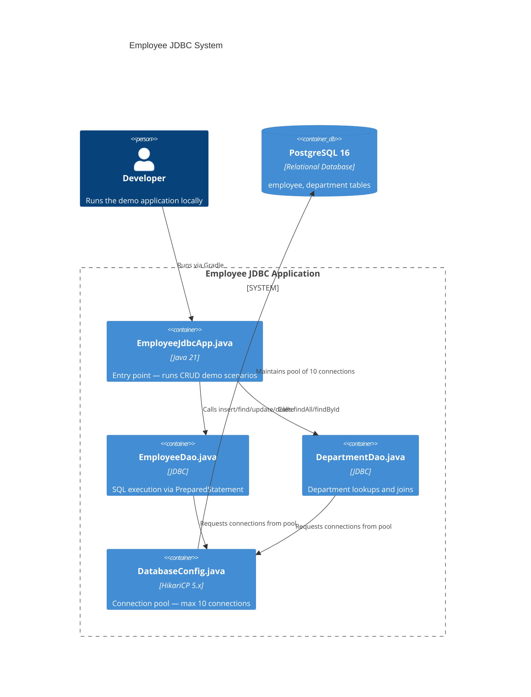

# Employee JDBC Project — Annotated Reference

> This is a reference example showing what a complete, correctly structured
> mini-project looks like. Study the ARCHITECTURE.md structure, README sections,
> and the level of detail expected in each file.

## Contents

- What This Project Demonstrates
- ARCHITECTURE.md (annotated)
- README.md (annotated)
- MINDMAP.md (annotated)

---

## What This Project Demonstrates

Primary concept: JDBC fundamentals — PreparedStatement, connection pooling (HikariCP),
transactions, and the DAO pattern.

Secondary concepts: Layer separation (Main → DAO → Config → DB), soft deletion,
batch operations, HikariCP pool configuration.

---

## ARCHITECTURE.md (annotated)

```markdown
# Employee JDBC Mini-Project — Architecture

This project builds a standalone Java application that manages employee and department
data using raw JDBC — no ORM, no Spring. The goal is to understand exactly what
Spring Data JPA eliminates: manual connection management, PreparedStatement boilerplate,
and transaction lifecycle. Every line of code you don't write here is a line Spring
Data JPA writes for you later.

## System Architecture



## Data Flow

```
  ./gradlew :03-jdbc:run
       │
       ▼
  [ EmployeeJdbcApp.main() ]     ← Orchestrates scenario: insert → query → update → delete
       │
       ├──────────────────────────────────────────┐
       ▼                                          ▼
  [ EmployeeDao ]                           [ DepartmentDao ]
       │                                          │
       └──────────────┬───────────────────────────┘
                      ▼
              [ DatabaseConfig ]              ← HikariCP pool (max 10 connections)
                      │
                      ▼
              [ JDBC Driver ]                 ← org.postgresql:postgresql:42.7.1
                      │
                      ▼
              [ PostgreSQL :5432 ]            ← springdb database, spring user
```

## Design Decisions

**Why raw JDBC instead of Spring Data JPA?**
This module intentionally uses raw JDBC to teach what JPA abstracts away. After
understanding PreparedStatement boilerplate, HikariCP configuration, and manual
transaction management here, the value of `JpaRepository` and `@Transactional` in
the next module becomes immediately obvious.

**Why HikariCP instead of DriverManager.getConnection()?**
`DriverManager.getConnection()` opens a new TCP connection for every call — expensive
(~50–200ms per connection). HikariCP pre-opens a pool of connections at startup and
reuses them. For a service handling 100 requests/second, the difference is
~10 seconds of connection overhead per second vs. ~0ms.

**Why DAO pattern?**
The DAO (Data Access Object) pattern isolates all SQL from the business logic. If the
SQL changes (table rename, query optimisation), only the DAO changes — not the service
logic. This is exactly what Spring Data repositories do, but made explicit here.

**Why soft deletion (active = false) instead of DELETE?**
Hard DELETE permanently destroys data. In production systems, regulatory requirements
(GDPR audit trails, SOX compliance) require keeping records of what happened.
Soft deletion lets you restore accidentally deleted rows and query historical states.

## Gradle Module Structure

```
03-jdbc/
├── build.gradle
└── src/main/java/com/learning/jdbc/
    ├── EmployeeJdbcApp.java        ← main() entry point
    ├── config/
    │   └── DatabaseConfig.java     ← HikariCP DataSource setup
    ├── dao/
    │   ├── EmployeeDao.java         ← CRUD operations for Employee
    │   └── DepartmentDao.java       ← Department lookups
    └── model/
        ├── Employee.java            ← Plain Java object (no JPA annotations)
        └── Department.java
```

## Connection Dependencies

Before running, start PostgreSQL:
```bash
docker run -d \
  --name springdb \
  -e POSTGRES_DB=springdb \
  -e POSTGRES_USER=spring \
  -e POSTGRES_PASSWORD=spring \
  -p 5432:5432 \
  postgres:16
```
```

---

## README.md (annotated)

```markdown
# Employee JDBC Mini-Project

A standalone Java application demonstrating raw JDBC — the layer that Spring Data JPA
eliminates. Understanding this makes `@Repository` and `JpaRepository` deeply intuitive.

## What You Will Learn

- How JDBC connects Java to PostgreSQL at the protocol level
- Why HikariCP connection pooling exists and how to configure it
- How PreparedStatement prevents SQL injection
- How to manage transactions manually (commit/rollback)
- The DAO pattern: separating SQL from business logic

## Prerequisites

- Java 21 (`java -version` should show `21`)
- Docker Desktop running
- Gradle wrapper (included in repo)

## Setup

Start PostgreSQL:
```bash
docker run -d \
  --name springdb \
  -e POSTGRES_DB=springdb \
  -e POSTGRES_USER=spring \
  -e POSTGRES_PASSWORD=spring \
  -p 5432:5432 \
  postgres:16
```

Verify it's running:
```bash
docker ps | grep springdb
```

## Running the Project

```bash
./gradlew :03-jdbc:run
```

Expected output:
```
HikariPool started: 10 connections ready
Inserting employee: Alice Johnson (Engineering)
Inserted with ID: 1
Inserting employee: Bob Smith (Marketing)
Inserted with ID: 2
Finding all employees in Engineering: 1 found
Updating salary for ID 1: 85000 -> 90000
Soft-deleting employee ID 2
Active employees: 1
Transaction demo: transfer rolled back successfully
```

## What to Observe

1. **Pool startup message** — HikariCP logs when the pool is ready. Note the pool
   size configured in DatabaseConfig.java.
2. **Generated IDs** — PostgreSQL's `SERIAL` type generates IDs automatically.
3. **Transaction rollback** — The demo intentionally triggers a rollback to show
   that neither operation committed.
4. **Soft delete** — Employee ID 2 is not deleted from the table; `active=false`.
   Query `SELECT * FROM employee WHERE id=2` in psql to verify.

## Project Walkthrough

**DatabaseConfig.java** — Configures HikariCP. The pool size of 10 means a maximum of
10 simultaneous database connections. This is intentionally small to demonstrate
connection contention in the extension exercises.

**EmployeeDao.java** — All SQL lives here. Note the `PreparedStatement` pattern —
parameterized `?` placeholders prevent SQL injection by separating the query structure
from the user-provided values.

**EmployeeJdbcApp.java** — Orchestrates the demo scenarios. In production this would be
a service class. Here it's a `main()` to keep the demo self-contained.

## Extension Exercises

1. **Add a batch insert**: Use `PreparedStatement.addBatch()` and `executeBatch()` to
   insert 1000 employees in a single round trip. Measure the time difference vs.
   1000 individual inserts.

2. **Implement optimistic locking**: Add a `version` column to the employee table.
   In EmployeeDao.update(), include `WHERE id = ? AND version = ?`. Verify that
   concurrent updates throw an exception.

3. **Add a search method**: Implement `List<Employee> searchByName(String partialName)`
   using `ILIKE '%' || ? || '%'`. Test that the parameter is safely parameterized
   (not vulnerable to SQL injection).

## Troubleshooting

**"Connection refused" on startup**
→ PostgreSQL is not running. Run `docker ps` to check. Start it with the docker run
command in Setup.

**"FATAL: password authentication failed"**
→ The container exists but was created with different credentials.
Run `docker rm -f springdb` then re-run the docker run command.

**"Table employee does not exist"**
→ The schema hasn't been created. Check that `data.sql` is in `src/main/resources/`
and contains the CREATE TABLE statements.
```

---

## MINDMAP.md (annotated)

```markdown
# Employee JDBC Mini-Project — Concept Map

## `03-jdbc/mini-project-03-employee-jdbc`

### Concepts Demonstrated
- **JDBC Architecture**
  - DriverManager (ServiceLoader auto-discovery)
  - Connection URL format (`jdbc:postgresql://host:port/db`)
  - PreparedStatement vs Statement (SQL injection prevention)
  - ResultSet iteration (forward-only cursor)
- **Connection Pooling**
  - HikariCP — why it exists (connection cost ~100ms)
  - Pool size: `maximumPoolSize=10`
  - Connection timeout and idle timeout
- **Transactions**
  - `connection.setAutoCommit(false)` → manual control
  - `connection.commit()` on success
  - `connection.rollback()` on failure
  - try-with-resources for automatic close
- **DAO Pattern**
  - SQL isolated in DAO layer
  - Model = plain Java object (no annotations)
  - One DAO per entity

### Key Classes
- **[`DatabaseConfig.java`](src/main/java/com/learning/jdbc/config/DatabaseConfig.java)**
  - HikariCP DataSource configuration
  - Pool size, timeout settings
- **[`EmployeeDao.java`](src/main/java/com/learning/jdbc/dao/EmployeeDao.java)**
  - insert, findById, findAll, update, softDelete
  - Parameterized queries only (no string concatenation)
- **[`EmployeeJdbcApp.java`](src/main/java/com/learning/jdbc/EmployeeJdbcApp.java)**
  - Demo orchestration
  - Transaction rollback demonstration

### Interview QA Focus
- JDBC vs Spring Data JPA — what JPA eliminates
- PreparedStatement vs Statement — why parameterized
- Connection pool sizing — how to calculate `maximumPoolSize`
- JDBC transaction management vs @Transactional
- Why soft delete over hard DELETE in production
```
