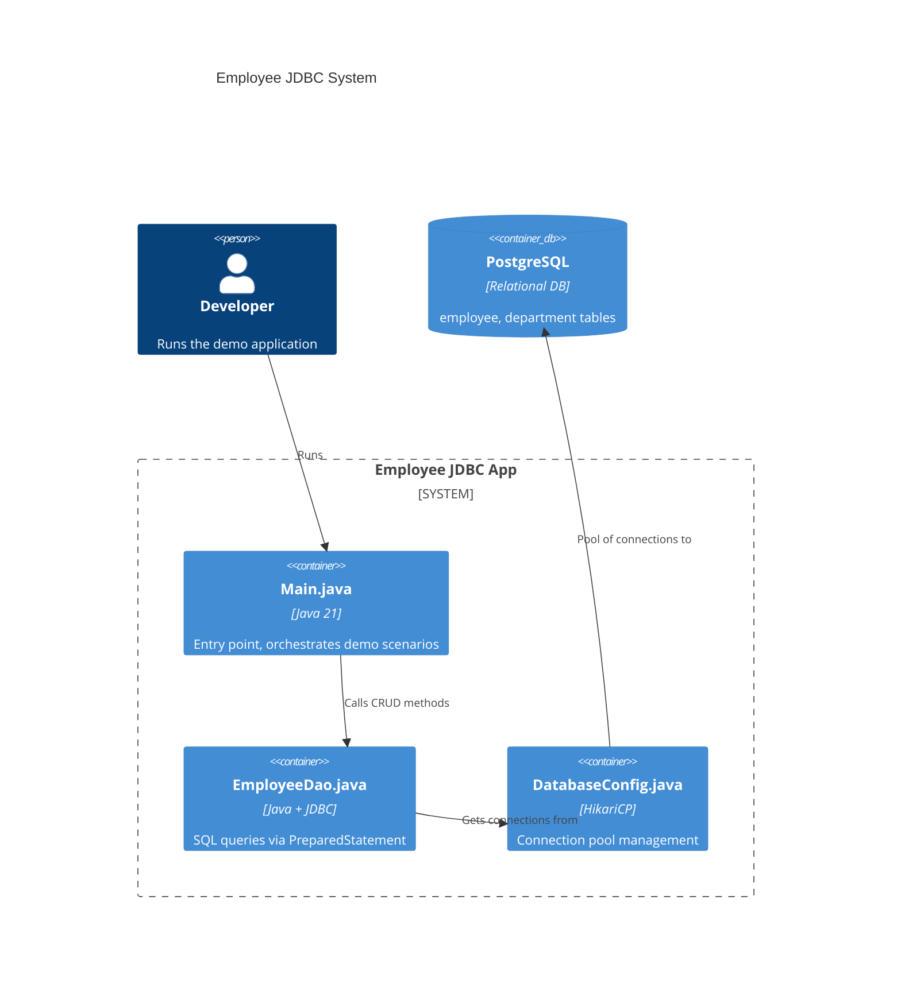

# Mini-Project Checklist — spring-mastery

Every mini-project must satisfy ALL items in this checklist before delivery.

## Contents

- Folder Structure
- ARCHITECTURE.md Requirements
- Java Source File Requirements
- README.md Requirements
- MINDMAP.md Requirements
- Quality Gate

---

## Folder Structure

```
XX-module/mini-project-NN-name/
├── ARCHITECTURE.md              ← C4 Mermaid + ASCII + Design Decisions
├── README.md                    ← Setup + run + observe + extend
├── MINDMAP.md                   ← Pure Markdown list mind map
├── build.gradle                 ← Module-specific Gradle build
└── src/
    └── main/
        └── java/
            └── com/learning/<module>/
                ├── <ModuleName>App.java      ← @SpringBootApplication entry point
                ├── config/                   ← @Configuration classes
                ├── controller/               ← @RestController (if REST project)
                ├── service/                  ← @Service + interface
                ├── repository/               ← JpaRepository or DAO
                ├── entity/                   ← @Entity classes
                ├── dto/                      ← Request/Response DTOs (records preferred)
                └── exception/                ← Custom exceptions
    └── resources/
        ├── application.properties
        └── data.sql                          ← Sample data (if applicable)
```

For simpler non-Spring-Boot demos (e.g., JDBC standalone):
```
XX-module/mini-project-NN-name/
├── ARCHITECTURE.md
├── README.md
├── MINDMAP.md
├── DatabaseConfig.java
├── EntityDao.java
└── Main.java
```

---

## ARCHITECTURE.md Requirements

### Mandatory sections (in this order)

1. `# [Project Name] — Architecture`
2. One-paragraph overview: what the project builds, what concept it primarily teaches
3. **System Architecture (Mermaid C4Container or C4Component)**
4. **Data Flow (ASCII pipeline)**
5. **Design Decisions** — WHY each layer/pattern was chosen
6. **Gradle Module Structure** — full package tree
7. **Connection / Environment Dependencies** — what must be running before the app

### C4 Mermaid diagram rules

- Use `C4Container` for projects with external dependencies (DB, Redis, etc.)
- Use `C4Component` for internal Spring Boot structure
- NEVER use `->` or `-->` inside C4 blocks — always `Rel(from, to, "label")`
- Minimum 5 nodes in the diagram

Example (C4Container):


### ASCII data flow diagram (minimum 5 stages)

```
  Developer / Test
       │
       ▼
  [ Main.java ]            ← Orchestrates demo scenarios
       │
       ▼
  [ EmployeeDao ]          ← Executes PreparedStatements
       │
       ▼
  [ HikariCP Pool ]        ← Manages connection lifecycle
       │
       ▼
  [ PostgreSQL JDBC Driver ] ← Type 4 pure Java driver
       │
       ▼
  [ PostgreSQL Database ]  ← Stores employee + department data
```

### Design Decisions section

Must answer these questions for each major decision:
- Why this executor/pattern instead of the simpler alternative?
- What would break at 10x scale?
- What would a senior engineer change in production?

---

## Java Source File Requirements

Every `.java` file in the mini-project must have:

- [ ] Layer 1 file header (╔══╗ box with ASCII diagram, PURPOSE, WHY IT EXISTS, PYTHON COMPARE)
- [ ] Layer 2 class javadoc (responsibility, Python equivalent, ASCII layer position)
- [ ] Layer 3 method javadoc on every public method (@param, @return, @throws)
- [ ] Layer 4 inline comments for non-obvious logic only
- [ ] `jakarta.*` not `javax.*`
- [ ] `com.learning.<module>` package
- [ ] No Maven references

---

## README.md Requirements

### Mandatory sections (in this order)

1. `# [Project Name]`
2. **What You Will Learn** — bullet list of concepts demonstrated
3. **Prerequisites** — Java version, Docker, tools
4. **Setup** — exact commands to start PostgreSQL Docker container
5. **Running the Project** — exact Gradle command
6. **What to Observe** — what console output / API responses to look for
7. **Project Walkthrough** — brief explanation of each class and why it exists
8. **Extension Exercises** — 3 numbered exercises to extend the project
9. **Troubleshooting** — 3 most common setup mistakes and fixes

### README quality bar

- Every command must be copy-pasteable — no `[your-value]` placeholders without example values
- Gradle commands must use the wrapper: `./gradlew :module:bootRun` not `gradle bootRun`
- Docker commands must include the full `docker run` or `docker compose up` command

---

## MINDMAP.md Requirements

- [ ] Pure Markdown lists — no mermaid fenced blocks
- [ ] Root heading = project name
- [ ] Sections: concepts demonstrated, package structure, key classes
- [ ] "Interview QA Focus" section listing what this project teaches
- [ ] All file references use relative paths

---

## Quality Gate

| Check | Why it matters |
|-------|---------------|
| All Java files have 4-layer comments | Core repo standard — non-negotiable |
| ARCHITECTURE.md has C4 diagram with Rel() | C4 arrows with -> break rendering |
| ARCHITECTURE.md has ASCII data flow | Visual learner accessibility |
| README has exact copy-paste commands | Beginner gets stuck on vague instructions |
| MINDMAP.md has no mermaid blocks | Markmap extension can't render mermaid |
| No javax.* anywhere | Jakarta EE 10 — Spring Boot 3.2 requires jakarta |
| No Maven references | Gradle-only repo |
| Extension exercises present | Deepens learning beyond the demo |
