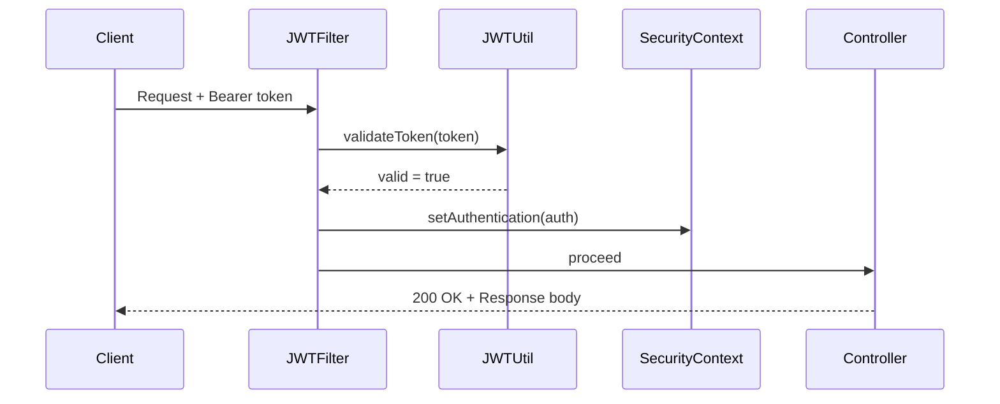
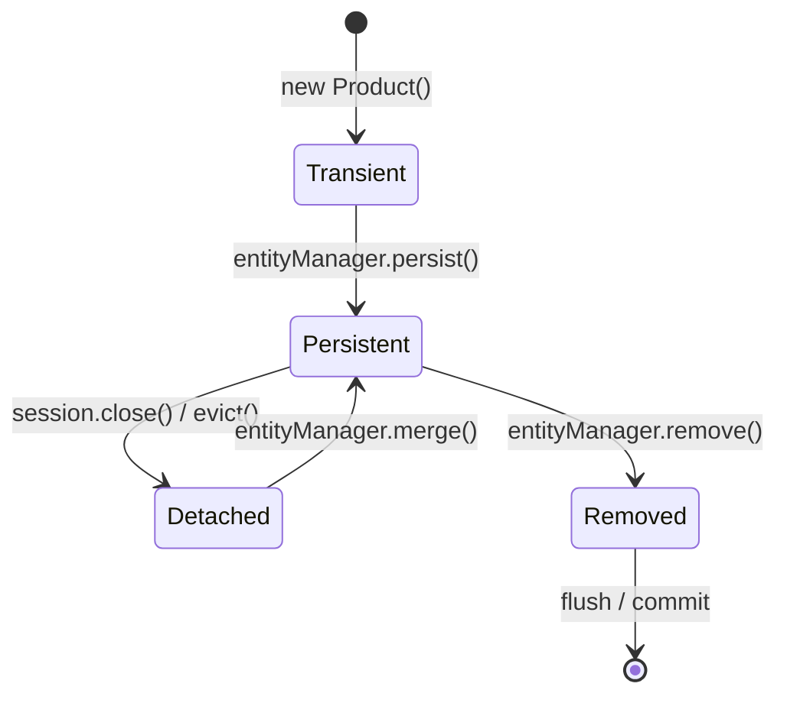

# Content Standards — explanation/*.md Files

Every `explanation/*.md` file in spring-mastery must satisfy ALL items in this checklist.

## Contents

- Standard 1: Mermaid Diagram (mandatory)
- Standard 2: Python Bridge Comparison (mandatory)
- Standard 3: Interview Questions Section (mandatory)
- Mermaid Diagram Type Reference
- ARCHITECTURE.md Standards
- What Immediately Fails the Standard

---

## Standard 1 — Mermaid Diagram (mandatory)

Every `explanation/*.md` must include at least one Mermaid diagram.
Multiple diagrams are encouraged when one type is not enough.

Pick the type that makes the concept clearest:

| Mermaid Type | Use This For |
|-------------|-------------|
| `flowchart TD` | Decision trees, request flows, algorithm steps, if/else logic |
| `sequenceDiagram` | Service calls, auth handshakes, event propagation, HTTP flows |
| `erDiagram` | Database entity relationships, JPA mapping |
| `classDiagram` | Class hierarchies, interface implementations, OOP structures |
| `stateDiagram-v2` | Bean lifecycle, circuit breaker states, thread states, JPA entity states |
| `C4Context` | System-level: users / external systems / your system |
| `C4Container` | Container view: Spring Boot app / DB / Redis / Message broker |
| `C4Component` | Internal layers: Controller / Service / Repo / Security |
| `timeline` | Technology history, Spring version evolution, framework timeline |
| `gitGraph` | Git branching strategies, feature branch workflows |
| `gantt` | Learning timelines, project phases |
| `journey` | User journeys: login flow, checkout, registration |
| `pie` | Test pyramid proportions, dependency categories |
| `quadrantChart` | 2×2 comparisons: tech choice matrices, risk/effort |
| `xychart-beta` | Benchmarks, performance data, scaling metrics |
| `block-beta` | Block architecture: Docker Compose stacks, system blocks |

**C4 diagrams: NEVER use `->` inside C4Context, C4Container, or C4Component.**
Always use `Rel(from, to, "label")`. See [mermaid-c4-fix.md](mermaid-c4-fix.md).

---

## Standard 2 — Python Bridge Comparison (mandatory)

Every `explanation/*.md` must compare the Java concept to its Python/FastAPI equivalent.
This is not a footnote — it is a first-class section, usually appearing right after
the opening concept explanation.

Format:
```markdown
## Python Bridge

> **Python equivalent:** `psycopg2.connect(dsn)` or `sqlalchemy.create_engine(url)`

In Python, you call `psycopg2.connect()` directly. In Java, `DriverManager.getConnection(url)`
serves the same role — but you rarely call it directly in Spring. Spring's `DataSource`
abstraction (equivalent to SQLAlchemy's `Engine`) manages connection pooling and lifecycle.

| Concept | Python | Java |
|---------|--------|------|
| DB connection factory | `create_engine()` | `DataSource` / `HikariCP` |
| Raw query | `cursor.execute(sql, params)` | `PreparedStatement.setX()` |
| Result iteration | `cursor.fetchall()` | `ResultSet.next()` / `.getX()` |
| Transaction | `async with db.begin():` | `@Transactional` |
```

---

## Standard 3 — Interview Questions Section (mandatory)

Every `explanation/*.md` ends with `## Interview Questions`.
Minimum 3 questions, maximum 8. Grouped exactly as shown.
Every question has an answer immediately below it.

```markdown
---

## Interview Questions

### Conceptual

**Q1: What is [concept] and why does it exist?**
> [2–3 sentence answer covering the origin problem and the solution]

**Q2: What is the difference between X and Y?**
> X does ___. Y does ___. Choose X when ___, choose Y when ___.

### Scenario / Debug

**Q3: Your @Transactional method is not rolling back on exception. What are the
3 most likely causes?**
> 1. The exception is a checked exception (not RuntimeException) — add `rollbackFor = Exception.class`
> 2. Self-invocation (calling the method from within the same class bypasses the proxy)
> 3. The exception is caught inside the method before it propagates to Spring

**Q4: [Describe a real bug or design decision scenario]**
> [Step-by-step diagnostic or design reasoning answer]

### Quick Fire

- What is the default fetch type for `@OneToMany`? *(LAZY)*
- Is `SessionFactory` thread-safe? *(Yes)* Is `Session` thread-safe? *(No)*
- Can you inject a prototype bean into a singleton? How? *(Yes — `@Lookup` or scoped proxy)*
```

---

## Mermaid Diagram Type Reference — Detailed

### When to use sequenceDiagram
For any interaction between components over time — HTTP request lifecycle, JWT validation,
Spring Security filter chain, service-to-service calls. This is the most used type in Spring.



### When to use stateDiagram-v2
For JPA entity states, Spring Bean lifecycle, thread states, circuit breaker states.



---

## ARCHITECTURE.md Standards

Every mini-project `ARCHITECTURE.md` must contain:

1. One-paragraph overview of what the project builds
2. A C4Container or C4Component Mermaid diagram (system + component view)
3. An ASCII data flow diagram showing the request pipeline
4. A "Design Decisions" section — WHY each layer/pattern was chosen
5. A "Gradle Module Structure" section with the full package tree

---

## Sub-topic Support Pack

If the topic is a substantial deepening, also create/update these files in the
specific sub-topic folder under `resources/`:

- `progressive-quiz-drill.md`
- `one-page-cheat-sheet.md`
- `top-resource-guide.md`

`top-resource-guide.md` must be a curated list of external learning resources
only: books, official docs, blogs, and videos. Do not use internal repo links
as the primary content of that file.

## What Immediately Fails the Standard

| Failure | Standard Violated |
|---------|------------------|
| No Mermaid diagram | Standard 1 — mandatory |
| C4 diagram uses `->` instead of `Rel()` | Standard 1 — C4 rule |
| No Python Bridge comparison | Standard 2 — mandatory |
| No Interview Questions section | Standard 3 — mandatory |
| Fewer than 3 interview questions | Standard 3 — minimum 3 |
| Questions not grouped (Conceptual / Scenario / Quick Fire) | Standard 3 — format |
| Questions with no answers | Standard 3 — every Q has an A |
| `javax.persistence` instead of `jakarta.persistence` | Stack constraint — Jakarta EE 10 |
| References Maven (`mvn`, `pom.xml`) | Stack constraint — Gradle only |
| mermaid mindmap block in MINDMAP.md | Standard 2 — must be pure Markdown lists |
