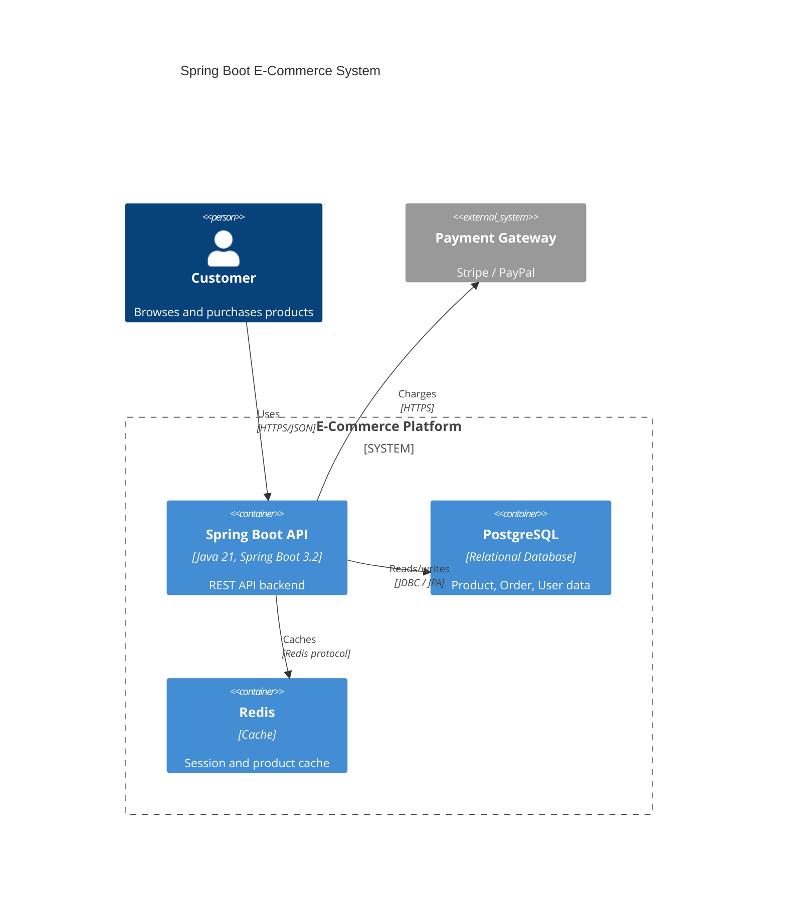

# Mermaid C4 Diagram Fix

## Contents

- The Problem
- The Rule
- Which Diagram Types Are Affected
- Correct Rel() Syntax
- Complete Working Example
- Verification Checklist

---

## The Problem

Inside `C4Context`, `C4Container`, and `C4Component` blocks, standard Mermaid
arrow syntax (`->`, `-->`) causes a lexical error:

```
Lexical error on line X. Unrecognized text.
```

This breaks rendering entirely — the diagram shows nothing.

---

## The Rule

**Inside C4 blocks:** Always use `Rel(from, to, "label")`.
**Outside C4 blocks:** Standard `->` arrows work fine in flowchart, sequenceDiagram, etc.

| Block Type | Arrow Syntax | Correct Syntax |
|-----------|-------------|---------------|
| `C4Context` | ❌ `user -> app: Uses` | ✅ `Rel(user, app, "Uses")` |
| `C4Container` | ❌ `app --> db: Queries` | ✅ `Rel(app, db, "Queries")` |
| `C4Component` | ❌ `ctrl -> svc: Calls` | ✅ `Rel(ctrl, svc, "Calls")` |
| `flowchart` | ✅ `A --> B` | ✅ `A --> B` (fine here) |
| `sequenceDiagram` | ✅ `A->>B: msg` | ✅ `A->>B: msg` (fine here) |

---

## Which Diagram Types Are Affected

Only these three block types require `Rel()`:
- `C4Context` — system-level view
- `C4Container` — container-level view (Spring Boot app, DB, Redis, etc.)
- `C4Component` — component-level view (Controller, Service, Repository)

All other Mermaid types (`flowchart`, `sequenceDiagram`, `erDiagram`, `classDiagram`,
`stateDiagram-v2`, `timeline`, etc.) use standard arrow syntax.

---

## Correct Rel() Syntax

```
Rel(sourceAlias, targetAlias, "Relationship label")
Rel(sourceAlias, targetAlias, "Label", "Technology")
```

Both forms are valid. Use the two-argument form for simple labels,
four-argument form when the technology is meaningful.

---

## Complete Working Example



---

## Verification Checklist

After writing or editing any file containing C4 diagrams:

- [ ] Search for `->` inside any `C4Context`, `C4Container`, `C4Component` block
- [ ] Search for `-->` inside any `C4Context`, `C4Container`, `C4Component` block
- [ ] Confirm every relationship uses `Rel(from, to, "label")`
- [ ] Confirm aliases used in `Rel()` match the aliases defined in `Person()`, `Container()`, `System()` declarations

If any `->` or `-->` exists inside a C4 block → replace with `Rel()` before finishing.
