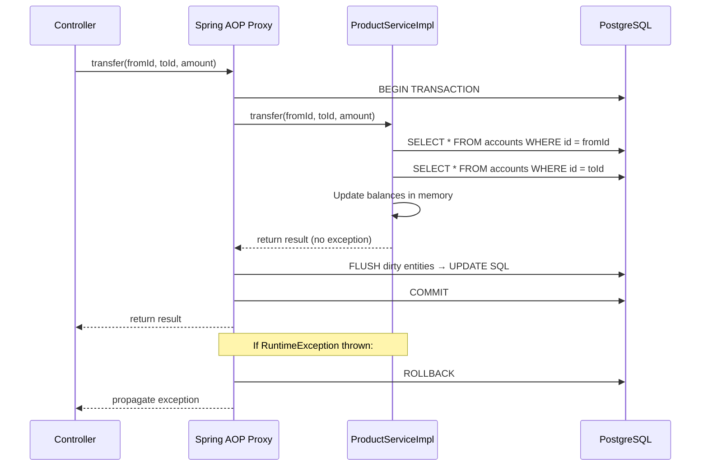
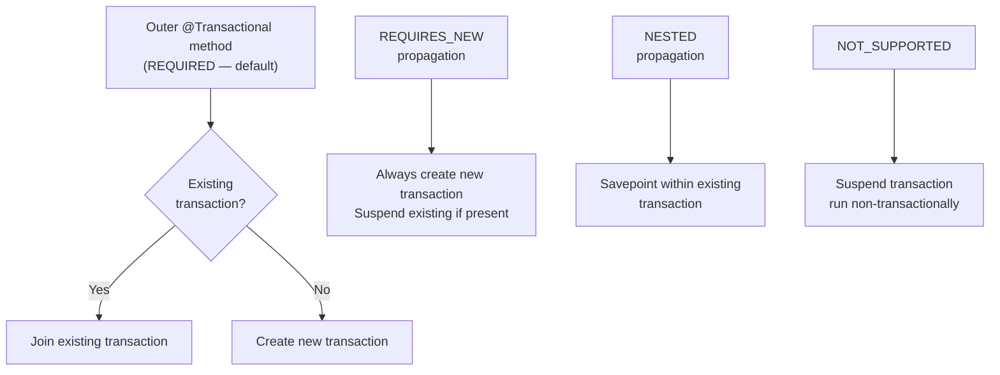

# @Transactional — The Most Important Spring Annotation to Understand Correctly

> Gold-standard example file. Study the structure, depth, opening style, Python Bridge
> format, diagram choice, anti-patterns, and interview question calibration.

## Contents

- Why @Transactional Exists
- Python Bridge
- How @Transactional Works (Architecture)
- Transaction Propagation
- Working Code Example
- Real-World Use Cases
- Anti-Patterns and Common Mistakes
- Interview Questions

---

Before `@Transactional`, every developer who needed an atomic database operation had
to write boilerplate: open connection, manually call `connection.setAutoCommit(false)`,
write the business logic, call `connection.commit()` on success, and call
`connection.rollback()` in a `catch` block. This was 15–20 lines of infrastructure
code surrounding every 5-line business operation. The code was copy-pasted everywhere.
When someone forgot the rollback in one place, money would disappear from accounts or
inventory would go negative — silently.

`@Transactional` eliminates this entirely. You annotate a method with `@Transactional`,
Spring wraps it in a proxy, and the proxy manages the transaction lifecycle. You write
only business logic. The annotation expresses intent; Spring handles execution.

The most important thing to understand: `@Transactional` does NOT work by magic. It
works via Spring's AOP proxy mechanism. Your `@Service` bean is not actually your
`ProductServiceImpl` class — it's a proxy object generated at startup that wraps your
class. Every method call goes through the proxy first. The proxy opens or joins a
transaction, then delegates to your method, then commits or rolls back based on the
outcome. Knowing this prevents the most common `@Transactional` bugs.

---

## Python Bridge

> **Python/FastAPI equivalent:** `async with db.begin():` in SQLAlchemy, or
> FastAPI's dependency-based transaction management.

```python
# Python / FastAPI + SQLAlchemy async pattern
async def transfer_funds(
    from_id: int, to_id: int, amount: Decimal,
    db: AsyncSession = Depends(get_db)
):
    async with db.begin():          # explicit transaction start
        from_acct = await db.get(Account, from_id)
        to_acct   = await db.get(Account, to_id)
        from_acct.balance -= amount
        to_acct.balance   += amount
    # commit happens at context manager exit
    # rollback on any exception
```

```java
// Java / Spring equivalent
@Transactional
public TransferResult transfer(Long fromId, Long toId, BigDecimal amount) {
    Account from = accountRepo.findById(fromId).orElseThrow();
    Account to   = accountRepo.findById(toId).orElseThrow();
    from.setBalance(from.getBalance().subtract(amount));
    to.setBalance(to.getBalance().add(amount));
    return new TransferResult(from.getBalance(), to.getBalance());
    // commit happens when method returns normally
    // rollback on any RuntimeException
}
```

| Concept | Python / FastAPI | Java / Spring |
|---------|-----------------|---------------|
| Transaction boundary | `async with db.begin():` block | `@Transactional` annotation |
| Commit trigger | Context manager `__aexit__` | Method returns normally |
| Rollback trigger | Any exception in the `with` block | Any `RuntimeException` (unchecked) |
| Checked exception rollback | N/A — Python has no checked exceptions | Requires `rollbackFor = Exception.class` |
| Propagation (nested calls) | Explicit nesting of `with` blocks | `@Transactional(propagation = REQUIRES_NEW)` |

**Key difference:** Python requires you to explicitly write `async with db.begin():` in
every function that needs a transaction. Spring applies the transaction transparently via
AOP proxy — your service code contains zero transaction infrastructure code. The trade-off:
Spring's approach can surprise you with proxy bypass bugs (self-invocation), which Python's
explicit approach never has.

---

## How @Transactional Works (Architecture)



---

## Transaction Propagation



---

## Working Code Example

```java
@Service
@RequiredArgsConstructor
public class AccountServiceImpl implements AccountService {

    private final AccountRepository accountRepo;
    private final TransferAuditRepository auditRepo;

    /**
     * Transfer funds atomically between two accounts.
     *
     * Flow:
     *   load fromAccount ──→ not found? → AccountNotFoundException
     *       │
     *   load toAccount ──→ not found? → AccountNotFoundException
     *       │
     *   check balance ──→ insufficient? → InsufficientFundsException
     *       │
     *   debit from, credit to (dirty check → UPDATE at flush)
     *       │
     *   write audit record
     *       │
     *   method returns → proxy COMMITS all changes atomically
     */
    @Transactional                           // default: REQUIRED propagation
    public TransferResult transfer(Long fromId, Long toId, BigDecimal amount) {
        Account from = accountRepo.findById(fromId)
            .orElseThrow(() -> new AccountNotFoundException(fromId));
        Account to = accountRepo.findById(toId)
            .orElseThrow(() -> new AccountNotFoundException(toId));

        if (from.getBalance().compareTo(amount) < 0) {
            throw new InsufficientFundsException(fromId, amount, from.getBalance());
        }

        // JPA dirty checking: just mutate the entities — no explicit save() needed
        from.setBalance(from.getBalance().subtract(amount));
        to.setBalance(to.getBalance().add(amount));

        // Audit runs in THE SAME transaction — if this fails, the transfer rolls back too
        auditRepo.save(new TransferAudit(fromId, toId, amount, LocalDateTime.now()));

        return new TransferResult(from.getBalance(), to.getBalance());
    }

    @Transactional(readOnly = true)          // disables dirty checking — faster for reads
    public Account findById(Long id) {
        return accountRepo.findById(id)
            .orElseThrow(() -> new AccountNotFoundException(id));
    }

    @Transactional(propagation = Propagation.REQUIRES_NEW)
    public void logFailedAttempt(Long accountId, String reason) {
        // REQUIRES_NEW: always creates its own transaction
        // If the outer transaction rolls back, this audit log STILL commits
        auditRepo.save(new FailedAttemptLog(accountId, reason, LocalDateTime.now()));
    }
}
```

---

## Real-World Use Cases

**Fintech — Atomic fund transfers (Robinhood, Revolut):**
Every fund transfer involves exactly two database writes — debit the source, credit the
destination. Without `@Transactional`, a server crash between the two writes leaves an
inconsistent state: money debited but never credited. `@Transactional` wraps both writes
in a single atomic unit. Either both commit or both roll back. The alternative — manual
`connection.commit()` — would require every developer to remember to handle this
correctly, and someone would eventually forget.

**E-commerce — Inventory + Order creation (Shopify, Amazon):**
When a customer places an order, the system must: (1) reduce inventory, (2) create the
order record, (3) create the payment intent. All three must succeed or none should.
Spring's `@Transactional` ensures that if the payment service is unavailable, the
inventory decrement is rolled back — no overselling. This is why e-commerce systems use
`@Transactional` at the service method level, not individual repository saves.

---

## Anti-Patterns and Common Mistakes

**1. Self-invocation (proxy bypass)**

```java
// WRONG — the proxy is bypassed
@Service
public class OrderServiceImpl {
    @Transactional
    public void processOrder(Order order) {
        // ...
        this.sendConfirmation(order);  // calls THIS.sendConfirmation, not the proxy
    }

    @Transactional(propagation = Propagation.REQUIRES_NEW)
    public void sendConfirmation(Order order) {
        // This does NOT run in its own transaction — runs in processOrder's transaction
        // because the proxy was bypassed
    }
}

// CORRECT — inject the service into itself, or extract to a separate bean
@Service
@RequiredArgsConstructor
public class OrderServiceImpl {
    private final ConfirmationService confirmationService; // separate bean

    @Transactional
    public void processOrder(Order order) {
        // ...
        confirmationService.sendConfirmation(order); // goes through proxy ✓
    }
}
```

**2. @Transactional on private methods**

`@Transactional` on a `private` method is silently ignored. Spring's AOP proxy cannot
intercept private methods — it can only intercept calls from outside the class. No error
is thrown; the annotation simply does nothing. Always place `@Transactional` on `public`
methods. Validate with integration tests that verify rollback behaviour.

**3. Checked exceptions not rolling back**

```java
// WRONG — IOException is checked, will NOT cause rollback by default
@Transactional
public void importFile(MultipartFile file) throws IOException {
    productRepo.deleteAll();
    processFile(file); // throws IOException on bad format
    // deleteAll() is COMMITTED even though processFile() threw
}

// CORRECT — declare rollback for checked exceptions
@Transactional(rollbackFor = IOException.class)
public void importFile(MultipartFile file) throws IOException {
    productRepo.deleteAll();
    processFile(file); // IOException → rollback deleteAll() ✓
}
```

---

## Interview Questions

### Conceptual

**Q1: Why does @Transactional on a private method silently do nothing?**
> @Transactional works via Spring's AOP proxy. The proxy wraps your bean and intercepts
> method calls to open/close transactions. AOP proxies in Spring use JDK dynamic proxies
> (for interfaces) or CGLIB (for classes) — both of which can only intercept calls from
> outside the class. Private methods are invisible to proxies. The annotation is present
> on the bytecode but the proxy never sees the method call, so no transaction is started.
> This is a silent failure — no exception, no warning in logs.

**Q2: What is the difference between Propagation.REQUIRED and Propagation.REQUIRES_NEW?**
> `REQUIRED` (default): if a transaction already exists, join it. If not, create one.
> All work happens in one transaction — either all commits or all rolls back together.
> `REQUIRES_NEW`: always create a brand new transaction, suspending the current one if
> it exists. The new transaction commits or rolls back independently. Use `REQUIRES_NEW`
> for audit logging that must persist even if the main operation fails.

### Scenario / Debug

**Q3: Your @Transactional method calls another @Transactional method in the same class.
The inner method uses REQUIRES_NEW propagation but seems to share the outer transaction.
Why?**
> Self-invocation. When `processOrder()` calls `this.sendConfirmation()`, the call goes
> directly to the underlying class instance, bypassing Spring's AOP proxy entirely.
> The proxy only intercepts calls from external beans. The REQUIRES_NEW annotation on
> `sendConfirmation()` is irrelevant — Spring never sees the call. Fix: extract
> `sendConfirmation()` to a separate Spring bean and inject that bean here.

**Q4: A developer marks a method @Transactional(readOnly=true) but it does a save().
What happens?**
> It depends on the JPA provider and database driver. With Hibernate, `readOnly=true`
> disables dirty checking and skips the flush before commit — the save() call adds the
> entity to the persistence context but Hibernate never generates the INSERT SQL.
> The data silently disappears. Some database drivers also set the connection to
> read-only mode, causing an actual exception. Either way, it's a data loss bug with
> no error message. Mark write methods `@Transactional` (default readOnly=false).

### Quick Fire

- Can `@Transactional` be used on an interface method in Spring? *(Yes, but class-level is preferred — interface annotations require JDK proxy)*
- What happens to a transaction if the JVM crashes mid-commit? *(Database rolls back — the COMMIT was never received)*
- What is the default isolation level for @Transactional? *(DEFAULT — delegates to the database default, usually READ_COMMITTED)*
- Does `@Transactional` work on a Spring `@Component` bean? *(Yes — any Spring-managed bean)*
