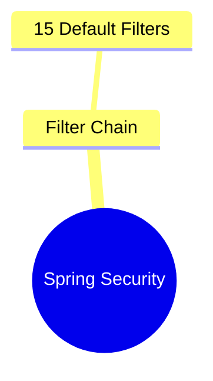

# Markmap Format Reference — spring-mastery MINDMAP.md Files

## Contents

- What Markmap Is (and What It Is Not)
- The Correct Format for This Repo
- Wrong Formats — Never Use These
- Full Template
- Depth Guidelines by Scope
- File Link Format
- Interview QA Focus Section
- Complete Worked Example (from the actual repo)
- Common Failures Checklist

---

## What Markmap Is (and What It Is Not)

The VS Code **Markmap** extension (by gera2ld) reads standard Markdown files and
renders them as interactive zoomable mind maps. It reads headings (`#`, `##`, `###`)
and list items (`-`, `*`) directly from the Markdown.

**It does NOT use a `mermaid` fenced block.**
**It does NOT use the Mermaid `mindmap` keyword.**
**It does NOT require any special fenced code block at all.**

The entire MINDMAP.md file IS the mind map — pure Markdown, nothing else.

---

## The Correct Format for This Repo

```markdown
# [Topic Name] — Concept Mindmap

## `module-path/sub-topic-path`

- **[`01-concept.md`](explanation/01-concept.md)** & **[`ConceptDemo.java`](explanation/ConceptDemo.java)**
  - Key idea 1
    - Detail A
    - Detail B
  - Key idea 2
    - Detail C

- **[`02-another.md`](explanation/02-another.md)**
  - Key idea 3
  - Key idea 4

### `exercises/`
- **[`README.md`](exercises/README.md)** (Execution instructions)
- **[`Ex01_Name.java`](exercises/Ex01_Name.java)**
  - What this exercise practises
  - Key technique used

### Interview QA Focus
- Question theme 1
- Question theme 2
- Question theme 3
```

---

## Wrong Formats — Never Use These

```markdown
<!-- WRONG 1: Mermaid mindmap block — does NOT render in VS Code Markmap -->


<!-- WRONG 2: Mermaid flowchart in a MINDMAP.md — wrong file type -->


<!-- WRONG 3: markmap fenced block — not what this repo uses -->
```markmap
# Spring Security
## Filter Chain
```

<!-- WRONG 4: Just a flat list with no hierarchy — too shallow -->
- @Transactional
- JPA
- Hibernate
```

None of these work with the Markmap VS Code extension as used in this repo.

---

## Full Template

```markdown
# [Sub-topic Name] — Concept Mindmap

## `XX-module/YY-subtopic`

### `explanation/`
- **[`01-concept-name.md`](explanation/01-concept-name.md)** & **[`ConceptDemo.java`](explanation/ConceptDemo.java)**
  - Core concept 1
    - Detail A (Python comparison angle)
    - Detail B (gotcha or nuance)
  - Core concept 2
    - Detail C
    - Detail D

- **[`02-next-concept.md`](explanation/02-next-concept.md)** & **[`NextDemo.java`](explanation/NextDemo.java)**
  - Core concept 3
    - Detail E
  - Core concept 4
    - Detail F
    - Detail G

### `exercises/`
- **[`README.md`](exercises/README.md)** (Execution instructions)
- **[`Ex01_Name.java`](exercises/Ex01_Name.java)**
  - What the exercise builds
  - Technique being practised
- **[`Ex02_Name.java`](exercises/Ex02_Name.java)**
  - What the exercise builds

### `MINDMAP.md`
- Visual Markdown Tree (this file)
- Markmap extension compatible

### Interview QA Focus
- Question theme 1
- Question theme 2
- Question theme 3
- Question theme 4
```

---

## Depth Guidelines by Scope

| Scope | Heading depth | List depth | Size |
|-------|--------------|------------|------|
| Module-level (e.g., whole `03-jdbc/`) | `##` sections per sub-topic | 3–4 levels | 60–100 lines |
| Sub-topic (e.g., `01-jdbc-fundamentals/`) | `###` sections | 3–4 levels | 30–60 lines |
| Mini-project | Flat — concepts used, what it demonstrates | 2–3 levels | 20–40 lines |

More depth = better for Markmap rendering. Shallow flat lists don't produce
interesting mind maps. Always aim for at least 3 levels of nesting on key concepts.

---

## File Link Format

Always use relative paths. Always use the `**[`filename`](path)**` pattern for files
that are main learning artifacts (explanation files, demo files, exercise files).

```markdown
# Correct patterns
- **[`01-jdbc-architecture.md`](explanation/01-jdbc-architecture.md)**
- **[`JdbcConnectionDemo.java`](explanation/JdbcConnectionDemo.java)**
- **[`Ex01_CrudOperations.java`](exercises/Ex01_CrudOperations.java)**

# Wrong patterns
- [01-jdbc-architecture.md]  ← missing path
- **01-jdbc-architecture.md**  ← not a link
- [file](../other-module/file)  ← cross-module links rarely useful in mindmaps
```

---

## Interview QA Focus Section

Always the last section in every MINDMAP.md. Lists the key question THEMES (not
full questions) that readers should be able to answer after studying this topic.

```markdown
### Interview QA Focus
- JDBC vs JPA — when to choose which
- How DriverManager discovers drivers (ServiceLoader, no Class.forName since Java 6)
- PreparedStatement vs Statement — SQL injection prevention
- Connection pool sizing (HikariCP defaults, how to tune)
- ResultSet scrollability vs forward-only
- Transaction isolation levels — READ_COMMITTED vs SERIALIZABLE
```

These themes map directly to the `## Interview Questions` sections at the end of
each `explanation/*.md` file. The mind map gives the topic overview; the interview
focus tells readers what to pay special attention to.

---

## Complete Worked Example (from the actual repo)

This is the actual MINDMAP.md from `00-java-foundation/01-java-basics/`:

```markdown
# Java Basics

## `00-java-foundation/01-java-basics`

### `explanation/`
- **[`01-how-java-works.md`](explanation/01-how-java-works.md)** & **[`HowJavaWorks.java`](explanation/HowJavaWorks.java)**
  - Execution Model
    - javac (Compiler → Bytecode `.class`)
    - JVM (Executer)
      - Class Loader → Security Verify
      - Execution Engine
        - Interpreter
        - JIT Compiler (Hotspots → Machine Code)
  - Environment
    - JDK (Development Kit: JRE + Tools)
    - JRE (Runtime: JVM + Libraries)
    - JVM (Virtual Machine)
  - Python Comparison: Script vs `public static void main`

- **[`02-variables-datatypes.md`](explanation/02-variables-datatypes.md)** & **[`VariablesDemo.java`](explanation/VariablesDemo.java)**
  - Primitives (Stack Memory, No Methods)
    - Numbers
      - Integers: `byte` (8-bit), `short` (16), `int` (32), `long` (64)
      - Decimals: `float` (32), `double` (64)
    - Text: `char` (16-bit Unicode)
    - Logic: `boolean` (1-bit)
  - Reference Types / Objects (Heap Memory)
    - Wrapper Classes (`Integer`, `Double`, `Boolean`, etc.)
    - `String`
  - The Autoboxing Trap (Implicit `null` unboxing → `NullPointerException`)

### `exercises/`
- **[`README.md`](exercises/README.md)** (Execution Instructions)
- **[`Ex01_TypeConversion.java`](exercises/Ex01_TypeConversion.java)**
  - Implicit Widening (`int` → `double`)
  - Explicit Narrowing Casts (`double` → `int`)
  - Integer Overflow Traps

### Interview QA Focus
- JDK vs JRE vs JVM
- Stack (Primitives) vs Heap (Objects)
- `==` vs `.equals()`
- JIT Compiler logic
- Implicit vs Explicit casting restrictions
```

---

## Common Failures Checklist

Before saving any MINDMAP.md, verify:

- [ ] File contains NO `mermaid` fenced block
- [ ] File does NOT use the `mindmap` keyword
- [ ] File is pure Markdown headings and lists only
- [ ] All file references use relative paths and exist in the module
- [ ] Key files are linked with `**[`filename`](path)**` format
- [ ] "Interview QA Focus" section is present at the end
- [ ] Minimum 3 levels of nesting on at least 2 major concepts
- [ ] File covers ALL explanation files in the sub-topic (none omitted)
- [ ] File covers ALL exercise files (none omitted)
