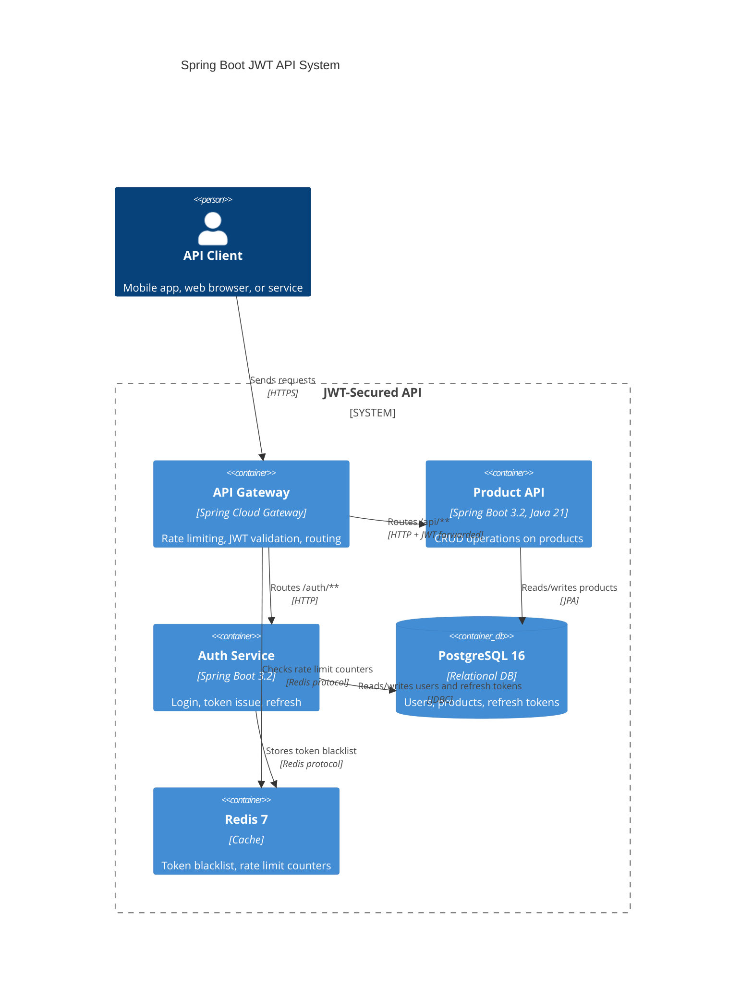

# Workflow: Mermaid C4 Diagram Fix

## When to Use This Workflow

Run this procedure:
- When writing a NEW C4 diagram block (C4Context, C4Container, C4Component)
- When a Mermaid diagram shows `Lexical error on line X. Unrecognized text.`
- After editing any file that contains a C4 block

## Step 1 — Identify the Error

If you see: `Lexical error on line X. Unrecognized text.`
Inside a C4 block, this is almost always a relationship syntax error.

## Step 2 — Apply the Relationship Fix

**WRONG — causes lexical error:**
```
user -> app: Commands
ui --> service: Calls
client ->> api: Requests
```

**RIGHT — always use Rel():**
```
Rel(user, app, "Commands")
Rel(ui, service, "Calls")
Rel(client, api, "Requests", "HTTPS/JSON")
```

The four-argument form `Rel(from, to, "label", "technology")` is also valid
and recommended when the technology/protocol is informative.

## Step 3 — Scope of This Rule

This rule applies ONLY inside these three Mermaid block types:
- `C4Context` — system-level view
- `C4Container` — container-level view (Spring Boot app, DB, Redis, broker)
- `C4Component` — internal component view (Controller, Service, Repository)

Standard arrow syntax works fine everywhere else:
- `flowchart TD` → `A --> B` ✅
- `sequenceDiagram` → `A->>B: message` ✅
- `classDiagram` → `A --|> B` ✅
- `stateDiagram-v2` → `A --> B` ✅

## Step 4 — Complete Correct C4Container Example



## Step 5 — Verification Checklist

After writing or editing any file with a C4 block:

- [ ] Search for `->` inside any C4 block → replace with `Rel()`
- [ ] Search for `-->` inside any C4 block → replace with `Rel()`
- [ ] Confirm all aliases in `Rel()` match aliases defined in `Person()`, `Container()`, `System()` etc.
- [ ] Confirm C4 block type is one of: C4Context, C4Container, C4Component
- [ ] Render the diagram in VS Code or online Mermaid editor to confirm no errors

## Common Node Definition Types

```
Person(alias, "Label", "Description")
System(alias, "Label", "Description")
System_Ext(alias, "Label", "Description")        ← external system
System_Boundary(alias, "Boundary Label") { ... }
Container(alias, "Label", "Technology", "Description")
ContainerDb(alias, "Label", "Technology", "Description")
Container_Ext(alias, "Label", "Technology", "Description")
Component(alias, "Label", "Technology", "Description")
```
