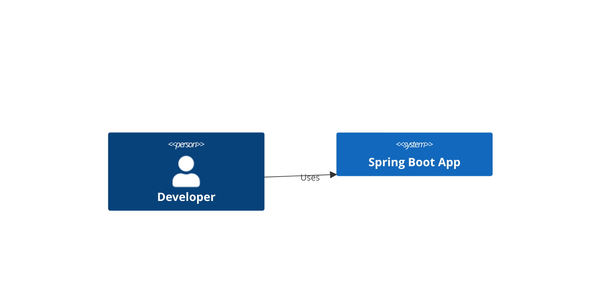

// turbo-all

### 1. Identify Lexical Errors (Mermaid C4)
If you see an error like `Lexical error on line X. Unrecognized text.`, it's likely a relationship syntax issue inside a C4 block.

### 2. The Relationship Fix
- **WRONG (causes errors):** `user -> app: Commands` or `ui --> service: Calls`
- **RIGHT:** `Rel(user, app, "Commands")` or `Rel(ui, service, "Calls")`

### 3. Scope of This Rule
This applies ONLY inside these Mermaid block types:
- `C4Context`
- `C4Container`
- `C4Component`

Standard `->` arrows are perfectly fine in `flowchart`, `sequenceDiagram`, `classDiagram`, etc.

### 4. Verification Step
After every update to a file containing C4 diagrams, scan and confirm:
- No `->` or `-->` exists inside any `C4Context`, `C4Container`, or `C4Component` block.
- All relationships use `Rel(from, to, "label")` syntax.

### 5. Example

**❌ Broken:**
```mermaid
C4Context
  Person(user, "Developer")
  System(app, "Spring Boot App")
  user -> app: Uses
```

**✅ Fixed:**

