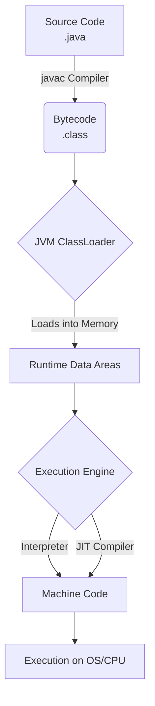

# How Java Works: A Deep Architecture Dive

To become a senior Java engineer, knowing syntax isn't enough. You must understand exactly how the Java Virtual Machine (JVM) compiles, loads, and executes your code. 

Java is neither strictly a compiled language (like C++) nor strictly an interpreted language (like Python). It is **both**.

## The Java Compilation and Execution Pipeline

When you write Java code, it goes through a multi-stage pipeline:

### Phase 1: Compile Time (`javac`)
The `javac` compiler converts your human-readable `.java` files into platform-independent **Bytecode** (`.class` files). Bytecode is not machine code; it is a highly optimized set of instructions designed specifically for the JVM.

### Phase 2: Runtime (The JVM)
When you run your program (via the `java` command), the JVM wakes up. The JVM itself is a native C++ program that interacts directly with the host OS.

#### 1. The ClassLoader Subsystem
The JVM doesn't load all `.class` files into memory at startup. It uses **Dynamic Class Loading**. A class is only loaded the very first time it is referenced. 
- **Bootstrap ClassLoader**: Loads core Java API classes (like `java.lang.String`).
- **Platform ClassLoader**: Loads platform-specific extensions.
- **Application ClassLoader**: Loads the code *you* wrote from the classpath.

*Architect Trap*: Memory leaks don't just happen with objects on the heap. If you dynamically load classes heavily in a server environment (like Tomcat or Spring Boot reloading context) without unloading them, you will cause a memory leak in the JVM's "Metaspace".

#### 2. The Execution Engine (Interpreter + JIT)
Once bytecode is loaded, the Execution Engine runs it.
- **The Interpreter**: Reads bytecode line-by-line and executes it. This is fast to start, but slow over time.
- **The JIT (Just-In-Time) Compiler**: The JVM monitors which methods are executed frequently (called "Hot" methods). Once a method crosses a specific invocation threshold, the JIT physically compiles that bytecode down into highly optimized, native OS machine code and caches it. 
- **De-optimization**: The JIT is aggressive. If it makes an assumption that turns out to be wrong later (e.g., assuming a class only has one subclass, and then a new subclass is loaded dynamically), it will instantly "de-optimize" the compiled machine code back into interpreted bytecode.

## Python Comparison: Execution Models

- C/C++: Compile once directly to machine code. Maximum speed, but requires rewriting/recompiling for every OS (Windows, Linux, Mac).
- Python: Pure execution via an interpreter (CPython). Starts instantly, but runs slowly because every line is decoded at runtime.
- Java: Uses JIT. It starts slightly slower than C++ because it interprets at first, but for long-running processes (like backend microservices), Java's JIT can actually rival or sometimes beat C++ because it can optimize the machine code *dynamically based on real-time runtime profiling*.

## Interview Questions - Architect Level

**Q1: What is "Write Once, Run Anywhere" (WORA), and how does the JVM physically achieve this?**
> The Java compiler does not compile to OS-specific machine instructions. It compiles to JVM bytecode. Sun Microsystems (now Oracle) wrote a separate, native JVM implementation for Windows, Linux, and Mac. As long as you install the correct JVM for your host machine, it act as a universal translator, reading the identical `.class` bytecode and executing it on any hardware.

**Q2: What is the primary difference between how Python executes a script versus how Java's JIT compiler works?**
> CPython interprets code line-by-line continuously. Java starts the same way, but uses runtime profiling to detect "hot spots". The JIT (Just-In-Time) compiler takes those heavily used bytecode methods, compiles them down to raw CPU machine code, and caches it. A long-running Java backend application ultimately executes almost entirely as raw machine code, unlike a standard Python script.

**Q3: What causes an `OutOfMemoryError: Metaspace`, and how does it relate to the ClassLoader?**
> Metaspace (formerly PermGen) is the native memory region where the JVM stores class definitions, method data, and static fields. If an application (or framework, via reflection) constantly generates and loads new proxy classes via custom ClassLoaders without ever allowing the old ClassLoaders to be garbage collected, the Metaspace fills up, causing a catastrophic memory failure. This is common in deeply nested enterprise applications with hot-reloading enabled.
