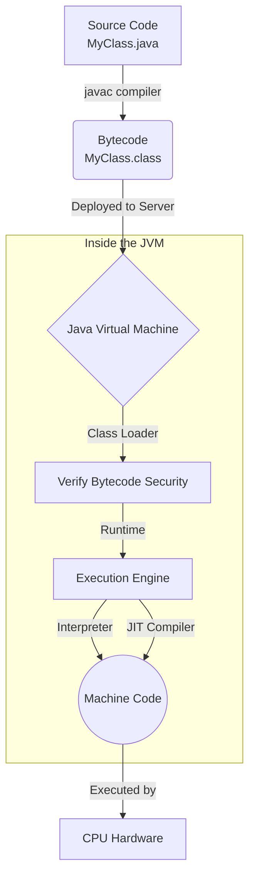
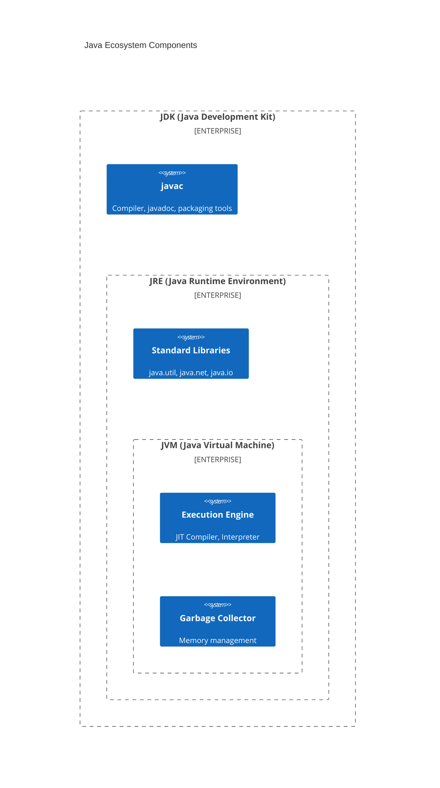

# 01 - How Java Works: The Compilation Pipeline

Before writing any Java code, you must understand how it executes. As a Python developer, you are used to the interpreter reading your `.py` source code line by line at runtime. Java completely separates compilation from execution.

## The Core Problem Java Solves

**What problem existed before this feature?**
In languages like C and C++, code must be compiled specifically for the target OS and hardware architecture (Windows vs Linux, x86 vs ARM). You had to distribute different unreadable binaries for every environment.

**How Java solved it:**
"Write Once, Run Anywhere" (WORA). Java compiles your source code into an intermediate format called **bytecode**. The local machine then runs a Java Virtual Machine (JVM) which translates that bytecode into machine code on the fly for whatever OS it is running on. You distribute one `.class` or `.jar` file, and as long as the target machine has a JVM installed, it runs perfectly.

## The Python vs Java Execution Model

**Python Model (Interpreted):**
```python
# execution.py
print("Hello World")
```
You run `python execution.py`. The Python interpreter parses the source code, compiles it into hidden bytecode (`.pyc`), and executes it in a single continuous step. If there's a syntax error on line 50, lines 1-49 will still execute before it crashes.

**Java Model (Compiled + Executed):**
```java
// Execution.java
public class Execution {
    public static void main(String[] args) {
        System.out.println("Hello World");
    }
}
```
You run `javac Execution.java`. This creates `Execution.class` (the bytecode). Then you run `java Execution`. 
If there's a syntax error anywhere in the file, **the compiler refuses to create the class file**. Zero code executes until the entire file is proven structurally valid.

### Key Difference
- **Python**: Compilation and execution are coupled. Catching type errors depends heavily on runtime execution or external tools (like `mypy`).
- **Java**: Compilation is a strict, separate barrier. You cannot deploy highly-flawed code because `javac` simply won't let you build it.

## The Java Execution Pipeline



### JIT (Just-In-Time) Compiler
Unlike Python which continuously interprets bytecode, the JVM monitors your running program. When it notices a particular method is executed thousands of times (a "hotspot"), the JIT Compiler kicks in. It compiles that Java bytecode directly into native machine code and caches it. The next time you call the method, it runs at the native speed of C/C++. This is why Enterprise Java apps often dramatically outperform Python backends for long-running processes.

## The JDK, JRE, and JVM

Here is the system architecture of the Java toolkit:



- **JVM** (Java Virtual Machine): The engine that actually runs the code.
- **JRE** (Java Runtime Environment): JVM + Core libraries. You need this to *run* applications.
- **JDK** (Java Development Kit): JRE + Compilers (`javac`) and developer tools. You need this to *write* applications. 

## Interview Questions

### Conceptual

**Q1: What is the difference between JDK, JRE, and JVM?**
> The JVM executes the bytecode. The JRE contains the JVM plus core libraries needed to run Java apps. The JDK contains the JRE plus development tools like the compiler (`javac`).

**Q2: What is the benefit of Java Bytecode over compiling directly to native machine code?**
> Bytecode provides platform independence. You compile once, and any machine with a JVM can run the exact same `.class` file, ensuring portability across multiple operating systems.

### Scenario / Debug

**Q3: You wrote `MyScript.java`, typed `java MyScript.java`, and got an error "Could not find or load main class". What went wrong?**
> Prior to Java 11, you could not run `.java` files directly. You must first compile it using `javac MyScript.java` to generate `MyScript.class`, and then execute the bytecode by typing `java MyScript` (without the `.class` extension).
> *(Note: Java 11+ does allow single-file source execution, but in typical Spring apps containing many files, the strict compiled-then-run pipeline is standard).*

**Q4: Your production server's CPU is spiking, and application performance is slow for the first few minutes after startup, but then it becomes extremely fast. Why?**
> This is classic JVM warmup. For the first few minutes, the JVM is strictly interpreting the bytecode. Once it identifies "hot" methods, the JIT (Just-In-Time) compiler translates them into highly optimized native machine code. After this warmup phase, the application hits peak performance.

### Quick Fire
- Does the JVM compile your source code? *(No, `javac` compiles source code into bytecode. The JVM runs the bytecode).*
- Can a `.class` file compiled on Windows run on Linux? *(Yes, bytecode is platform-agnostic).*
- What happens if your Java code has a syntax error? *(It will fail at compile-time and never produce a `.class` file).*
