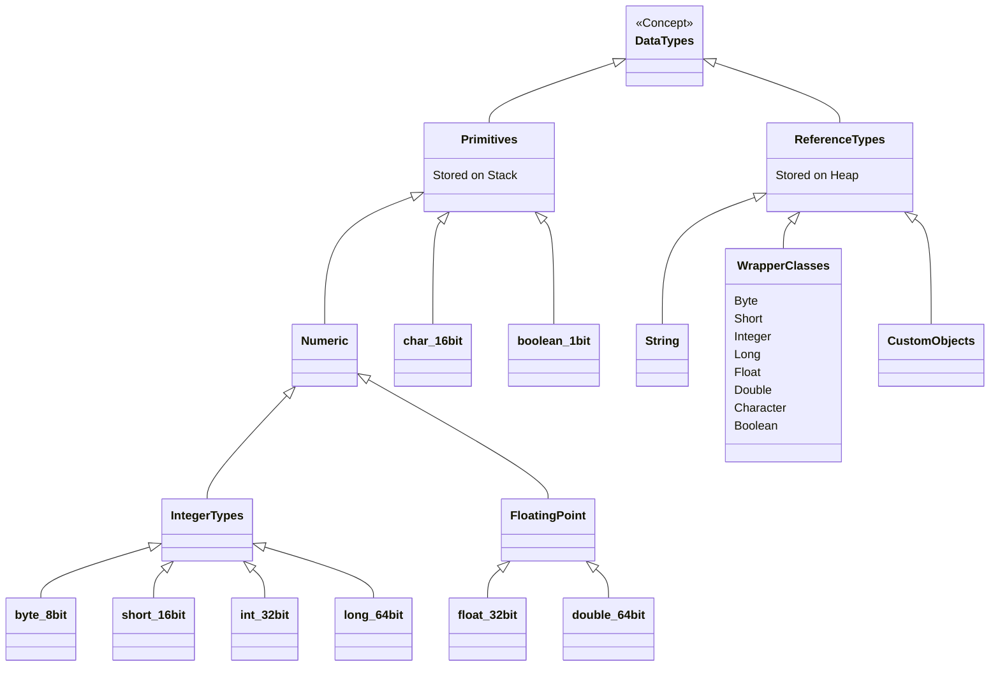

# 02 - Variables and Data Types

In Python, variables are just labels pointing to objects in memory. The type is bound to the object, not the variable. Java is **statically typed**. The type is strictly bound to the variable at compile-time.

## Primitives vs Objects

Python only has objects. Even simply `x = 5` creates an integer object on the heap.
Java splits its types into two distinct categories for performance:
1. **Primitives**: Raw data values stored directly in Memory (the Stack). They have no methods.
2. **Objects (Reference Types)**: Complex structures stored in the Heap. The variable just holds a pointer to the memory address.

## The Python vs Java Type Model

**Python Model (Dynamic & Object-Oriented):**
```python
# execution.py
age = 25       # age points to an int object
age = "twenty" # perfectly fine, now age points to a string object
```

**Java Model (Static & Strict):**
```java
// Variables.java
int age = 25;
// age = "twenty"; // COMPILE ERROR: incompatible types

String name = "Alice"; 
// 'age' is a primitive stored on the stack.
// 'name' is a reference stored on the stack, pointing to an Object on the heap.
```

### Key Difference
- **Python**: Variables don't have types, values do. 
- **Java**: Variables must declare their type upfront. A variable of type `int` can never hold anything other than an integer.

## The Java Type Hierarchy

Java provides Wrapper classes for primitives so they can be treated as objects when necessary (e.g., storing them in Collections, which don't accept primitives).



## The Autoboxing Trap

Because Java Collections (like `List` or `Map`) only store Objects, Java automatically converts primitives to their Wrapper counterparts. This is called **Autoboxing**. 
Converting back is called **Unboxing**.

```java
Integer count = 5; // Autoboxing: implicitly new Integer(5)
int rawCount = count; // Unboxing: implicitly count.intValue()
```

**The Trap**:
If an `Integer` object is `null`, unboxing it throws a `NullPointerException`. Primitives can NEVER be null.

## Interview Questions

### Conceptual

**Q1: What is the difference between a primitive type and a wrapper class?**
> Primitives (like `int`, `boolean`) hold raw values directly on the stack and have no methods. Wrapper classes (like `Integer`, `Boolean`) are full objects stored on the heap that contain a primitive value and provide utility methods. Wrappers can be null; primitives cannot.

**Q2: Why does Java still have primitive types instead of making everything an object like Python?**
> Performance and memory efficiency. Primitives are stored directly on the execution stack and require exactly their designated bit-size (e.g., 32 bits for an `int`). An `Integer` object requires memory for the object header + the payload, plus a pointer reference on the stack, drastically increasing the memory footprint and garbage collection overhead.

### Scenario / Debug

**Q3: You wrote `Integer count = null; int current = count;` and the application crashed. Why?**
> This is a classic NullPointerException caused by implicit unboxing. The compiler attempts to call `count.intValue()` to assign it to the primitive `current`. Because `count` is null, calling a method on it throws an NPE.

**Q4: You're doing high-frequency financial calculations involving money (e.g., $10.05). Should you use `double` or `float`?**
> Neither. Floating point numbers cannot accurately represent base-10 decimals, resulting in precision loss (e.g., 0.1 + 0.2 = 0.30000000000000004). You must always use `BigDecimal` for currency and precise mathematical calculations in Java.

### Quick Fire
- Which integer type is the default in Java? *(The `int` type).*
- Can a primitive `boolean` be null? *(No, the default is `false`. Only `Boolean` objects can be null).*
- What is "autoboxing"? *(The automatic conversion the compiler makes between the primitive types and their corresponding object wrapper classes).*
