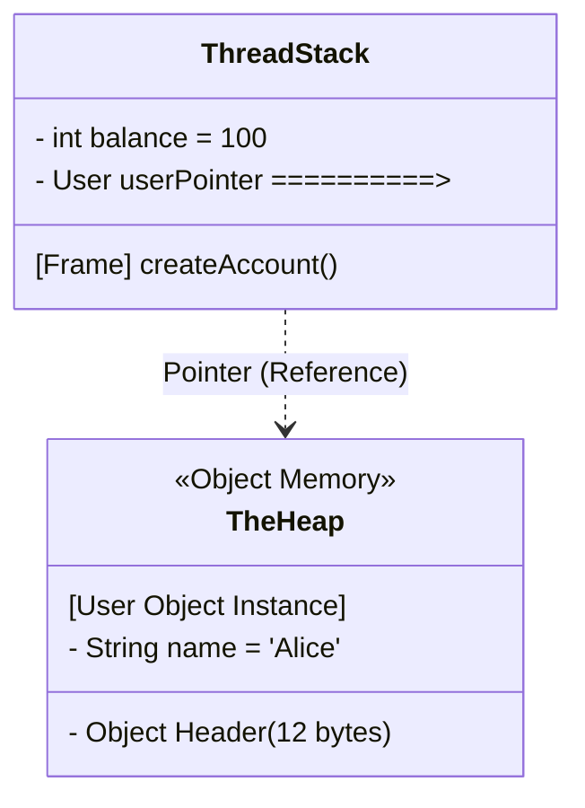

# Variables and Data Types: Memory Architecture

In Java, declaring a variable requires explicitly declaring its type because Java needs to know **exactly how many bytes** to allocate in RAM, and whether that memory lives on the Stack or the Heap.

## The Two Families of Types

Java rigidly divides data into two distinct categories:

### 1. Primitives (The Stack)
Primitives are the raw building blocks. They are not objects. They have no methods, no associated metadata, and no memory overhead. When you declare a primitive inside a method, it is typically allocated directly onto the **Thread Execution Stack**.

| Category | Type | True Size | Range Limit | Notes |
| :--- | :--- | :--- | :--- | :--- |
| Integer | `byte` | 8 bits | -128 to 127 | Good for raw data streams / network buffers. |
| Integer | `short` | 16 bits | -32k to 32k | Rarely used. Legacy compatibility. |
| Integer | `int` | 32 bits | -2B to 2B | **The default integer type.** Guaranteed atomic on 32-bit systems. |
| Integer | `long` | 64 bits | Extremely massive | Suffix with `L` (`long x = 100L`). |
| Decimal | `float` | 32 bits | 7 decimal digits | Suffix with `f` (`float y = 10.5f`). |
| Decimal | `double` | 64 bits | 15 decimal digits | **The default decimal type.** |
| Letter | `char` | 16 bits | 0 to 65,535 | Holds purely absolute Unicode characters. Use single quotes `'A'`. |
| Flag | `boolean` | 1 byte (JVM Dependent) | `true` or `false` | Arrays of booleans usually pack tightly, but single variables take an entire byte. |

### 2. References (The Heap)
Any type that is a `Class`, `Interface`, or `Array` is a Reference Type. Strings, Objects, and Arrays go here.
When you declare a Reference variable inside a method:
1. A small pointer (usually 32 or 64 bits) is allocated on the **Stack**.
2. The actual object payload (including its memory header) is allocated on the **Heap**.
3. The pointer points to the Heap memory address.

## Deep Practitioner Details

### Memory Layout: Stack vs. Heap
- **The Stack**: Every thread in Java gets exactly one Thread Stack. Every time a method is invoked, a "Stack Frame" is pushed. Local primitive variables and references live here. When the method finishes, the frame pops off, creating instantaneous garbage collection for those variables.
- **The Heap**: A massive, shared memory space where all Objects and Arrays live. It is heavily monitored by the Garbage Collector. Memory fragmentation occurs here.
- **Escape Analysis**: Modern JVMs are smarter than the textbook definitions. If the JIT Compiler detects that an object created in a method *never escapes* that method, it may perform **Scalar Replacement** and allocate the object's fields directly onto the Stack instead of the Heap, completely bypassing the Garbage Collector.

### Python Comparison: Value vs Reference

In Python, setting `x = 5` creates an Integer object on the heap, and `x` references it. If you do `y = x`, both point to the same object.

In Java:
```java
int x = 5; 
int y = x; // 100% physically copies the 32 bits from x to y on the Stack. 

StringBuilder sb1 = new StringBuilder("Hi");
StringBuilder sb2 = sb1; // Copies the 64-bit POINTER. Both now point to the EXACT SAME object on the Heap.
```
**Java is strictly "Pass-by-Value"**. 
When passing a primitive to a method, you are copying the bit values.
When passing an object to a method, you are copying the memory references. If the method alters the object referenced, the caller sees the changes because they share the exact same Heap object constraint.

---

## Technical Diagram: Stack vs Heap Allocation



---

## Interview Questions - Architect Level

**Q1: Why is Java strictly considered "Pass-by-Value" even when passing objects?**
> When you pass a primitive, Java makes a literal bitwise copy of the value. When you pass an object, it is impossible to pass the object itself. Instead, Java passes the *reference* (the memory pointer) by value. A bitwise copy of the memory address is created. Because both the original pointer and the copied pointer point to the identical memory space on the Heap, modifying the internal state of the object affects both. However, if the method reassigns the copied pointer to a `new` Object, the original pointer remains completely unaffected.

**Q2: What is the TLAB, and how does it speed up object allocation?**
> TLAB stands for Thread Local Allocation Buffer. Because the Heap is a globally shared memory space among all threads, creating `new` objects inherently causes lock contention. The JVM solves this by giving every thread its own small, exclusive chunk of memory on the Heap called the TLAB. Threads can allocate objects rapidly into their personal buffer without locking the rest of the application.

**Q3: Explain what "Escape Analysis" achieves at runtime.**
> Escape Analysis is an advanced optimization the JIT compiler performs. It examines the entire scope of a method. If it determines that an instantiated object is never passed out of the method, returned, or assigned to a global field, then the object does not truly "escape". The JIT will perform Scalar Replacement, breaking the object down into constituent primitive fields and allocating them perfectly onto the CPU registers or the Thread Stack. This essentially achieves instantaneous object creation and instantaneous garbage collection with zero heap overhead.
