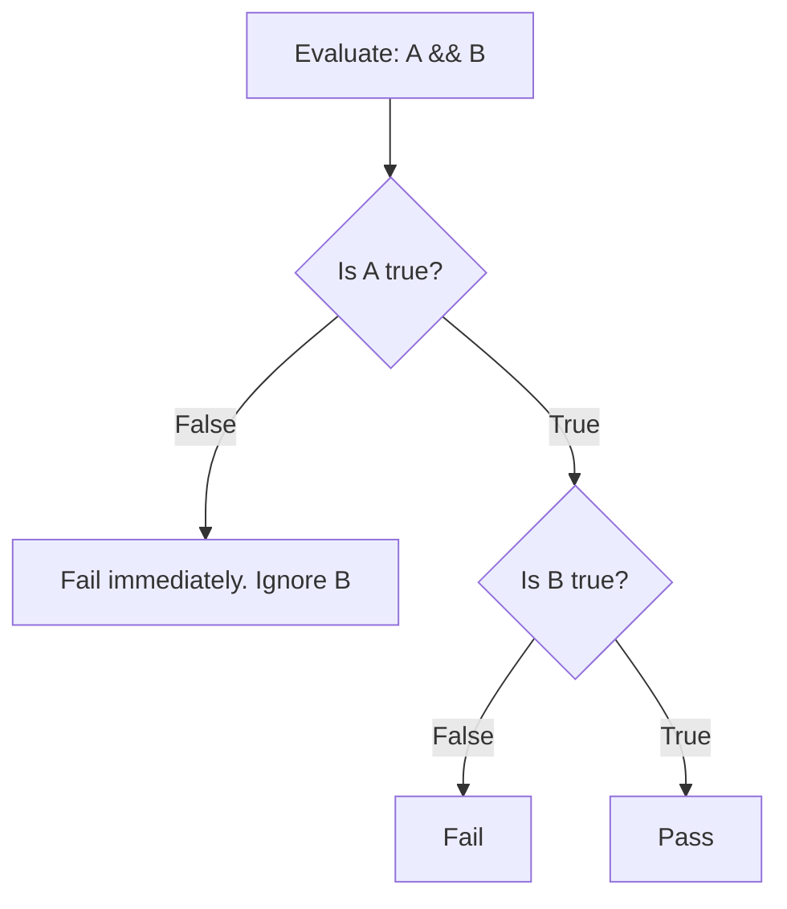

# Operators and CPU Mechanics

Java operators act identically to those in C and Python, performing arithmetic, logic, and bitwise manipulation. However, understanding their exact effect on the underlying execution engine unlocks major optimization potential.

## Operator Categories

### 1. Arithmetic Operators
`+`, `-`, `*`, `/`, `%`
- These translate directly to highly optimized ALUs (Arithmetic Logic Units) instructions on the CPU.
- **Warning**: Integer division truncates. `5 / 2` is `2`. You must promote to float first: `5 / 2.0` -> `2.5`.

### 2. Relational (Comparison) Operators
`==`, `!=`, `>`, `<`, `>=`, `<=`
- Crucially, `==` works differently based on the memory model.
- For Primitives: Compares exact bitwise values.
- For References: Compares memory addresses (pointers). Extremely fast, but rarely what you actually want (you usually want `.equals()`).

### 3. Logical Operators (Short-Circuiting)
`&&` (AND), `||` (OR)
- **Deep Practitioner Detail**: Short-circuiting isn't just a syntactic convenience; it controls entire bytecode branching paths.
  ```java
  if (user != null && user.isActive()) { ... }
  ```
  If `user` is null, the JVM *immediately* abandons the the right hemisphere of the statement. `.isActive()` is never parsed, preventing a `NullPointerException`. 
- **Bitwise Logic vs Short-Circuit**: Java also has `&` and `|` which act as non-short-circuiting boolean evaluators if provided booleans. They force the evaluation of both sides regardless of the outcome. (Rarely used in business logic).

### 4. Bitwise and Shift Operators
`&`, `|`, `^` (XOR), `~` (NOT), `<<`, `>>`, `>>>`
Perform operations at the binary level.
- `<< 1` (Left shift by 1) is mathematically identical to multiplying by 2.
- `>> 1` (Right shift by 1) is identical to dividing by 2 (preserving the negative sign).
- `>>> 1` (Unsigned right shift) forces zeros into the most significant bits regardless of sign.

## Python Comparison: Operator Overloading

In Python, virtually every operator is actually a method invocation under the hood. 
```python
a + b # Strictly calls a.__add__(b)
```
This is why you can add lists together, multiply strings, and define custom classes that intercept standard operators.

**Java explicitly forbids Operator Overloading.** 
The JVM mandates that operators belong exclusively to primitive types (with the single exception of `+` compiling down to `StringBuilder.append()` for `String` objects). 
This lack of overloading was an intentional design choice by James Gosling to guarantee that seeing `a + b` in enterprise code definitively means a cheap, guaranteed numeric addition, zero hidden method calls attached.

---

## Technical Diagram: Short-Circuit Branching



---

## Interview Questions - Architect Level

**Q1: What is the underlying physical distinction when evaluating Objects using `==` vs `.equals()`?**
> The `==` operator physically compares the binary values residing in the variable on the Thread Stack. For primitive variables, this is an instantaneous numerical equivalence check. For Object references, the value residing on the Stack is a 64-bit pointer. Therefore, `==` strictly checks if both pointers target the exact identical memory address on the Heap. The `.equals()` method dynamically invokes a virtual method to sequentially compare the logical internal state of the two Objects traversing the Heap.

**Q2: Why use `x << 1` instead of `x * 2` for extreme high-performance applications (like game engines or high-frequency trading APIs)?**
> At the bytecode level, multiplication (`imul`) requires the CPU's arithmetic logic unit to execute a complex multi-cycle instruction. A bitwise left shift (`shl`) operates directly on the CPU registers by physically shifting the bits one placement position towards the most significant bit. While modern JIT compilers often optimize `* 2` into a shift automatically, doing it explicitly guarantees the lowest CPU cycle execution profile directly at the algorithmic level.

**Q3: What does the Unsigned Right Shift (`>>>`) do, and why doesn't C/C++ have it?**
> In C/C++, integer types can be explicitly declared as `unsigned int`. Java explicitly rejects the concept of unsigned integer typings; all standard integer numeric types in Java are signed (meaning the first bit strictly defines positive/negative). Therefore, standard arithmetic right shift (`>>`) automatically propagates the sign bit to preserve negativity. The special unsigned right shift (`>>>`) was created organically to force a zero into the Most Significant Bit, allowing raw binary manipulation regardless of mathematical sign representation.
