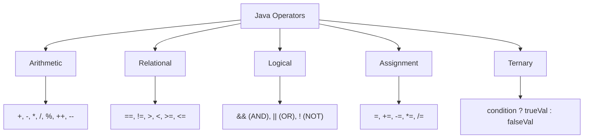

# 03 - Operators

Java operators are very similar to Python and C-family languages, but with a few strictly enforced type rules and different logical operator symbols.

## The Python vs Java Operator Model

**Python Model:**
```python
# execution.py
is_valid = True and not False
if age == 25: pass
greeting = "Hi " + "there"

# Python has `is` for identity and `==` for equality
if name == "Alice": pass # Checks value equality
```

**Java Model:**
```java
// Operators.java
boolean isValid = true && !false;
if (age == 25) {}
String greeting = "Hi " + "there";

// BE CAREFUL: Java's `==` is Python's `is`.
// Java's `.equals()` is Python's `==`.
if (name.equals("Alice")) {} // Checks value equality!
```

### Key Differences
- **Logical Symbols**: Python uses words (`and`, `or`, `not`). Java uses symbols (`&&`, `||`, `!`).
- **Equality Trap**: In Python, `==` compares values. In Java, `==` on Objects compares *memory addresses* (identity). You must use `.equals()` to compare Object values!
- **Ternary Operator**: Python's `x if condition else y` becomes `condition ? x : y` in Java.

## Operator Categories



### 1. Arithmetic
Standard math operations.
- **Trap**: Integer division truncates. `5 / 2` evaluates to `2`, not `2.5`. To get a decimal, at least one operand must be a float/double: `5.0 / 2`.
- **Increment/Decrement**: `x++` (post-increment) and `++x` (pre-increment) exist in Java but not in Python.

### 2. Relational
Used for comparing primitive values. Yields a `boolean`.
`==`, `!=`, `<`, `>`, `<=`, `>=`.

### 3. Logical
Used to combine boolean expressions.
`&&` (AND), `||` (OR), `!` (NOT). Both `&&` and `||` short-circuit (stop evaluating if the left side determines the outcome).

### 4. Ternary
A concise `if-else` statement that returns a value.
```java
int max = (a > b) ? a : b;
```

## Operator Precedence

Java evaluates expressions based on strict precedence rules.

```mermaid
flowchart LR
    1[Postfix: expr++, expr--] --> 2[Prefix: ++expr, --expr, !]
    2 --> 3[Multiplicative: *, /, %]
    3 --> 4[Additive: +, -]
    4 --> 5[Relational: <, >, <=, >=]
    5 --> 6[Equality: ==, !=]
    6 --> 7[Logical AND: &&]
    7 --> 8[Logical OR: ||]
    8 --> 9[Ternary: ? :]
    9 --> 10[Assignment: =, +=, etc.]
```

## Interview Questions

### Conceptual

**Q1: What is the difference between `&` and `&&`?**
> `&&` is the logical short-circuiting AND operator. If the left side is false, the right side isn't evaluated. `&` is the Bitwise AND operator, which evaluates both sides unconditionally and operates on individual bits if given integers.

**Q2: Why must you use `.equals()` instead of `==` to compare Strings?**
> A String is an Object. The `==` operator on objects compares their memory references (did they come from the exact same instantiation?). The `.equals()` method compares the actual character sequence inside the string for equality.

### Scenario / Debug

**Q3: `int percent = 50 / 100 * 1000;` What is the value of `percent` and why?**
> The value is `0`. Due to integer division, `50 / 100` truncates the decimal and evaluates to `0`. Then `0 * 1000` is `0`. You should reorder it to `50 * 1000 / 100` or use floating point math `50.0 / 100 * 1000`.

**Q4: Given `int x = 5; int y = x++;` what are the values of x and y?**
> `x` is 6 and `y` is 5. The postfix operator `x++` returns the current value of `x` (which is assigned to `y`), and *then* increments `x`.

### Quick Fire
- What is the Java equivalent of Python's `and`? *(`&&`)*
- Does Java have a `**` operator for exponents? *(No, you must use `Math.pow(base, exp)`)*
- What is the output of `!true`? *(`false`)*
