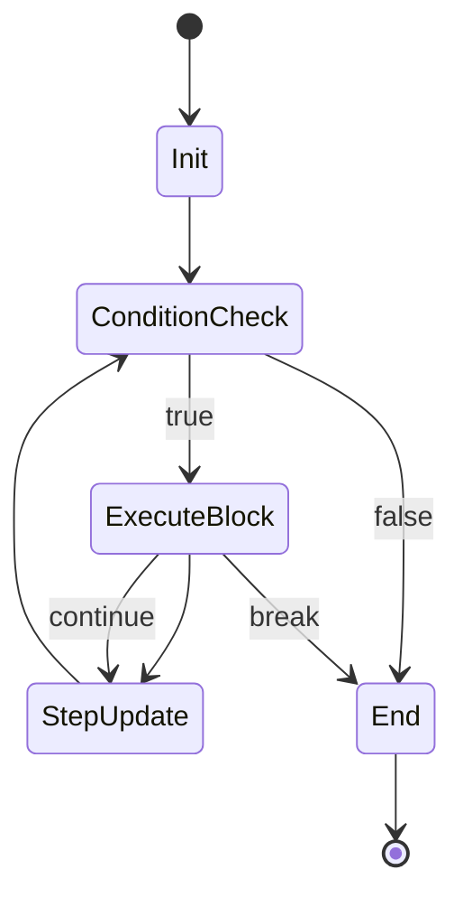

# 04 - Control Flow

Control flow in Java uses the same fundamental concepts as Python but with completely different syntax. Python relies on indentation; Java relies on curly braces `{}` and parentheses `()`.

## The Python vs Java Control Flow Model

**Python Model:**
```python
# execution.py
if age > 18:
    print("Welcome")
elif age == 18:
    print("Just barely")
else:
    print("Sorry")

for i in range(5):
    print(i)
```

**Java Model:**
```java
// ControlFlow.java
if (age > 18) {
    System.out.println("Welcome");
} else if (age == 18) {
    System.out.println("Just barely");
} else {
    System.out.println("Sorry");
}

for (int i = 0; i < 5; i++) {
    System.out.println(i);
}
```

### Key Differences
- **Scoping**: Python scopes by indentation. Java scopes by `{ ... }`. Indentation in Java is purely cosmetic (though strongly urged for readability).
- **For Loops**: Python's `for` loop is an iterator-based loop (`foreach`). Java has a traditional C-style for loop (`for (init; cond; step)`) AND an enhanced for-each loop (`for (Type item : collection)`).
- **Conditionals**: Python's `elif` is `else if` in Java. Conditions **must** be wrapped in parentheses `( )`.
- **Truthiness**: Python has "truthy" values (empty list = false, zero = false, None = false). Java does not. `if (myList)` is a compile error in Java. You must explicitly evaluate to a boolean: `if (!myList.isEmpty())`.

## Loop Execution States

Java handles loops using strict state transitions.



## Switch Expressions

Before Java 14, `switch` blocks were notoriously verbose and prone to "fall-through" bugs (forgetting the `break` keyword). Java 14 introduced **Switch Expressions**, which closely resemble Python 3.10's `match` statement.

**Old Switch (Avoid):**
```java
String type;
switch(day) {
    case "MONDAY":
    case "TUESDAY":
        type = "Weekday";
        break; // DANGER: Forgetting this means it executes the next case!
    default:
        type = "Unknown";
}
```

**New Switch Expression (Java 14+):**
```java
String type = switch(day) {
    case "MONDAY", "TUESDAY" -> "Weekday";
    case "SATURDAY", "SUNDAY" -> "Weekend";
    default -> "Unknown";
}; // No breaks needed! Returns value. 
```

## Interview Questions

### Conceptual

**Q1: What is the difference between `while` and `do-while`?**
> A `while` loop checks its condition at the very beginning. If false, it never executes. A `do-while` loop executes its block *first*, and checks the condition at the end. It is guaranteed to run at least once.

**Q2: What is the benefit of the enhanced `for-each` loop over the traditional `for` loop?**
> The enhanced for loop (`for (String name : names)`) prevents off-by-one index bugs out of the box because it delegates iteration to the underlying collection iterator. However, you do not have an index variable to modify during the iteration.

### Scenario / Debug

**Q3: You wrote `if (myList.size()) { process(); }` but the code won't compile. Why?**
> Java has no concept of "truthiness". The `if` statement expects a strict `boolean` expression. `myList.size()` returns an `int`. You must explicitly state your intent: `if (myList.size() > 0) { ... }` or better, `if (!myList.isEmpty()) { ... }`.

**Q4: You wrote a switch statement on an enum, but removing the `break` statement caused strange bugs where multiple cases executed. Why?**
> Traditional Java `switch` statements exhibit "fall-through" behavior. Once a case matches, it continues executing downward through all subsequent cases until a `break` is encountered. You should use the modern arrow-syntax switch expressions (`case X -> value;`) to entirely eliminate this bug vector.

### Quick Fire
- Does Java have `elif`? *(No, you must type `else if` separate words).*
- Can you use Strings in a traditional switch block? *(Yes, since Java 7 it works via hash comparisons).*
- Does indentation matter to the Java compiler? *(No, only the curly braces `{}` define block scope).*
