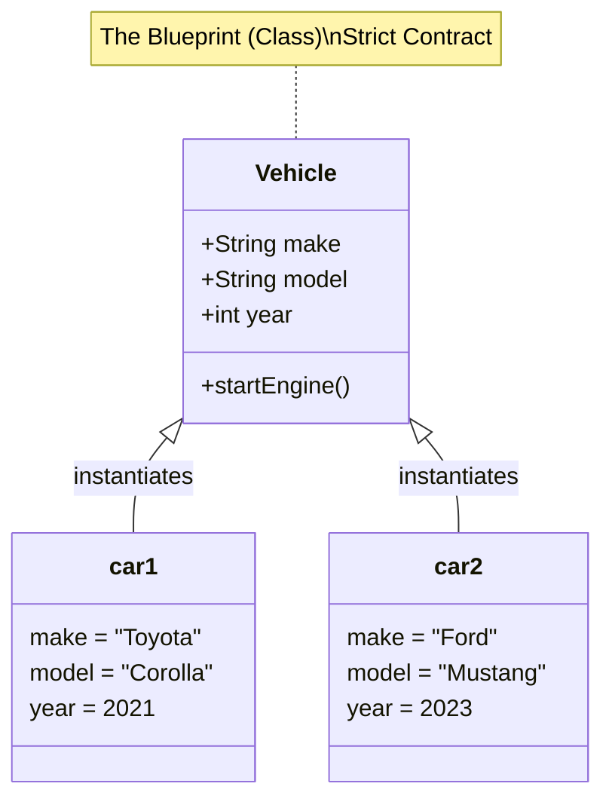
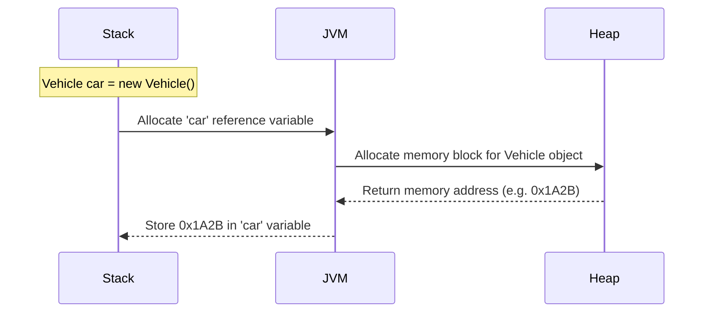

# 01 - Classes and Objects

> **Python Bridge:** In Python, a `class` is a dynamic object itself, and you can add properties at runtime arbitrarily (`obj.new_prop = "value"`). In Java, a `class` is a **strict blueprint**. If a property isn't declared in the class, it cannot exist on the object. Period.

## The Blueprint vs The Instance

- **Class:** The template or architectural blueprint. It defines the *state* (fields/variables) and *behavior* (methods) that objects created from it will have. It exists in the **Metaspace** memory and does not hold actual user data.
- **Object (Instance):** The actual house built from the blueprint. It holds concrete data (state) and exists in the **Heap** memory.

### Visualizing the Relationship



## The `new` Keyword and Memory (Crucial)

Unlike Python where you just call the class name like a function (`my_car = Car()`), Java requires the `new` keyword to explicitly allocate memory.

```java
// 1. Reference Variable (Stack)
Vehicle myCar; 

// 2. Memory Allocation + Instantiation (Heap)
myCar = new Vehicle(); 
```

### Memory Sequence



## Python vs Java Syntax Comparison

**Python:**
```python
class Vehicle:
    def __init__(self):
        self.make = "Unknown"  # Dynamic attribute creation

car = Vehicle()
car.new_property = "Added!"    # Valid in Python!
```

**Java:**
```java
public class Vehicle {
    String make = "Unknown";   // Strict declaration required
}

Vehicle car = new Vehicle();
// car.newProperty = "Added!"; // COMPILER ERROR
```

---

## Interview Questions

### Conceptual
**Q: What is the difference between an object and a class?**
A: A class is a logical blueprint that defines the structure and behavior, loading once per classloader. An object is a physical reality (instance) allocated in heap memory holding specific state.

**Q: Where are objects stored in Java compared to local variables?**
A: Objects (instances) are stored in the **Heap** memory. Local reference variables pointing to those objects are stored on the **Stack**.

### Scenario / Debug
**Q: You declare `Vehicle v;` and then call `v.startEngine();`. What happens?**
A: The compiler will throw an error: `variable v might not have been initialized`. If it was an instance variable (field) instead of a local variable, it would throw a `NullPointerException` at runtime because its default value is `null` until `new Vehicle()` is assigned to it.

### Quick Fire
- **Does Java support adding methods to an object at runtime?** No. Java has a statically typed, locked object model.
- **What keyword allocates heap memory for an object?** The `new` keyword.
