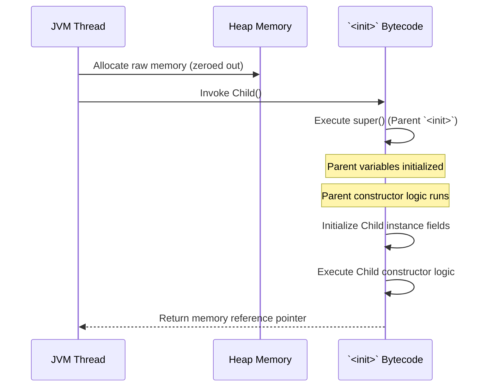

# Constructors: Bytecode Initialization (`<init>`)

A constructor is invoked when an object is instantiated. However, the Java compiler radically transforms what you write in Java into a highly specific bytecode instruction cycle.

## The `<init>` Method
At the JVM bytecode level, there is technically no such thing as a "constructor". When you compile your code, `javac` creates a special, hidden instance initialization method named `<init>`. 
Every time you use the `new` keyword, the JVM allocates the raw memory, then explicitly invokes the `<init>` method to set up the object state.

### The Immutable Ordering Rule
The JVM strictly enforces the initialization order natively:
1. `super()` is called. (The parent class's `<init>` MUST execute first).
2. Instance variable assignments are executed in sequential order.
3. The actual logic inside your constructor block is executed.

If you don't explicitly call `super()`, the compiler synthetically inserts `super();` at instruction line 0 of the constructor.

```java
public class Child extends Parent {
    private int x = 10;
    
    public Child() {
        // Line 1: super(); (Injected by compiler)
        // Line 2: this.x = 10; (Injected by compiler here!)
        System.out.println("Child ready");
    }
}
```
*Architect Trap:* Because instance variables are actually executed *after* `super()`, if you call an overridden method from inside the parent's constructor, that method will execute on the `Child` *before* the child's variables have been initialized! This causes catastrophic `NullPointException`s or `0` state bugs. **Never call an overridable method from inside a constructor.**

## Python Comparison: `__new__` vs `__init__`

In Python, object creation is a multi-step process. 
`__new__` physically allocates the memory and returns the empty object. `__init__` is then called to populate the object dictionary.

In Java, `new` is a raw keyword, not a method. You cannot override `new` to return a cached or different object. If `new` executes, memory *will* be allocated directly, and the exact `<init>` constructor *will* run. If you want cached objects (like Python's `__new__` can accomplish), you must fully obscure the constructor by making it `private` and forcing users through a `static` Factory Method.

---

## Technical Concept: The Initialization Pipeline



---

## Interview Questions - Architect Level

**Q1: What physically executes when you omit a constructor entirely from a Java class?**
> The Java compiler intervenes and synthesizes a "Default No-Argument Constructor" entirely consisting of a single recursive invocation payload: `super();`. This guarantees the hierarchical chain of `<init>` bytecode methods remains strictly intact all the way up to `java.lang.Object`.

**Q2: Explain why invoking an overridden method from within a base constructor is classified as an architectural anti-pattern.**
> The JVM enforces that local field initializations occur *after* the `super()` call. If a `Parent` constructor invokes a method, and the `Child` has overridden that method, polymorphically the `Child` implementation executes. However, because the JVM is still executing the `Parent` constructor, the `Child`'s local field initializations have not yet occurred. The overridden method will execute against uninitialized default values (e.g., null or 0), leading to silent and catastrophic runtime state drift.

**Q3: How do you prevent object instantiation strictly at the compiler level?**
> To absolutely guarantee a class cannot be instantiated using the `new` keyword (for utility classes like `Math` or strictly controlled Singletons), the constructor must be explicitly declared `private`. Because the constructor is inaccessible to external scopes, the compiler rejects any programmatic instantiation attempts.
