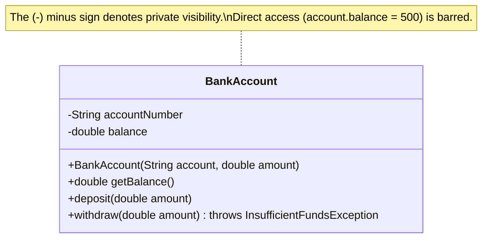

# 03 - Encapsulation

> **Python Bridge:** Python doesn't have true access modifiers. A single leading underscore (`_password`) is just a "gentleman's agreement" that developers shouldn't touch it. Java has **enforced encapsulation** using the `private` keyword, completely blocking access at compile time.

## Data Hiding via Getters and Setters

Encapsulation means bundling state (fields) and behavior (methods) together within a single unit (class), but more importantly: **restricting direct access to that state to protect it from outside interference**.

### The Rule

1. Make every single field `private` by default.
2. Provide `public` getters and setters **only if needed**.
3. Use the setters to enforce validation rules.

### Visualizing Protection



## Python vs Java Encapsulation

**Python:**
```python
class BankAccount:
    def __init__(self, balance):
        self._balance = balance # Just a convention
        
account = BankAccount(100)
account._balance = -9999        # Python allows this! No real protection.
```

**Java:**
```java
public class BankAccount {
    private double balance; // Strictly enforced by compiler

    public BankAccount(double initialBalance) {
        if (initialBalance >= 0) {
            this.balance = initialBalance;
        }
    }

    public double getBalance() {
        return this.balance;
    }

    public void withdraw(double amount) {
        if (amount > 0 && amount <= this.balance) {
            this.balance -= amount;
        } else {
            throw new IllegalArgumentException("Invalid withdrawal");
        }
    }
}

BankAccount account = new BankAccount(100);
// account.balance = -9999; // COMPILER ERROR
```

## Why Getters/Setters Instead of Public Fields?

1. **Validation:** You can prevent negative balances or invalid state.
2. **Read-Only / Write-Only:** A private field with only a `getBalance()` method becomes effectively Read-Only.
3. **Change Implementation:** If you change how balance is stored internally (e.g., from `double` to `BigDecimal`), the public `getBalance()` signature remains the same, so no other code breaks.
4. **Framework Standard:** Frameworks like Spring Boot, Hibernate, and Jackson *rely* completely on standard getters and setters to magically map JSON to Java Objects via Reflection.

---

## Interview Questions

### Conceptual
**Q: What is data hiding in Java?**
A: Data hiding restricts direct access to class members using access modifiers (like `private`), ensuring fields cannot be arbitrarily altered outside the class's authorized behavioral methods.

**Q: Explain Encapsulation vs Abstraction.**
A: Encapsulation is hiding the internal state to protect data integrity (Getters/Setters). Abstraction is exposing only the necessary functionality while hiding the implementation details (Interfaces/Abstract classes). "Encapsulation hides state; Abstraction hides complexity."

### Scenario / Debug
**Q: You mark a boolean field `isActive` as `private`. What should you name the getter method?**
A: The standard naming convention for boolean getters is `isActive()` (or sometimes `isObjectActive()`), not `getIsActive()`. The setter remains `setActive(boolean isActive)`. Spring/Jackson will look for the `is...()` method when serializing booleans.

### Quick Fire
- **Are methods usually marked private?** Sometimes, if they are internal helper functions that shouldn't be exposed to the outside API.
- **Can reflection bypass private fields?** Yes, using `Field.setAccessible(true)`, but this is discouraged in standard coding outside of authorized frameworks (like Hibernate).
