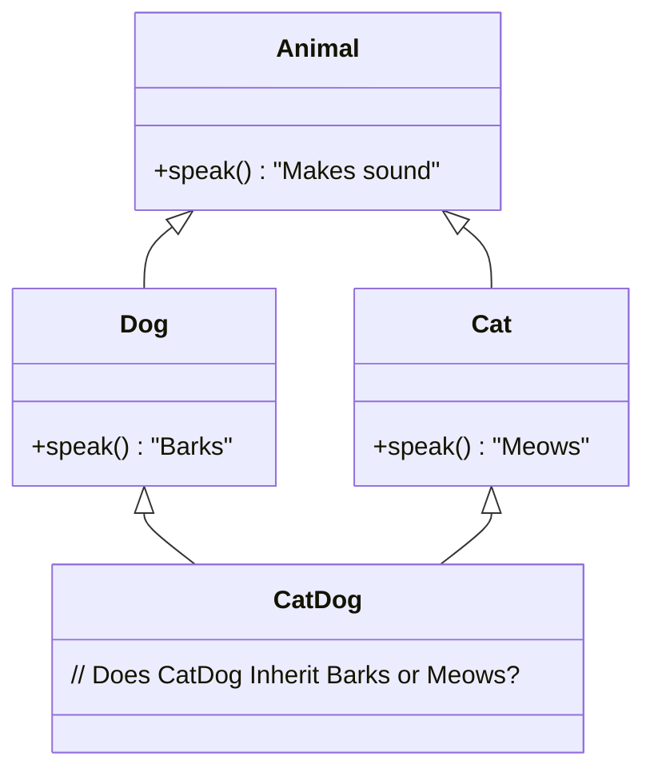

# 04 - Inheritance

> **Python Bridge:** Python supports Multiple Inheritance (`class Child(Parent1, Parent2):`). Java **strictly prohibits Multiple Inheritance** for classes to avoid the "Diamond Death Problem." A Java class can only inherit from exactly *one* immediate parent using the `extends` keyword.

## The "Is-A" Relationship

Inheritance establishes an "**Is-A**" hierarchy. A `Dog` Is-A `Animal`. A `SavingsAccount` Is-A `BankAccount`. The child class inherits all non-private fields and methods from the parent, allowing infinite code reuse.

### The Diamond Death Problem

If Java allowed multiple inheritance:

*Because Java only allows single inheritance, this ambiguity is physically impossible to create via classes.* (Java uses Interfaces to handle multiple behaviors).

## Python vs Java Syntax

**Python:**
```python
class Animal:
    def speak(self): print("Sound")

class Dog(Animal): # In parenthesis
    def speak(self): # Overriding
        super().speak()
        print("Bark")
```

**Java:**
```java
class Animal {
    void speak() { System.out.println("Sound"); }
}

class Dog extends Animal { // Uses "extends" keywords
    @Override // Highly recommended annotation
    void speak() { 
        super.speak();
        System.out.println("Bark"); 
    }
}
```

## The `super` Keyword

When dealing with inheritance, `super` refers to the immediate parent class, similar to `this` referring to the current class.

1. **`super.method()`:** Calls the method belonging to the parent.
2. **`super()`:** Calls the constructor belonging to the parent.
   - **CRUCIAL RULE:** If the parent class has a parameterized constructor, the child class *must* call `super(args)` as the absolute first line of its own constructor. Java will not guess data.

## Object Class: The Silent King

In Java, *every single class* inherits from `java.lang.Object`. If you type `class Dog {}`, the compiler actually interprets it as `class Dog extends Object {}`. This is where methods like `equals()`, `hashCode()`, and `toString()` come from.

---

## Interview Questions

### Conceptual
**Q: Why doesn't Java support multiple inheritance for classes?**
A: To prevent ambiguity known as the "Diamond Problem", where a class inherits from two parents who both have the same method signature, leaving the compiler guessing which implementation to prioritize.

**Q: Explain the difference between `super` and `this`.**
A: `this` refers to the current instance of the class (handling naming shadow issues and constructor chains). `super` specifically targets the immediate parent class (for calling overridden methods or parent constructors).

### Scenario / Debug
**Q: The parent class `Vehicle` has no default constructor, only `Vehicle(String make)`. The child class `Car extends Vehicle` has an empty block `{}`. Why does it fail to compile?**
A: The compiler inserts an invisible default constructor `Car() { super(); }` into the child. The invisible `super()` takes zero arguments and tries to call `Vehicle()`. But `Vehicle()` doesn't exist anymore! The developer must manually write a `Car` constructor to call `super(make)`.

### Quick Fire
- **What keyword is used to inherit from another class?** `extends`
- **What class is at the top of every hierarchy in Java?** `Object`
