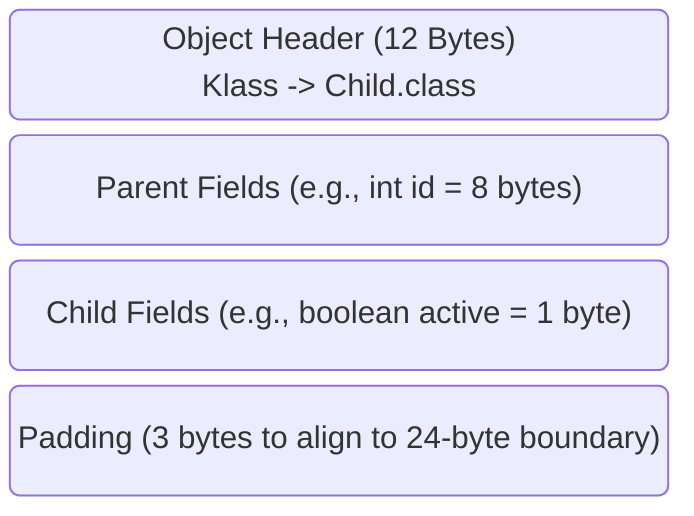

# Inheritance: Memory Structure and V-Tables

Inheritance (`extends`) allows a child class to inherit fields and methods from a parent class. While this promotes code reusability, a Senior Java Developer must understand how the JVM physically structures inherited objects in the Heap and how the compiler routes method calls.

## Memory Layout of Inherited Objects

When you instantiate a `Child` object, the JVM does *not* create two separate objects (a Parent and a Child). 

**The JVM creates a single, contiguous block of memory.** 
The memory block contains:
1. The 12-byte Object Header (Mark Word + Klass Pointer).
2. All instance variables declared in the `Parent` (even private ones!).
3. All instance variables declared in the `Child`.

*Architect Concept:* Even if a field in the Parent is marked `private`, it is still physically allocated inside the Child's memory block. The Child object physically possesses the memory; it is merely restricted by the compiler from directly addressing it syntactically.

## The Virtual Method Table (V-Table)

If a Child overrides a Parent's method, how does the JVM instantly know which one to execute at runtime? 
Java does not search the class hierarchy tree linearly every time you call a method (which would destroy performance). It uses an array of pointers called the **V-Table**.

1. Every `Class` defined in Metaspace has an internal array of memory pointers to its method implementations (the V-Table).
2. When a class is loaded, its V-Table is cloned from its Parent's V-Table.
3. If the Child adds a new method, it is appended to the bottom of the V-Table array.
4. If the Child *overrides* an existing method, the pointer at the exact same array index is silently swapped out to point to the new Child implementation.

When executing `child.print()`, the JVM looks at the object's Klass pointer, jumps instantly to an exact, mathematically fixed index in the V-Table array, and executes the highly optimized machine code. This is why Java method dispatch operates in `O(1)` constant time.

## Python Comparison: Multiple Inheritance and MRO

In Python, classes can inherit from dozens of disparate parents (`class Child(Base1, Base2):`). Because Python objects are hash dictionaries, resolving a method call forces the Python interpreter to traverse the inheritance tree node-by-node dynamically (Method Resolution Order - MRO) every single time a method is invoked. This is excruciatingly slow.

Java structurally outlaws multiple inheritance. By strictly enforcing a linear `Object -> Parent -> Child` chain, the JVM can map methods mathematically into a highly optimized, flat, contiguous memory V-Table. 

---

## Interview Questions - Architect Level

**Q1: How does Java simulate a structurally independent Parent object during `super()` execution if only a single memory block exists?**
> The `super()` constructor invocation does not create a functional "Parent Object". There is no separate object header. It simply commands the JVM execution engine to initialize the memory coordinates explicitly mapped for the Parent's declared variables living inside the contiguous Child object block footprint. The entire system is operating exclusively on a single object allocation.

**Q2: Since `private` inherited fields physically reside in the Child's Heap memory block, how does the JVM prevent the Child from mutating them?**
> Access Modifiers natively exist as semantic constraints only during the `javac` compile-time phase. The compiler rigorously scans variable assignments; if it detects an illegal access against a `private` field, it explicitly refuses to generate the final Bytecode execution. At runtime, the JVM structurally ignores it; a developer can trivially execute `Field.setAccessible(true)` via Reflection and dynamically overwrite the private parent memory residing locally in the Child object.

**Q3: Explain the mechanical process of method routing utilizing a V-Table array.**
> Virtual method dispatch executes utilizing memory offsets. When a method is compiled, the compiler dictates that method `B` will strictly reside at index offset `1`. When the instruction engine reads an `invokevirtual` bytecode instruction against the `Child`, it traverses the Klass pointer up into the native JVM Metaspace. It maps the array lookup at index `1`, instantly capturing the stored physical C++ machine code pointer execution address, regardless of whether that pointer leads to the base Parent implementation or a swapped Child overriding implementation.
