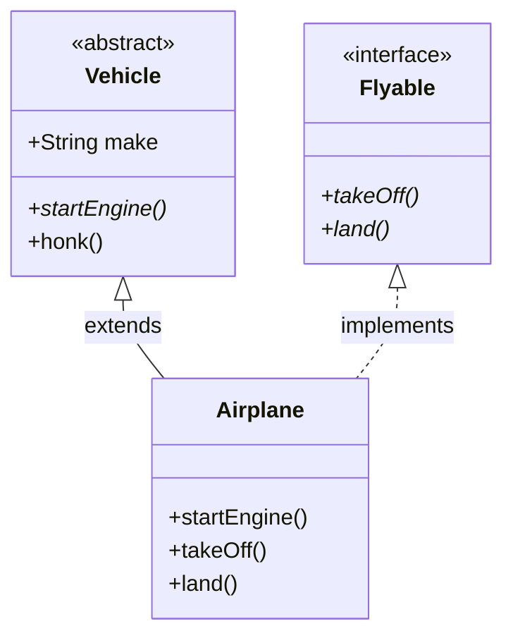

# 06 - Abstraction: Abstract Classes vs Interfaces

> **Python Bridge:** Python doesn't have strict abstract classes and interfaces natively (it relies on the `abc` module and `NotImplementedError`). Java treats abstraction natively as a first-class citizen. 

Abstraction is the concept of showing *what* an object can do, while hiding *how* it does it. In Java, there are two primary ways to force child classes to implement behavior.

## 1. Abstract Classes (`abstract class`)

An abstract class is a partially finished blueprint. It can contain fully implemented methods, but it also contains `abstract` methods with no body (just signatures).

- You **cannot** instantiate an abstract class (`new Shape()` is illegal).
- Child classes **must** override all abstract methods, or they must become abstract classes themselves.

## 2. Interfaces (`interface`)

An interface is a strict 100% contract (historically). It defines *capabilities* that a class promises to fulfill, regardless of where that class sits in the inheritance tree.

- A class can only `extends` ONE abstract class.
- A class can `implements` MULTIPLE interfaces.

### When to Choose Which?

```mermaid
flowchart TD
    Start[Design Decision] --> IsIt[Is it a core Identity?]
    IsIt -- Yes ("Dog IS-A Animal") --> ShareCode[Do they share common implemented code?]
    ShareCode -- Yes --> Abstract(Abstract Class)
    ShareCode -- No --> Inter1[Interface]
    IsIt -- No ("Dog CAN-RUN") --> Inter2(Interface)
```

### Visualizing the Hierarchy



## Java 8+ Interface Evolution (Important for Spring!)

Historically, Interfaces could only contain empty method signatures. Since Java 8, interfaces can contain **`default`** methods with full implementations!

Why did Java break its own rule? **Backwards compatibility.**
When Java added the `.stream()` method to the ancient `Collection` interface in Java 8, it would have broken millions of custom collections worldwide because they didn't have that method implemented. By creating `default void stream() { ... }`, they safely injected behavior into existing hierarchies. Note: Spring utilizes default interface methods heavily for repository behavior.

---

## Interview Questions

### Conceptual
**Q: What is the difference between an Abstract Class and an Interface?**
A: An abstract class represents an "Is-A" identity, can hold state (instance variables), and a class can only inherit one. An interface represents a "Can-Do" capability, holds no state (only `public static final` constants), and a class can implement dozens of them.

**Q: Can you instantiate an abstract class?**
A: No. But you *can* use an abstract class as a reference variable pointing to a concrete child object (Polymorphism!).

### Scenario / Debug
**Q: Interface `A` and Interface `B` both have a `default void doSomething()` method. A class implements both. Will it compile?**
A: The compiler will throw an error due to the Multiple Inheritance Diamond Problem arising from default methods. The implementing class must override `doSomething()` itself to resolve the ambiguity (it can arbitrarily call `A.super.doSomething()` inside its override if it wishes).

### Quick Fire
- **Do interface methods need to be marked `public`?** No, they are implicitly `public abstract` by default.
- **Can an interface extend another interface?** Yes, an interface can `extends` multiple other interfaces!
