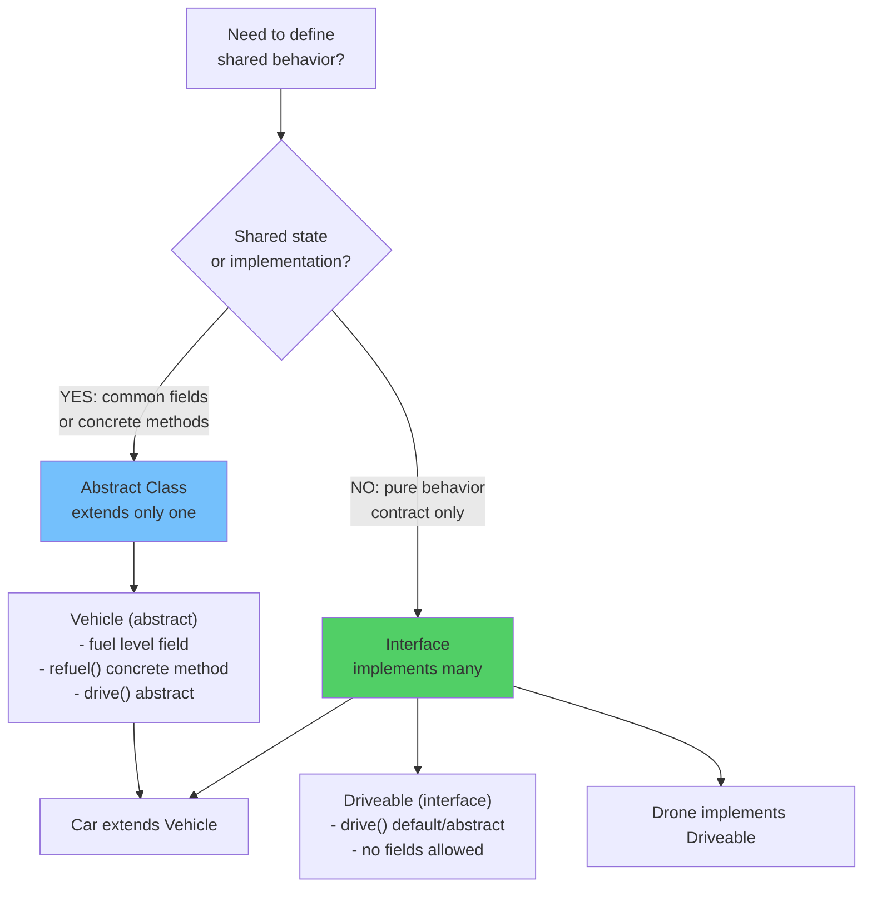

# Abstraction: Interfaces vs. Abstract Classes

Abstraction allows you to define behaviors while deferring the actual structural implementation. But at a deep architectural level, deciding between an **Interface** and an **Abstract Class** drives deep impacts into the JVM execution pipeline.

## Diagram: Abstract Class vs Interface Decision



## 1. Abstract Classes
An `abstract class` is a class that cannot be instantiated (`new Shape()` is illegal). It can possess abstract methods (no logic body) AND concrete methods (with logic).

- **Architect Concept (Memory Structure):** An abstract class actually functions exactly identically to a standard Java class in the Metaspace. It commands its own implicit `<init>` constructor. It consumes Heap memory allocation space to store its declared instance fields when its downstream Child is instantiated. The JVM merely installs a hard semantic compilation barrier blocking direct standalone structural initialization.

## 2. Interfaces
An `interface` purely defines behavior capabilities. Historically (before Java 8), it was forced to be 100% implicitly abstract.
Because a single Java class cannot map multi-inheritance linearly into a V-table memory array, Java natively permits an object to organically implement limitless Interfaces sequentially alongside a single primary Class parent.

### The Problem of Evolution: Default Methods
Before Java 8, if you added a new `print()` method signature into a universally shared interface (like `java.util.Collection`), literally every single enterprise server framework possessing that interface globally across the entire planet instantly broke compilation simultaneously overnight.

To execute massive internal architecture migrations safely, Java 8 formally unveiled **Default Methods** inside Interfaces.
```java
public interface Connectable {
    void standardMethod(); // Unimplemented 
    
    // Concrete Default Implementation!
    default void connectLog() {
        System.out.println("Default Interface Payload Executing");
    }
}
```
**Architect Concept:** The JIT compiler effectively injects the `.class` function executing bytecode directly natively inside the core Interface memory structure block residing in Metaspace. If a downstream generic implementing class does not universally intercept and deploy a localized override, the JVM dynamically routes execution fallback cleanly to the Interface default logic block using generic `invokeinterface` pointer lookups.

### The Final JVM Showdown: Abstract vs Interface
- **State Mutation (Fields):** Abstract Classes natively possess instance memory fields physically. They can modify variables internally per generic object instantiation. Interfaces organically cannot hold any internal mutatable per-object memory footprint; they universally only store completely globally shared `public static final` constants dynamically mapping into direct memory coordinates.
- **Multiple Binding Constraints:** A deep complex hierarchy mathematically restricts future API expansion dynamically if bound purely rigidly to an Abstract base Class linear parent sequence. Interfaces empower disparate objects (e.g., `Car` and `House`) to universally merge behaviors (`implements Insurable`) concurrently without breaking the internal Class lineage constraints.

## Python Comparison: ABCs (Abstract Base Classes)

Python inherently does not possess structural Java `interface` capability dynamically. Python functionally uses the `abc` library to emulate Abstraction:
```python
from abc import ABC, abstractmethod

class Animal(ABC):
    @abstractmethod
    def speak(self):
        pass
```
Because Python permits infinite generic multi-inheritance architecture unconditionally, there is fundamentally zero mechanical difference between an Interface and an Abstract Base Class organically within the Python memory engine processing. Java strictly explicitly isolates them physically into distinctly radically disparate Metaspace execution strategies (V-Tables vs I-Tables) to enforce extreme deterministic speed.

---

## Interview Questions - Architect Level

**Q1: Since an abstract class legally cannot be explicitly instantiated independently, can it safely possess constructors?**
> Absolutely, and in fact, it definitively naturally possesses them implicitly. Standard Child implementations forcibly sequentially navigate up the generic invocation memory chain universally triggering `super()` on every `<init>` invocation cycle. The abstract `<init>` constructor bytecode is universally required optimally to safely populate internal memory variables declared across the abstract lineage explicitly prior to granting execution payload capability. 

**Q2: What occurs dynamically if a Java Object arbitrarily implements two independent unique Interfaces that accidentally natively declare an identical `default` implementation signature?**
> The compiler encounters the "Multiple Default Inheritance Diamond Problem". Since the JVM essentially requires mathematically absolute predictable routing for method resolution dynamically, if a single `Class` intrinsically implements `A.print()` and `B.print()` concurrent defaults simultaneously, the internal compilation phase forcibly fails instantly declaring structural ambiguity. The developer must aggressively intervene natively inside the Class body to cleanly issue an explicit hardcoded `.print()` structural override, definitively mapping execution safely directly out of the ambiguity pipeline.

**Q3: Why functionally would an architect deploy an Abstract Class today if modern Java 8+ generic interfaces fully empower identical `default` and `static` structural implementations?**
> The physical line strictly revolves around **structural memory condition constraints**. Interface architecture structurally forbids intrinsic mutable instance object fields linearly. If the shared polymorphic infrastructure demands tracking complex localized instance state conditionally (`e.g., private int attemptsCount = 0;`), Interface architecture strictly collapses inherently. Abstract Classes fundamentally guarantee independent object state capability uniquely paired universally with polymorphic polymorphic abstraction execution natively together.
