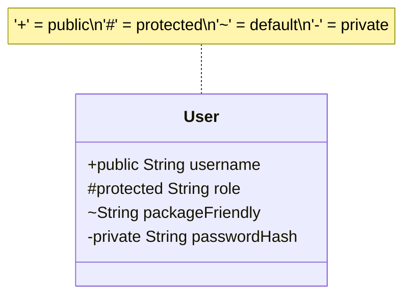

# 07 - Access Modifiers

> **Python Bridge:** Python has `public` by default, and `_private` by convention. Java has four mathematically strict levels of visibility enforced by the compiler.

## The Visibility Grid

Java uses four access modifiers to answer one question: *"If I am writing code in Class A, am I allowed to see a field/method in Class B?"*

| Modifier      | Same Class? | Same Package? | Child Class? (Diff Package) | The Whole World? |
|---------------|------------|--------------|----------------------------|-----------------|
| `private`     | ✅ Yes      | ❌ No         | ❌ No                      | ❌ No           |
| `(default)`   | ✅ Yes      | ✅ Yes        | ❌ No                      | ❌ No           |
| `protected`   | ✅ Yes      | ✅ Yes        | ✅ Yes                     | ❌ No           |
| `public`      | ✅ Yes      | ✅ Yes        | ✅ Yes                     | ✅ Yes          |

### Deep Dive

1. **`private`**: The baseline level. Only methods physically inside the exact same `{}` block can access it. Use this for 99% of fields.
2. **`(default)` (Package-Private)**: You don't type a keyword; just write `String name;`. Any class inside the same folder structure (package) can access it. *Note: Spring limits use of this outside of testing.*
3. **`protected`**: Includes everything from `default`, *plus* child classes located in completely different packages. Use this when writing an Abstract Class specifically designed to be extended by external libraries.
4. **`public`**: Anyone, anywhere can access it. Use this for class definitions, constructors, and getter/setter methods.

## Security Best Practices in Spring

1. **Entities/DTOs**: Fields `-private`, Getters/Setters `+public`.
2. **Services**: Class `+public`, dependency injected fields `-private`.
3. **Controllers**: Class `+public`, injected service `-private`, mapping methods `+public`.
4. **Repositories**: Interface `+public` (internally converted by Spring).

---

## Interview Questions

### Conceptual
**Q: What is the difference between `protected` and package-private?**
A: Package-private limits access strictly to the current package. `protected` grants the exact same package-level access, *but also* allows child classes residing in totally different packages to access the inherited member.

**Q: Can you mark a top-level Class as `private`?**
A: No. A top-level class can only be `public` or package-private. Making a top-level class `private` would mean absolutely nothing could ever see it or instantiate it. (You *can* make inner/nested classes private).

### Scenario / Debug
**Q: You override a `protected` method from a parent class, but you accidentally mark the overridden version as `default` (no modifier). Will it compile?**
A: No. Java restricts you from strictly reducing visibility when overriding. A `protected` method can be overridden as `protected` or `public` (increasing visibility), but it cannot be choked down to `default` or `private`.

### Quick Fire
- **What is the default modifier if you type nothing?** Package-private (often called default scope).
- **Should database repository fields in a service be public?** Absolutely not, they should be tightly encapsulated as `private final`.
