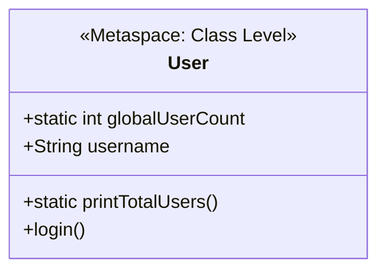

# 08 - Static Members

> **Python Bridge:** In Python, a variable declared inside a class but outside of `__init__` becomes a Class Variable (shared across all instances), but it can be shadowed by instance attributes. In Java, the `static` keyword explicitly creates a **Class-Level Variable or Method**.

## The `static` Keyword

By default, every time you use `new`, Java allocates fresh heap memory for the object's fields. But if you mark a field or method as `static`, it belongs to the *Class* itself, stored in the JVM's Metaspace, loading exactly once. 

- **Static Variable:** Shared tracking. If one object changes it, it changes for *every* object.
- **Static Method:** Utility behavior. A method that doesn't need to read or touch instance state (`this.`), and can be called directly using the `ClassName.methodName()`.
- **Static Block:** Code that executes automatically exactly once, the microsecond the Class is loaded into memory (often used for complex static initialization).

### Memory Visualization



```java
public class User {
    static int globalUserCount = 0; // Lives in Metaspace
    String username;                // Lives in Heap

    public User(String username) {
        this.username = username;
        globalUserCount++; // Shared counter increments!
    }
}
```

## `static final`: The Java Constant

If you combine `static` (belongs to the class) with `final` (cannot be changed), you create a global constant.

> **Convention:** Constants are always `UPPER_SNAKE_CASE`.

```java
public static final double PI = 3.14159;
public static final String API_VERSION = "v1.2";
```

## Why `public static void main(String[] args)`?

When you run a Java application, no objects exist yet. The JVM needs a way to kickstart the program *without* instantiating anything. By declaring `main` as `static`, the JVM can call the method directly from the Class signature.

---

## Interview Questions

### Conceptual
**Q: Can a `static` method call a non-static method in the same class?**
A: No. A `static` method belongs to the class blueprint and has no concept of "this" specific object. It cannot call an instance method because it doesn't know *which* instance's heap memory to target.

**Q: Where are static variables stored in Java 8+?**
A: They are stored in the **Metaspace** (formerly PermGen), alongside class definitions and metadata, not in the standard object Heap.

### Scenario / Debug
**Q: `User u = new User(); u.globalUserCount = 5;` Does this compile? Is it good practice?**
A: It *does* compile (Java allows you to access static variables through an instance reference as a legacy feature), but it is universally considered terrible practice. It hides the fact that the variable is global. You should strictly access it statically: `User.globalUserCount = 5;`. Most IDEs will flag instance-driven static access as a warning.

### Quick Fire
- **What executes first: a static block or the constructor?** The static block (`static { ... }`). It executes when the ClassLoader loads the class into memory, long before `new` ever gets called.
- **Can you override a `static` method?** No. Method overriding requires polymorphic runtime dispatch across objects. Static methods are resolved via early binding at compile time (Method Hiding).
