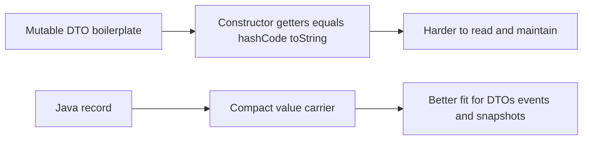

# Module 03: Advanced OOP

Welcome to the third module of the Java Foundation series. Here, we move from basic object-oriented concepts into the advanced features that show up in professional Java code.

If you plan to use frameworks like Spring Boot or Hibernate, mastering generics, annotations, and records is non-negotiable.

## Why Records Matter



## Concept Map
[View the Concept Mindmap](MINDMAP.md)

## Support Pack

Use these subtopic-level study aids alongside the lessons:

- [Progressive Quiz Drill](resources/progressive-quiz-drill.md)
- [One-Page Cheat Sheet](resources/one-page-cheat-sheet.md)
- [Top Resource Guide](resources/top-resource-guide.md)

## Topics Covered

1. **[Inner Classes](explanation/01-inner-classes.md)**
   - The 4 types of nested classes and when to use them for extreme encapsulation.
2. **[Enums](explanation/02-enums.md)**
   - Why Java enums are full-fledged classes under the hood, not just integer aliases.
3. **[Generics](explanation/03-generics.md)**
   - Writing flexible, type-safe code and understanding type erasure.
4. **[Annotations](explanation/04-annotations.md)**
   - Adding metadata to code and how reflection processors actually use it.
5. **[Wrapper Classes](explanation/05-wrapper-classes.md)**
   - Autoboxing, unboxing, and the performance cost of treating primitives like objects.
6. **[Records](explanation/07-records.md)**
   - Immutable data carriers for DTOs, snapshots, and API payloads.
7. **[The Object Class](explanation/06-object-class.md)**
   - The father of all Java classes, and the critical contract between `equals()` and `hashCode()`.

## Demos & Code Examples
The `explanation/` folder contains thoroughly commented, runnable Java files to prove the theory:
- `InnerClassDemo.java`
- `EnumDemo.java`
- `GenericsDemo.java`
- `AnnotationDemo.java`
- `RecordsDemo.java`

You can run any demo from the root of the monolithic project using Gradle:
```shell
./gradlew :00-java-foundation:run -PmainClass=RecordsDemo
```

## Exercises
When you are ready, test your knowledge:
- **[Ex01_GenericPair.java](exercises/Ex01_GenericPair.java)**: Build your own generic data structure.
- **[Ex02_StatusEnum.java](exercises/Ex02_StatusEnum.java)**: Build an enum with encapsulated state and logic.
