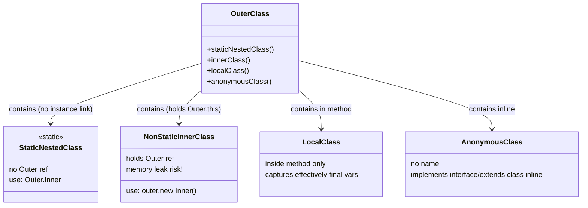

# Inner Classes in Java: A Deep Dive

Inner classes (or nested classes) are classes defined within another class. While they might seem like a simple syntactic convenience for logically grouping classes, their implementation in Java has massive implications for **memory management, encapsulation, and closure scope**.

Understanding how the JVM processes inner classes separates a junior developer from a deep practitioner.

## Diagram: Inner Class Type Hierarchy



## The Core Concept: Nested vs. Inner

Java distinctly categorizes these into two families:
1. **Nested Classes (Static)**: Essentially top-level classes that have been tucked inside the namespace of another class for organizational purposes.
2. **Inner Classes (Non-Static)**: Classes that are intimately tied to a specific *instance* of the outer class.

---

## 1. Static Nested Class
A static nested class does **not** hold a reference to the outer class instance. 

- **Use Case**: Used when a class is only relevant in the context of the outer class, but does not need to access the outer class's state (e.g., `Map.Entry` inside `Map`, or `Node` inside `LinkedList`).
- **Syntax**: `static class Inner {}`
- **Instantiation**: `Outer.Inner obj = new Outer.Inner();`

### 🧠 Deep Practitioner Detail: Bytecode Generation
At the JVM specification level, **there are no inner classes**. The JVM only understands top-level classes. When you compile `public class Outer { static class Inner {} }`, the Java compiler creates two entirely separate `.class` files:
1. `Outer.class`
2. `Outer$Inner.class`

For static nested classes, the relationship is purely syntactic sugar enforced by the compiler, not the runtime.

---

## 2. Member Inner Class (Non-static)
A member inner class is deeply coupled to an instance of the outer class. It can access all members (including `private`) of the outer instance.

- **Syntax**: `class Inner {}`
- **Instantiation**: `Outer o = new Outer(); Outer.Inner i = o.new Inner();`

### 🧠 Deep Practitioner Detail: The Invisible `Outer.this` pointer
How does a member inner class access the outer class's private variables? If the JVM only sees two separate `.class` files (`Outer.class` and `Outer$Inner.class`), how do they share state?
1. The compiler silently modifies the constructor of `Outer$Inner` to require a parameter: `Outer$Inner(Outer this$0)`.
2. It stores `this$0` as an invisible `final` field inside the inner class.
3. Every time you access an outer variable, the compiler translates it to `this$0.variableName`.
4. If the outer variable was `private`, the compiler creates a synthetic, hidden "package-private" accessor method in `Outer.class` (e.g., `static int access$000(Outer)`).

### 🚨 The "Memory Leak" Trap
Because every instance of a Member Inner Class holds a hidden, strong reference (`Outer.this`) to its parent, **the parent cannot be Garbage Collected as long as the inner instance exists.**
If you pass the inner instance to a long-lived thread or cache, you will accidentally leak the entire outer object. This is a notorious cause of `OutOfMemoryError` in UI frameworks like Android or Swing.

If your inner class does not *need* to access outer instance variables, **always make it `static`**.

---

## 3. Local Inner Class
A class defined inside a block consisting of a method body. 
- Scoped strictly to that method.

### 🧠 Deep Practitioner Detail: Variable Shadowing
If the local class has a field with the same name as the outer class, you must use Special `this` syntax to resolve it:
```java
public class Outer {
    int x = 1;
    public void start() {
        class LocalInner {
            int x = 2;
            void print() {
                System.out.println(x); // Prints 2
                System.out.println(this.x); // Prints 2 (LocalInner's x)
                System.out.println(Outer.this.x); // Prints 1 (The highly specific Outer instance pointer)
            }
        }
    }
}
```

---

## 4. Anonymous Inner Class
An inner class without a name, instantiated immediately where it is defined. Typically used to quickly implement interfaces or extend classes (e.g., `new Runnable() { ... }`).

### 🧠 Deep Practitioner Detail: "Effectively Final" Closure Capture
In Python or JavaScript, closures capture local variables by reference. If the variable changes later, the closure sees the updated value.
**Java does not work this way.** 

When an Anonymous/Local inner class accesses a local variable from its enclosing method, the Java compiler **creates a hidden copy** of that variable inside the inner class's memory. 
Because there are now two copies of the variable (one on the stack for the method, one on the heap in the object), modifying one would result in the other being out of sync.

To prevent this data inconsistency, Java enforces that any local variable accessed by an inner class must be **effectively final** (you can never change its value after initialization).

```java
public void makeRequest() {
    int id = 100; // Effectively final
    // id = 101;  // If you uncomment this, the line below will NOT COMPILE
    
    Runnable r = new Runnable() {
        public void run() {
            System.out.println(id); // Using the hidden, frozen copy of `id`
        }
    };
}
```

---

## Python Comparison

In Python, nested classes are strictly **Static Nested Classes**. There is no syntactical concept of a "Member Inner Class".

```python
class Outer:
    class Inner:
        def __init__(self):
            # Python Inner has NO access to Outer's internal state automatically
            # There is no `Outer.this` equivalent.
            pass
```

To achieve Java-like Member Inner functionality in Python, you must manually pass the outer instance, fully exposing the mechanism that Java hides from you:
```python
class Outer:
    def __init__(self):
        self.secret = 42
        
    class Inner:
        def __init__(self, outer_ref):
            self.outer = outer_ref
            
    def get_inner(self):
        return Outer.Inner(self) # We pass 'self' explicitly
```

Furthermore, Python's `lambda` handles variable closure by reference, often leading to the famous "late binding" loop closure bug. Java's "effectively final" copy restriction structurally prevents that exact class of bug.

---

## Interview Questions - Expert Level

**Q1: How does the JVM handle Inner Classes if the JVM specification doesn't recognize them?**
> The Java compiler synthesizes standard top-level `.class` files named `Outer$Inner.class`. To handle private variable access between them, the compiler injects hidden accessor methods (`access$000`) and passes a reference of the outer instance implicitly into the inner class constructor (`this$0`).

**Q2: What is the primary performance and memory danger of making a nested class non-static?**
> A non-static inner class holds a strong, implicit reference to the outer instance (`Outer.this`). If the inner class instance is long-lived or cached, the entire outer class object cannot be garbage collected, creating a massive memory leak. Therefore, nested classes should default to `static` unless they explicitly require outer instance state.

**Q3: Why must variables referenced by an anonymous inner class be "effectively final"?**
> Unlike languages with true reference closures, Java captures local variables by *value* (copying them into hidden fields in the generated `Outer$Inner` class). If the original variable could continue changing on the method stack, the copied value inside the inner object heap would silently drift out of sync. Java enforces "effectively final" to guarantee that both copies of the variable are identical forever.
