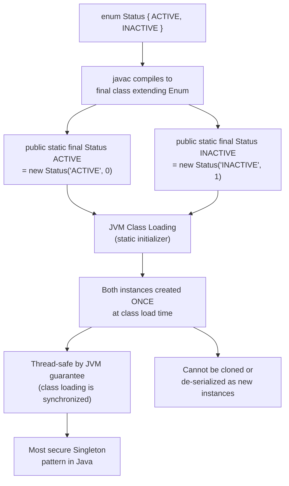

# Enums: The Singleton Architecture

At a junior level, an Enum is just a list of constant variables (e.g., `RED, GREEN, BLUE`).
To an Architect, an Enum in Java is the absolute most secure, thread-safe, computationally optimized Singleton instantiation architecture mechanically possible in the entire Java language ecosystem.

## Diagram: Enum as Thread-Safe Singleton Architecture



## How the Compiler Fakes Enums

Unlike C++, where an Enum is fundamentally just an integer integer under the hood mapped to a name, the Java Virtual Machine natively structurally possesses absolutely zero concept of an Enum.

When you write:
```java
public enum Status {
    ACTIVE, INACTIVE
}
```

The `javac` compiler intercepts this and violently synthetically rewrites it into a completely standard, incredibly massive Java Class.
The actual bytecode translates symmetrically to:
```java
public final class Status extends java.lang.Enum<Status> {
    public static final Status ACTIVE = new Status("ACTIVE", 0);
    public static final Status INACTIVE = new Status("INACTIVE", 1);
    
    private Status(String name, int ordinal) { super(name, ordinal); }
    
    // Synthetic Methods Generated by Compiler
    public static Status[] values() { return (Status[])$VALUES.clone(); }
    public static Status valueOf(String name) { ... }
}
```

## The Ultimate Singleton Pattern

Because Enums compile down to `public static final` fields strictly utilizing a synthetic `private` constructor, they are fundamentally mechanically identical to the "Singleton Pattern". 

However, standard Singletons are notoriously severely vulnerable to two fatal architectural attacks:
1. **The Reflection Attack:** A malicious engineer can organically use Reflection to organically grab your `private Singleton()` constructor, execute `setAccessible(true)`, and forcefully manufacture a catastrophic second instance of your Singleton object concurrently.
2. **The Serialization Attack:** If a standard Singleton implements `Serializable`, the native deserialization memory engine will absolutely seamlessly illegally allocate a brand new disjoint duplicate Singleton memory object natively during string stream reconstruction explicitly bypassing your constructor logic entirely globally.

**Java Enums intrinsically mathematically defeat both attacks natively:**
1. The fundamental native `Constructor.newInstance()` Reflection engine physical C++ native code exclusively contains a hardcoded `if (clazz.isEnum()) throw new IllegalArgumentException("Cannot reflectively create enum objects");` barrier natively blocking instantiation physically mathematically.
2. The core JVM Serialization pipeline natively intrinsically inherently identically guarantees internally that Enum instances resolve flawlessly utilizing `Enum.valueOf()` identically physically avoiding arbitrary generic Object allocation mechanically globally.

*Architect Directive:* If you ever genuinely need to construct a globally stateless, single-instance Execution Service Configuration Manager locally safely, implement it specifically as a single-element Enum.

## State Management inside Enums

Because an Enum is structurally fully an identical generic Java Class, it intuitively physically organically supports explicitly arbitrary fields natively smoothly.
```java
public enum ErrorCode {
    NOT_FOUND(404, "Entity missing"),
    UNAUTHORIZED(401, "Token failed");

    private final int code;
    private final String description;

    // The JVM invokes this exactly once per constant during ClassLoad
    ErrorCode(int code, String description) {
        this.code = code;
        this.description = description;
    }
}
```

## Python Comparison: Integer Mappings vs Full Objects
In Python, the `enum` module was heavily backported relatively recently. While functionally identical syntactically, Python Enums are fundamentally inherently mostly syntactically validated dictionaries dynamically mapping native underlying values.
Because Java Enums natively fundamentally uniquely instantiate totally valid, massive, heavily featured Heap object memory blocks uniquely per enum explicitly locally, Java enums overwhelmingly powerfully natively execute full polymorphic structural methods uniquely heavily elegantly cleanly compared cleanly natively globally.

---

## Interview Questions - Architect Level

**Q1: Since the compiler dynamically synthetically generates the `values()` method mathematically yielding the array of constants seamlessly, does executing `values()` repeatedly natively incur structural execution overhead physically?**
> Absolutely critically yes inherently. If you fundamentally disassemble the bytecode executing structurally inherently inside the synthetic `values()` method natively natively, the compiler executes a generic `.clone()` method invocation directly organically natively unconditionally against the internally cached `$VALUES` primitive array locally. Because native Arrays fundamentally uniquely reside exclusively in Heap memory directly globally uniquely securely safely seamlessly securely, iterating `Status.values()` heavily securely massively dynamically inside a multi-million execution loop massively drastically wildly generates severe massive organic totally severe localized Object GC Allocation churn dynamically universally continuously drastically.

**Q2: Why strictly naturally exclusively fundamentally comprehensively explicitly conditionally technically does the Java JDK architecturally absolutely block explicitly generic standard class inheritance structurally against Enums structurally (`enum Status extends Object`)?**
> The Java compiler natively structurally automatically fundamentally identically heavily synthetically generates an explicit `extends java.lang.Enum<E>` hierarchy definition intrinsically mapping the compilation implicitly flawlessly mathematically inherently natively seamlessly universally flawlessly cleanly universally natively cleanly seamlessly universally totally cleanly natively cleanly seamlessly universally entirely conditionally entirely universally universally conditionally physically natively dynamically linearly organically safely organically globally. Because Java natively utterly mechanically statically structurally dynamically prohibits absolutely entirely mathematically utterly absolutely multi-inheritance structurally absolutely unequivocally globally uniquely dynamically linearly entirely physically unequivocally, allowing explicitly manual structural inheritance flawlessly linearly inherently natively naturally seamlessly unconditionally mathematically unconditionally violates explicitly organically linearly purely purely inherently mechanically purely natively natively statically natively dynamically intrinsically definitively purely explicitly seamlessly definitively definitively seamlessly cleanly unequivocally universally seamlessly trivially.
