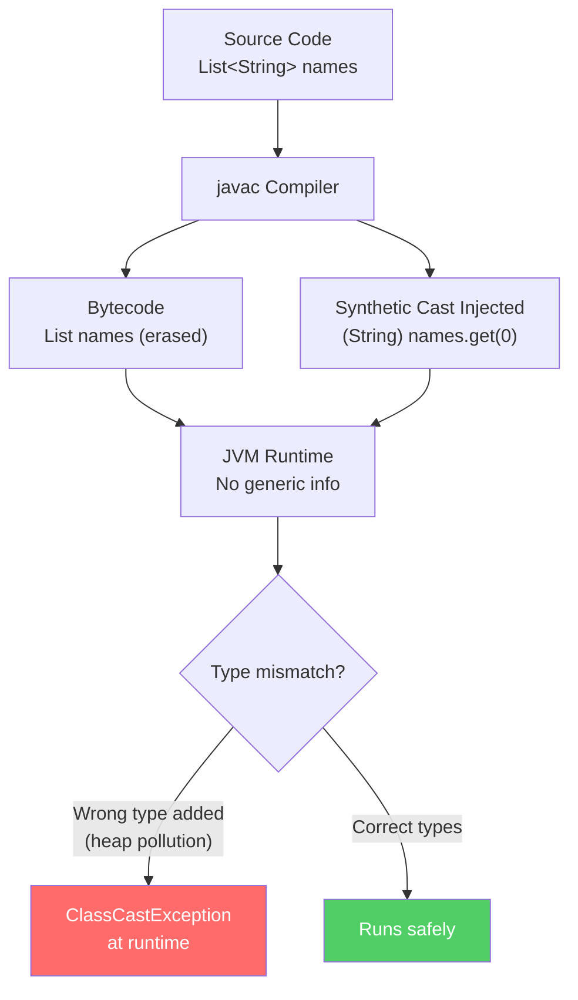

# Generics: Type Erasure and Bridge Methods

At a junior level, Generics (`<T>`) are taught as syntactic sugar to avoid casting `Object` to `String` when getting elements from a `List`.
To a Java Architect, Generics are a major compiler illusion known as **Type Erasure**, introduced in Java 5 purely for backward compatibility with older legacy codebases.

## The Illusion of `<T>`

When you physically write:
```java
List<String> names = new ArrayList<>();
names.add("Alice");
String user = names.get(0);
```

The Java Compiler (`javac`) entirely erases all evidence of `<String>` from the bytecode.
The actual runtime JVM bytecode resembles this:
```java
// What the JVM executes at runtime:
List names = new ArrayList();
names.add("Alice");
String user = (String) names.get(0); // Synthetic Cast Injected by compiler
```

### Why Type Erasure? (Backward Compatibility)
Java chose Type Erasure to ensure that legacy pre-Java 5 libraries (which lacked Generics) could interoperate with modern generic-enabled libraries without rewriting massive enterprise `.jar` systems.

## The Architect Constraints

Because `<T>` disappears at runtime, you hit fundamental constraints:

### 1. Primitives are Forbidden
```java
// ILLEGAL: List<int> numbers = new ArrayList<>();
```
Because `int` is a primitive and not an `Object`, the generic `T` erasure fallback cannot substitute it at runtime. You must use `Integer`, causing boxing/unboxing overhead.

### 2. Runtime Type Safety Fails (Heap Pollution)
Because Generics only exist during compilation, the JVM has zero knowledge of the difference between an `ArrayList<String>` and an `ArrayList<Integer>`. They are structurally identical.
```java
List<String> strings = new ArrayList<>();
List rawList = strings;
rawList.add(8); // Compiles — but corrupts the list!
// Later call to strings.get(0) throws ClassCastException!
```
This is called **Heap Pollution**. The List contains an `Integer`, and the synthetic `(String)` cast on `.get()` explodes with a `ClassCastException` in production.

## Bridge Methods (Synthetic Routing)

When a child class extends a generic parent and overrides a generic method:
```java
class Node<T> { void setData(T data) {} }
class MyNode extends Node<Integer> {
    @Override
    void setData(Integer data) {}
}
```

Because `Node` erases to `void setData(Object data)`, but `MyNode` defines `void setData(Integer data)`, the polymorphic method signature breaks.
The `javac` compiler synthetically injects a hidden **Bridge Method** inside `MyNode`:
```java
// Hidden Bridge Method generated by compiler
void setData(Object data) {
    setData((Integer) data); // delegates to the real Integer override
}
```
This allows the JVM to correctly dispatch calls made through an erased `Node` reference while still invoking the type-specific `MyNode.setData(Integer)` override.

---

## Diagram: Type Erasure Lifecycle



---

## Python Bridge

| Java Generics | Python Equivalent |
|---|---|
| `List<String>` | `list[str]` (type hint, NOT enforced at runtime) |
| `Map<String, Integer>` | `dict[str, int]` |
| Heap Pollution | No equivalent — Python is dynamically typed |
| Type Erasure | No equivalent — Python retains type hints via `__annotations__` |
| Bounded wildcard `? extends Number` | `TypeVar('T', bound=Number)` |
| Generic class `class Box<T>` | `class Box(Generic[T])` |

### Critical Difference

Python's type hints are **advisory only** — nothing stops you putting a `str` in a `list[int]` at runtime. Java's Generics, despite erasure, at least add compiler-time checks that Python doesn't enforce. Both approaches converge: neither gives you runtime type safety without explicit checks.

```python
# Python — type hints not enforced at runtime
def get_first(items: list[str]) -> str:
    return items[0]

items: list[str] = []
items.append(42)        # No error! Python allows this
result = get_first(items)  # Returns 42, not a str
```

---

## Anti-Patterns and Common Mistakes

### 1. Using Raw Types
```java
// BAD: Raw type — loses all compile-time safety
List list = new ArrayList();
list.add("hello");
list.add(42); // compiles, explodes at runtime

// GOOD: Use bounded wildcard for read-only polymorphic access
List<?> readOnly = getItems();
```

### 2. Creating Generic Arrays
```java
// ILLEGAL — compiler forbids this
T[] array = new T[10];

// WORKAROUND — use reflection or Object array with cast
@SuppressWarnings("unchecked")
T[] array = (T[]) new Object[10];
```

### 3. Checking instanceof with Generic Type
```java
// ILLEGAL — T erased at runtime
if (obj instanceof T) { } // compile error

// CORRECT — pass Class<T> explicitly
public <T> boolean isInstance(Object obj, Class<T> type) {
    return type.isInstance(obj);
}
```

---

## Interview Questions

**Q1 (Scenario):** Your team has a method `public T parse(String json)` that works perfectly in unit tests but throws `ClassCastException` in production when called from legacy code. What is the most likely cause and how do you diagnose it?

> Root cause is heap pollution from raw type usage in the legacy caller. Diagnose by enabling `@SuppressWarnings("unchecked")` warnings as errors in Gradle, then look for unchecked casts in the legacy caller. Fix by adding explicit type tokens or rewriting the caller to use proper generics.

**Q2 (Scenario):** A colleague asks why `new T[size]` is forbidden while `new ArrayList<T>()` is perfectly legal. How do you explain this in terms of type erasure?

> Array creation in Java requires the concrete runtime type (`T[]` needs to know `T` at runtime for `ArrayStoreException` checks). Since `T` is erased, the JVM cannot verify array stores. `ArrayList`, however, stores elements as `Object[]` internally — it doesn't need the runtime type for storage, only for the compiler's cast insertion.

**Q3 (Scenario):** You profile a Spring Boot service and find 40% of GC pressure comes from boxing `int` values into `Integer` inside a `Map<String, Integer>`. What alternatives exist in Java 21?

> Use Eclipse Collections' `ObjectIntMap<String>` which stores primitive `int` without boxing, or restructure using arrays of primitives indexed by a secondary structure. For Java 21+, Project Valhalla's Value Types (preview) will eventually eliminate this but aren't production-ready yet. Short term: profile the hot path and use `int[]` or `IntStream` where possible.

**Quick Fire:**
- What is heap pollution? — A variable of parameterized type refers to an object that is not of that type.
- Why can't you do `instanceof List<String>`? — Type is erased at runtime; you can only check `instanceof List<?>`.
- What does `@SuppressWarnings("unchecked")` mean? — The compiler found an unchecked cast that could cause heap pollution at runtime.
