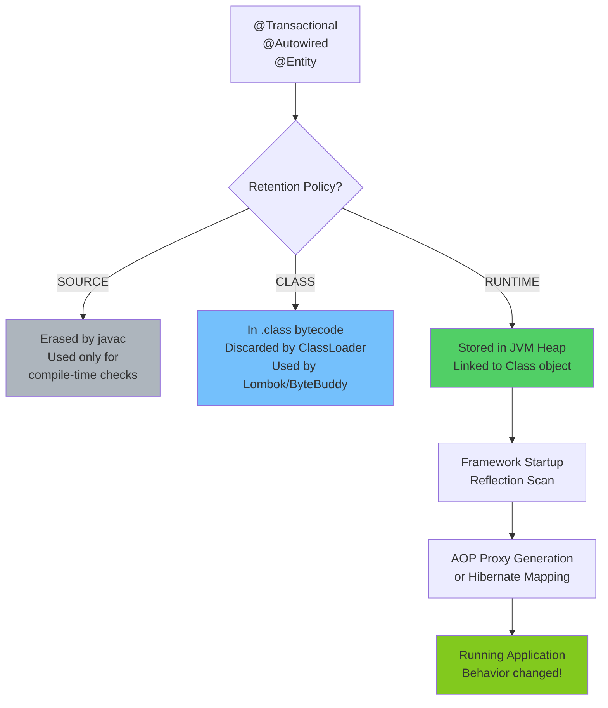

# Annotations: The Meta-Programming Engine

At a junior level, Annotations (`@Override`, `@Autowired`, `@Entity`) are taught as tags you put above methods and classes to make frameworks do magic.
To a Java Architect, Annotations represent the primary Declarative Meta-Programming architecture of the JVM, relying almost entirely on dynamic Reflection engines during ClassLoad initialization.

## Structurally: What is an Annotation?

Under the hood, an Annotation in Java is fundamentally just a standard Java `Interface`.

When you write:
```java
public @interface Transactional {
    int timeout() default 30;
}
```

The Java compiler compiles this down to essentially:
```java
public interface Transactional extends java.lang.annotation.Annotation {
    int timeout();
}
```

Because an annotation is literally just an interface, it physically cannot magically "do" anything. It contains zero execution logic. The `@Transactional` tag does absolutely nothing on its own.

## The Architect Architecture (AOP + Reflection)

For an Annotation to function, a separate execution framework (like Spring or Hibernate) must actively scan the executing class dynamically during application startup.

### Retention Policy (The Architect's Filter)
For a framework to scan for `@Transactional`, the Annotation must survive the compilation pipeline. This is controlled by `@Retention`.

1. **`SOURCE`** (Example: `@Override`). Erased completely by the compiler. Exists strictly to validate the Abstract Syntax Tree during compilation. Does not exist in the `.class` file.
2. **`CLASS`** (Default). Recorded into the `.class` bytecode file, but discarded by the ClassLoader during JVM initialization. Used for bytecode manipulation tools (Lombok, ByteBuddy).
3. **`RUNTIME`** (Example: `@Autowired`). Permanently embedded into JVM Heap memory associated with the `Class<?>` object. The only Retention Policy that allows Spring/Hibernate engines to use `class.getAnnotations()` dynamically.

## Performance Impact: The Reflection Bottleneck

When Spring boots up, it executes roughly this logic for every single Class:
```java
for (Method method : targetClass.getDeclaredMethods()) {
    if (method.isAnnotationPresent(Transactional.class)) {
        // Generate a synthetic Dynamic Proxy subclass in memory!
        return createTransactionalProxy(targetClass);
    }
}
```
**Architect Warning:** `getDeclaredMethods()` clones the entire array of `Method` objects every time it executes. Massive startup reflection scanning is the #1 reason Spring Boot microservices boot slowly in CI/CD pipelines compared to statically compiled languages like Go or Rust.

---

## Diagram: Annotation Processing Pipeline



---

## Python Bridge

| Java Annotations | Python Equivalent |
|---|---|
| `@Retention(RUNTIME)` | Python decorators (`@decorator`) — always available |
| `@interface MyAnnotation` | `class MyAnnotation` used as a decorator |
| `@Override` | No direct equivalent (Python has no compile-time override check) |
| `@Deprecated` | `@warnings.deprecated` (Python 3.13+) |
| Spring `@Autowired` | FastAPI `Depends()` — dependency injection via framework |
| Spring `@Transactional` | SQLAlchemy session context / Tortoise ORM `@atomic` |
| `getDeclaredMethods()` scan | `inspect.getmembers()` scan |

### Critical Difference

Python decorators are **first-class functions** — they execute code directly. Java annotations are **passive metadata** — they only make something happen if a framework scans for them. This is the core conceptual shift:

```python
# Python decorator — runs code immediately when applied
def transactional(func):
    def wrapper(*args, **kwargs):
        db.begin()
        try:
            result = func(*args, **kwargs)
            db.commit()
            return result
        except Exception:
            db.rollback()
            raise
    return wrapper

@transactional           # This IS the implementation
def transfer_funds():
    pass
```

In Java, `@Transactional` is just metadata. Spring must separately discover it, generate a proxy class, and wire it all together.

---

## Anti-Patterns and Common Mistakes

### 1. Using `@Transactional` on private methods
```java
// BROKEN: Spring generates a proxy that wraps the class.
// Private methods are called directly on 'this', bypassing the proxy.
@Service
public class PaymentService {
    @Transactional  // Has NO effect on private methods!
    private void processPayment() { }
}
```
Fix: Make the method `public` or `protected`.

### 2. Forgetting `@Retention(RUNTIME)` on custom annotations
```java
// BAD: Default retention is CLASS — invisible to Spring at runtime
public @interface AuditLog { }

// GOOD: Must be RUNTIME for framework scanning
@Retention(RetentionPolicy.RUNTIME)
@Target(ElementType.METHOD)
public @interface AuditLog { }
```

### 3. Self-invocation breaking AOP proxies
```java
@Service
public class OrderService {
    public void placeOrder() {
        this.validateOrder(); // Calls 'this' directly — bypasses proxy!
    }

    @Transactional
    public void validateOrder() { } // Transaction will NOT start here
}
```
Fix: Inject `ApplicationContext` and call `context.getBean(OrderService.class).validateOrder()`, or refactor to a separate bean.

---

## Interview Questions

**Q1 (Scenario):** A developer marks `validatePayment()` as `@Transactional` but the transaction never rolls back when the method throws an exception. Another developer marks `processOrder()` as `@Transactional` and it also fails to start a transaction. What are the two most likely root causes?

> First: `validatePayment()` might be private — AOP proxies cannot intercept private methods. Second: `processOrder()` might be called from within the same class (self-invocation), bypassing the proxy. Fix by making methods public/protected and extracting to a separate Spring-managed bean.

**Q2 (Scenario):** Your Spring Boot app takes 45 seconds to start in your CI pipeline. Profiling shows 80% of startup time is annotation scanning across 2,000 classes. What strategies reduce this?

> 1. Use Spring AOT (Ahead-of-Time) compilation (Spring Boot 3+) to pre-compute the application context at build time, eliminating runtime reflection. 2. Use `@ComponentScan` with explicit `basePackages` to limit scan scope. 3. Consider GraalVM native image compilation which eliminates startup reflection entirely. 4. Profile which auto-configurations are triggering unnecessary scans and exclude them with `@SpringBootApplication(exclude = {...})`.

**Q3 (Scenario):** You need a custom `@RateLimit` annotation that limits method calls to 100/second per user. Walk through exactly how you would implement this — from annotation definition to enforcement.

> 1. Define `@RateLimit` with `@Retention(RUNTIME)`, `@Target(METHOD)`, and a `limit` attribute. 2. Create a Spring `@Aspect` with `@Around` that intercepts methods annotated with `@RateLimit`. 3. In the advice, extract the current user from `SecurityContextHolder`, check a `RateLimiter` (e.g., Guava or Resilience4j), throw `TooManyRequestsException` if over limit, or proceed with `joinPoint.proceed()`.

**Quick Fire:**
- What does `@Target(ElementType.METHOD)` mean? — The annotation can only be placed on methods, not classes or fields.
- Can an annotation have another annotation on it? — Yes, these are called meta-annotations (e.g., `@Transactional` itself uses `@Retention` and `@Target`).
- What is the difference between `@Component`, `@Service`, `@Repository`? — Functionally identical (`@Service` and `@Repository` are specializations of `@Component`), but `@Repository` adds exception translation.
