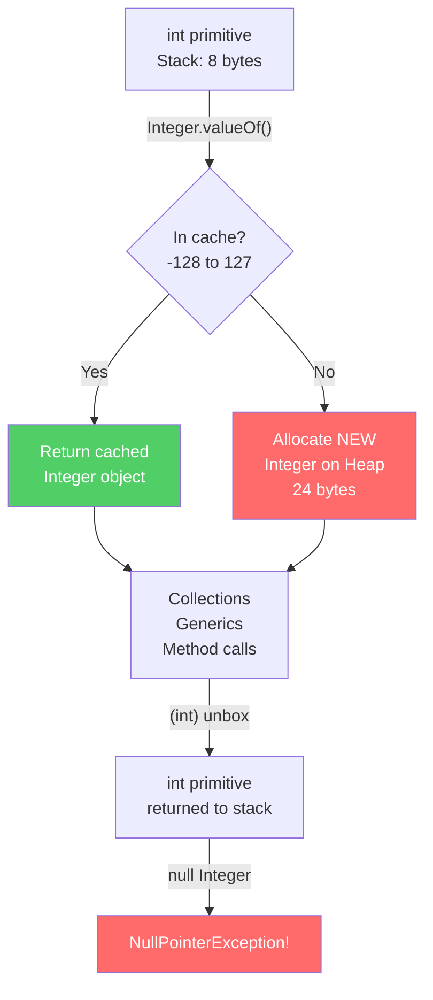

# Wrapper Classes: Autoboxing and Memory Caches

At a junior level, Wrapper Classes (`Integer`, `Long`, `Boolean`) are taught as the Object equivalents of primitive types (`int`, `long`, `boolean`), necessary because Generics like `ArrayList<Integer>` do not accept primitives.
To a Java Architect, Wrapper Classes represent the #1 source of hidden GC memory allocations, unintentional object instantiation loops, and silent `NullPointerException`s in production.

## The Cost of Autoboxing

Java 5 introduced Autoboxing to implicitly convert primitives to Wrappers automatically.
```java
List<Long> times = new ArrayList<>();
long current = System.currentTimeMillis();

// The compiler transforms this:
times.add(current);

// Into this bytecode:
times.add(Long.valueOf(current));
```

**The Architect Overhead:**
A bare `long` occupies exactly 64-bits (8 bytes) on the stack.
An equivalent `Long` object on the JVM Heap allocates:
- 12 bytes for the JVM Object Header (Mark Word + Klass Pointer)
- 8 bytes for the internally encapsulated `value` field
- 4 bytes of memory alignment padding
- **Total: 24 bytes per `Long` object — 3× more than the raw primitive!**

Adding 1,000,000 `long` values to an `ArrayList<Long>` allocates ~24MB of heap objects instead of 8MB of primitives. Each object is a separate heap allocation, causing CPU cache misses and triggering GC "Stop-The-World" sweeps.

## The Integer Cache Trap

To reduce boxing overhead, the JVM caches commonly used Integer values:
```java
// The JVM caches Integer instances from -128 to 127
Integer a = 100;
Integer b = 100;
System.out.println(a == b); // true — same cached instance!

Integer x = 200;
Integer y = 200;
System.out.println(x == y); // false — two different heap objects!
```

This is `Integer.valueOf()` using an internal static cache (`IntegerCache`). Values outside `[-128, 127]` are **always new objects**. Using `==` on Integer objects above 127 is a silent bug that only shows up at scale.

```java
// The production trap
public boolean isSameAccount(Integer accountId1, Integer accountId2) {
    return accountId1 == accountId2; // WRONG: use .equals()!
}
// Works in tests (IDs 1-10 are cached)
// Fails in production (IDs 10000+ are not cached)
```

## NullPointerException from Unboxing

```java
// getScore() returns Integer (nullable)
Integer score = playerRepository.getScore(playerId);

// Unboxing null throws NullPointerException!
int total = score + bonusPoints; // NPE if score is null

// CORRECT: check for null before unboxing
int total = (score != null ? score : 0) + bonusPoints;
// OR use Optional
int total = Optional.ofNullable(score).orElse(0) + bonusPoints;
```

---

## Diagram: Autoboxing and Integer Cache



---

## Python Bridge

| Java Wrapper Classes | Python Equivalent |
|---|---|
| `int` (primitive) | `int` (Python has no primitives — all ints are objects) |
| `Integer` (wrapper) | `int` (same object in Python) |
| Autoboxing overhead | No equivalent — Python `int` is always an object |
| Integer cache [-128, 127] | Python interns small integers (implementation detail, varies) |
| `Integer.MAX_VALUE = 2^31-1` | Python `int` is arbitrary precision — no max |
| `Long` (64-bit) | `int` (Python ints are arbitrary precision) |
| `Double` | `float` (Python uses 64-bit float like Java's `double`) |
| `Boolean.TRUE` / `Boolean.FALSE` | `True` / `False` (Python singletons) |

### Critical Difference

Python's `int` is **always** an object — there are no primitives. Java uses primitives for performance and Wrappers for APIs that require objects. This is a fundamental JVM/CPython architectural difference. NumPy closes the gap by providing true C arrays of raw numbers.

```python
# Python — no primitives, no boxing overhead
numbers = [1, 2, 3, 1000000]  # These are Python int objects

# For performance-critical number crunching, use numpy arrays
import numpy as np
arr = np.array([1, 2, 3, 1000000], dtype=np.int64)  # Raw C int64 array!
```

---

## Anti-Patterns and Common Mistakes

### 1. Using `==` instead of `.equals()` for Wrappers
```java
// BAD: identity comparison, fails for values > 127
Integer count1 = 500;
Integer count2 = 500;
if (count1 == count2) { } // false! Different objects.

// GOOD: value equality
if (count1.equals(count2)) { } // true
```

### 2. Mixing `long` and `Long` in sum loops
```java
// BAD: autoboxing on every iteration — 1M object allocations
Long sum = 0L;
for (long i = 0; i < 1_000_000; i++) {
    sum += i; // Unboxes sum, adds i, re-boxes the result!
}

// GOOD: use primitive in the loop
long sum = 0L;
for (long i = 0; i < 1_000_000; i++) {
    sum += i; // Pure stack arithmetic, zero heap allocations
}
```

### 3. Returning nullable Wrapper instead of OptionalInt
```java
// BAD: caller must null-check, easy to forget
public Integer findMaxScore(List<Player> players) {
    return players.isEmpty() ? null : players.stream()
        .mapToInt(Player::getScore).max().getAsInt();
}

// GOOD: OptionalInt communicates absence explicitly
public OptionalInt findMaxScore(List<Player> players) {
    return players.stream().mapToInt(Player::getScore).max();
}
```

---

## Interview Questions

**Q1 (Scenario):** A fintech service processes 10 million transactions per minute and you discover it uses `ArrayList<Double>` for price calculations in the hot path. Profiling shows 30% of CPU time in GC pauses. What is the root cause and fix?

> Root cause: autoboxing creates a `Double` heap object (24 bytes) for every `double` value stored in the `ArrayList<Double>`. At 10M/min that's 240MB of short-lived objects per minute triggering frequent Minor GC. Fix: replace `ArrayList<Double>` with `double[]` or Eclipse Collections' `DoubleArrayList`, which stores raw primitives. Also consider `DoubleStream` for aggregations to avoid boxing entirely.

**Q2 (Scenario):** A new developer on your team writes a unit test that passes: `assert getUserId() == 42`. The test passes in local dev but fails in CI where user IDs start at 500. What Java behavior explains this?

> Integer cache. The JVM caches `Integer` instances for values -128 to 127. In local dev, user IDs happen to be small (≤127) so `==` compares cached instances that are the same object. In CI, IDs are ≥500, so each `Integer.valueOf(500)` creates a distinct heap object, making `==` (identity comparison) return `false`. Fix: use `.equals()` or `int` primitive comparison.

**Q3 (Scenario):** You review code that does `Map<String, Boolean> flags = new HashMap<>()` and then `if (flags.get("enabled"))`. A reviewer flags this as a NullPointerException risk. Explain why and how to fix it properly.

> `flags.get("enabled")` returns `Boolean` (a wrapper), which can be `null` if the key doesn't exist. Unboxing `null` to `boolean` in the `if` statement throws NPE. Fixes: (1) use `Boolean.TRUE.equals(flags.get("enabled"))` — safe because `equals` handles null, (2) use `flags.getOrDefault("enabled", false)` to provide a default, (3) use `Map<String, Boolean>` and add `Objects.requireNonNullElse()`.

**Quick Fire:**
- What range does the Integer cache cover? — -128 to 127 by default (JVM flag `-XX:AutoBoxCacheMax` can extend the upper bound).
- Why does `Long sum = 0L` inside a tight loop kill GC performance? — Each `sum += i` unboxes sum, adds i, then re-boxes the result as a new `Long` object every iteration.
- What's the memory overhead of an Integer vs int? — int: 4 bytes on stack. Integer: ~16 bytes on heap (header + value field).
