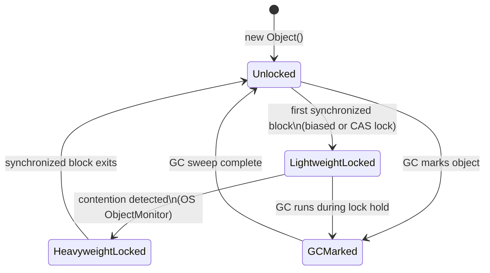

# The Object Class: The DNA of the JVM

At a junior level, `Object` is taught as the root parent class of every single class in Java, providing basic methods like `.toString()`, `.equals()`, and `.hashCode()`.
To a Java Architect, the `java.lang.Object` class represents the absolute lowest fundamental tier of JVM physical memory structure, providing intrinsic object headers for Garbage Collection, Object Monitor Locking, and native hash generation.

## The Physical Object Header

Every Java object instantiated on the JVM Heap carries an invisible **Object Header** — memory the JVM injects before your fields. You never write it; it's always there.

On a 64-bit JVM with compressed OOPs (default), every object has:

| Header Component | Size | Purpose |
|---|---|---|
| Mark Word | 8 bytes | GC age, lock state, identity hashCode |
| Klass Pointer | 4 bytes (compressed) | Pointer to the class metadata |
| **Total** | **12 bytes** | Before any of your fields! |

```java
// You think you wrote this:
class Point {
    int x;
    int y;
}

// The JVM allocates this on the heap:
// [Mark Word 8 bytes][Klass Ptr 4 bytes][x 4 bytes][y 4 bytes][padding 4 bytes]
// Total: 24 bytes — NOT 8 bytes!
```

The Mark Word is multipurpose — it changes its own internal layout based on the object's state:
- **Unlocked:** stores identity hashCode + GC age
- **Lightweight locked:** stores pointer to lock record on the calling thread's stack
- **Heavyweight locked (inflated):** stores pointer to OS-level `ObjectMonitor`
- **GC Marked:** stores forwarding pointer used during GC compaction

## The `hashCode()` Contract

The Object class defines the `equals`/`hashCode` contract that every Java HashMap, HashSet, and any hash-based structure depends on:

> **Rule:** If `a.equals(b)` is `true`, then `a.hashCode()` MUST equal `b.hashCode()`.
> The reverse is NOT required — two objects can have the same hashCode without being equal (this is a hash collision).

```java
// BROKEN: overrides equals but not hashCode
public class Employee {
    private String id;

    @Override
    public boolean equals(Object o) {
        if (this == o) return true;
        if (!(o instanceof Employee e)) return false;
        return Objects.equals(id, e.id);
    }
    // hashCode NOT overridden!
}

Employee e1 = new Employee("E001");
Employee e2 = new Employee("E001");

Set<Employee> set = new HashSet<>();
set.add(e1);
set.contains(e2); // FALSE — despite e1.equals(e2) being true!
// HashMap lookup will also fail silently.
```

## The `toString()` Default (The Debugging Trap)

The default `Object.toString()` returns `ClassName@HexHashCode`:
```java
Employee emp = new Employee("E001");
System.out.println(emp); // "Employee@7b23ec81" — useless in logs!

// Every production class should override toString()
@Override
public String toString() {
    return "Employee{id='" + id + "', name='" + name + "'}";
}
// Or use Lombok: @ToString
```

## `wait()`, `notify()`, `notifyAll()` — The Object Monitor

Because every Java object has a built-in monitor (via the Mark Word), any object can be used as a synchronization lock and a condition variable:

```java
class BoundedBuffer<T> {
    private final Queue<T> queue = new LinkedList<>();
    private final int capacity;

    synchronized void put(T item) throws InterruptedException {
        while (queue.size() == capacity) {
            wait(); // releases the monitor and waits
        }
        queue.add(item);
        notifyAll(); // wake up threads waiting to take
    }

    synchronized T take() throws InterruptedException {
        while (queue.isEmpty()) {
            wait();
        }
        T item = queue.poll();
        notifyAll(); // wake up threads waiting to put
        return item;
    }
}
```
`wait()`, `notify()`, `notifyAll()` must be called from within a `synchronized` block on the same object, or `IllegalMonitorStateException` is thrown.

---

## Diagram: Object Header State Machine



---

## Python Bridge

| Java Object Method | Python Equivalent |
|---|---|
| `Object.toString()` | `__repr__()` / `__str__()` |
| `Object.equals(Object)` | `__eq__(other)` |
| `Object.hashCode()` | `__hash__()` |
| `Object.getClass()` | `type(obj)` / `obj.__class__` |
| `synchronized(obj)` + `wait()`/`notify()` | `threading.Condition` |
| `instanceof` check | `isinstance(obj, MyClass)` |
| `Object.clone()` | `copy.copy()` / `copy.deepcopy()` |

### Critical Difference

Python enforces the equals/hash contract too:
```python
# Python — if __eq__ is defined, __hash__ is set to None
# unless you also define __hash__!
class Employee:
    def __init__(self, id): self.id = id
    def __eq__(self, other): return self.id == other.id
    # __hash__ is now None — Employee is unhashable!

e = Employee("E001")
{e}  # TypeError: unhashable type: 'Employee'
```
Java silently breaks HashMap/HashSet behavior. Python raises `TypeError` immediately. Python's failure mode is actually safer here.

---

## Anti-Patterns and Common Mistakes

### 1. Overriding `equals` without `hashCode`
As shown above — any object used in a HashMap or HashSet will silently fail lookups. Fix: always override both together. Use `Objects.equals()` and `Objects.hash()` helpers:
```java
@Override
public int hashCode() {
    return Objects.hash(id, department);
}
```

### 2. Using mutable fields in hashCode
```java
// BAD: if 'name' changes after insertion, the object is lost in the HashSet!
@Override
public int hashCode() {
    return Objects.hash(id, name); // name is mutable
}
```
Fix: compute hashCode only from immutable fields (`final` fields or `@Id`).

### 3. Calling `wait()` without a loop
```java
// BAD: spurious wakeups will break this
synchronized (lock) {
    if (queue.isEmpty()) {  // NOT a loop!
        lock.wait();
    }
}

// GOOD: always use while loop for wait conditions
synchronized (lock) {
    while (queue.isEmpty()) {  // Re-check after every wakeup
        lock.wait();
    }
}
```

---

## Interview Questions

**Q1 (Scenario):** A team's `CustomerOrder` objects are stored in a `HashSet` for deduplication. After a load test, duplicate orders appear in the set. Code review shows `equals()` is correctly overridden. What is the single most likely cause and how do you detect it?

> `hashCode()` is not overridden. Two equal `CustomerOrder` objects hash to different buckets, so `HashSet.contains()` looks in the wrong bucket and never finds the existing entry. Detect by adding `System.out.println(order1.hashCode() + " " + order2.hashCode())` for two equal orders — they will differ. Fix: override `hashCode()` consistent with `equals()`.

**Q2 (Scenario):** You profile a Spring Boot app and see `ObjectMonitor` inflation happening frequently on a shared `List`. What does this indicate and what would you change architecturally?

> ObjectMonitor inflation means the lightweight CAS-based lock was insufficient — multiple threads are contending on the same synchronized block. The JVM escalated to an OS-level heavyweight mutex. Fix: replace the synchronized `List` with a `ConcurrentLinkedQueue` or `CopyOnWriteArrayList`, or redesign to avoid sharing mutable state between threads (prefer message passing or `java.util.concurrent` structures).

**Q3 (Scenario):** A developer proposes caching `Customer` objects in a `HashMap<Customer, Account>` where the `Customer` class has mutable `email` field included in `hashCode()`. What production failure scenario would you predict?

> After a `Customer` is inserted, if its `email` changes, the computed `hashCode()` changes. The entry now lives in the wrong bucket. Any `map.get(customer)` call will compute the new hash, look in the wrong bucket, and return `null` — even though the entry exists. This is a "lost object" bug. Fix: base `hashCode()` only on immutable identity fields like `id`.

**Quick Fire:**
- What is the minimum size of any Java object on a 64-bit JVM? — 16 bytes (12-byte header + 4-byte padding alignment).
- Why must `wait()` be called inside a `while` loop? — To guard against spurious wakeups — the JVM may wake a thread even when the condition hasn't changed.
- What does `getClass().getName()` return vs `getClass().getSimpleName()`? — `getName()` returns the fully qualified name (`com.learning.Employee`); `getSimpleName()` returns just `Employee`.
