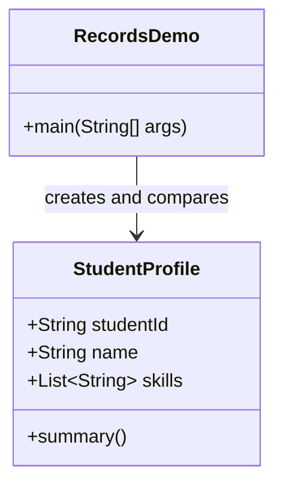

# Records: Immutable Value Objects Without Boilerplate

Before records, Java forced you to write the same repetitive data-carrier code over and over again: fields, constructor, getters, `equals()`, `hashCode()`, and `toString()`. That was fine when object models were tiny, but it became noisy and error-prone as APIs grew. Records were added to let Java express "this is a value object" directly in the type system instead of burying that intent inside boilerplate.

The deeper reason records matter is not convenience alone. In Spring applications, many objects are not "entities with behavior"; they are payloads, snapshots, and messages. Those objects should be easy to read, hard to mutate, and safe to compare by value. Records give you that contract by default, which makes them a natural fit for DTOs, event messages, and read models.

Because records are final, shallowly immutable value carriers, they reduce accidental state leaks. That matters in enterprise code where the same object may be logged, serialized, cached, or handed across threads. When you want a stable API contract, records are a better default than a mutable JavaBean.

## Python Bridge

| Concept | Python / FastAPI | Java / Spring |
|---|---|---|
| Immutable DTO | `@dataclass(frozen=True)` | `record UserResponse(...)` |
| Construction | Named fields at instantiation | Canonical constructor with components |
| Equality | Value-based `==` on dataclasses | Auto-generated `equals()` / `hashCode()` |
| Serialization payload | Pydantic model | Record used as controller/service DTO |

Python dataclasses and Pydantic models make data objects concise, but Java records go one step further by teaching the compiler that the object's main job is to carry values. That means the JVM and Spring ecosystem can rely on stable value semantics, and the code reader immediately knows the object should not be treated like a mutable state bucket.



## Working Java Code

```java
/**
 * ╔════════════════════════════════════════════════════════════════════════════╗
 * ║  FILE   : RecordsDemo.java                                                 ║
 * ║  MODULE : 00-java-foundation / 03-advanced-oop                             ║
 * ║  GRADLE : ./gradlew :00-java-foundation:run --args="RecordsDemo"          ║
 * ║  PURPOSE : Demonstrate records as immutable value carriers                 ║
 * ║  PYTHON  : @dataclass(frozen=True)                                         ║
 * ╚════════════════════════════════════════════════════════════════════════════╝
 */
package explanation;

import java.util.List;
import java.util.Objects;

/**
 * Record demo entry point and nested immutable payload.
 *
 * <p><b>Python FastAPI equivalent:</b>
 * <pre>
 *   @dataclass(frozen=True)
 *   class StudentProfile:
 *       student_id: str
 *       name: str
 *       skills: list[str]
 * </pre>
 */
public class RecordsDemo {

    /**
     * Immutable student snapshot used to demonstrate record semantics.
     *
     * <p><b>Python equivalent:</b> frozen dataclass used for API payloads.</p>
     */
    public record StudentProfile(String studentId, String name, List<String> skills) {
        public StudentProfile {
            Objects.requireNonNull(studentId);
            Objects.requireNonNull(name);
            Objects.requireNonNull(skills);
            studentId = studentId.strip();
            name = name.strip();
            skills = List.copyOf(skills);
        }

        String summary() {
            return studentId + " | " + name + " | skills=" + skills.size();
        }
    }

    /**
     * Prints the record's value semantics and defensive-copy behavior.
     *
     * @param args unused
     */
    public static void main(String[] args) {
        StudentProfile profile = new StudentProfile("S-101", "Asha", List.of("Java", "Spring"));
        System.out.println(profile);
        System.out.println(profile.summary());
    }
}
```

## Real-World Use Cases

In **REST APIs for e-commerce platforms**, records work well as request and response DTOs. A checkout endpoint can return a `PaymentSummary` record with the final amount, currency, and order ID. The benefit is that the payload stays stable and explicit; if you skip the record approach and use a mutable bean, it becomes easier for accidental setters or framework side effects to change the response shape.

In **event-driven systems at companies like Stripe or Netflix**, records are a strong fit for event payloads and audit snapshots. A `PaymentAuthorizedEvent` record gives you a compact, immutable message that is safe to serialize and replay. If you skip immutability here, consumers can accidentally mutate the payload after publishing, which makes debugging distributed workflows much harder.

## Anti-Patterns

1. **Using a record with a mutable collection and no defensive copy**
   ```java
   record UserProfile(List<String> roles) {}
   ```
   This is dangerous because the caller can mutate the list after construction and break the record's value semantics. The fix is to use a defensive copy in the compact constructor.
   ```java
   record UserProfile(List<String> roles) {
       UserProfile {
           roles = List.copyOf(roles);
       }
   }
   ```

2. **Treating a record like a JPA entity**
   ```java
   @Entity
   record Customer(Long id, String name) {}
   ```
   Records are final and immutable, which clashes with JPA's proxying and lifecycle needs. The fix is to use a normal entity class for persistence and a record for the DTO layer.
   ```java
   @Entity
   class CustomerEntity { /* mutable persistence model */ }
   record CustomerResponse(Long id, String name) {}
   ```

3. **Using a record when the object owns behavior and mutable state**
   ```java
   record Cart(int items) {
       void addItem() { /* mutate state */ }
   }
   ```
   This defeats the record's purpose. If the object needs identity, lifecycle, or internal mutation, use a regular class. Keep records for data carriers and snapshots.
   ```java
   class Cart {
       private int items;
       void addItem() { items++; }
   }
   ```

## Interview Questions

### Conceptual

**Q1: Why did Java add records when JavaBeans already existed?**
> JavaBeans solve "mutable object with many properties," but modern service layers often need the opposite: a small, explicit, immutable value object. Records reduce boilerplate and make the value semantics obvious, which helps API DTOs stay stable and easy to reason about.

**Q2: When should you choose a record instead of a normal class?**
> Choose a record when the object is a data carrier, snapshot, or message and its identity is the values inside it. Choose a normal class when the object has lifecycle, mutation, inheritance needs, or framework constraints like JPA proxying.

### Scenario / Debug

**Q3: A record contains `List<String> tags`, and later the tags suddenly change in logs. What happened?**
> The record likely stored a mutable list reference directly. Someone mutated the original list after construction, so the supposedly immutable record appeared to change. The fix is a defensive copy in the compact constructor with `List.copyOf(...)`.

**Q4: A teammate mapped a JPA entity directly as a record and Hibernate fails at runtime. Why is that a bad fit?**
> Records are final and immutable, while JPA expects a mutable entity model it can proxy, hydrate, and dirty-check. The safer design is entity class for persistence and record for API transfer.

### Quick Fire

- What does a record generate automatically? *(Constructor, accessors, `equals()`, `hashCode()`, and `toString()`.)*
- Why are records good for API DTOs? *(They are compact, immutable, and value-based.)*
- What should you do with mutable nested state in a record? *(Make a defensive copy.)*
