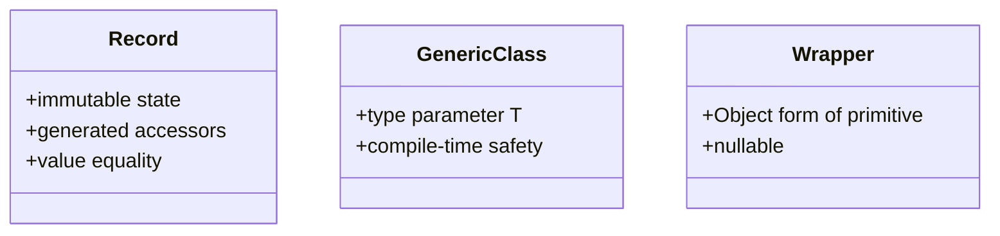

# Advanced OOP One-Page Cheat Sheet

## Fast Rules

| Topic | Rule |
|---|---|
| Records | use for immutable DTOs, snapshots, and payloads |
| `equals()` / `hashCode()` | define value identity, not memory identity |
| Generics | prefer them over raw types and casts |
| Wrappers | use only when an API needs objects, nulls, or collections |
| Collections | choose by order, uniqueness, lookup speed, and mutability |

## Python Bridge

| Java | Python |
|---|---|
| record | frozen dataclass |
| generic class | `TypeVar` / typed container |
| wrapper `Integer` | boxed int-like object in object-only APIs |
| `HashSet` | set |
| `LinkedHashSet` | ordered dedupe structure |

## Common Traps

1. Mutating data after putting it in a value object.
2. Using raw `Object` instead of a type parameter.
3. Comparing wrapper objects with `==`.
4. Assuming a collection preserves order when it does not.

## Interview Questions

1. Why are records a better default than mutable DTO classes?
2. Why do generics improve both readability and safety?
3. When would you choose `LinkedHashSet` over `HashSet`?
