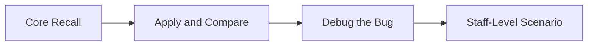

# Advanced OOP Progressive Quiz Drill



## Round 1 - Core Recall

**Q1.** Why do records exist when Java already has classes?

**Q2.** Why does `equals()` / `hashCode()` matter more for value objects than for mutable objects?

**Q3.** What problem do generics solve in collections and service APIs?

**Q4.** Why are wrapper classes important even though primitives are faster?

## Round 2 - Apply and Compare

**Q5.** You need to move immutable data across a service boundary. Would you choose a record or a mutable class? Why?

**Q6.** You need a type-safe reusable holder for different payload types. Would you use generics or raw `Object`? Why?

**Q7.** You need to store unique values while preserving insertion order. Which collection would you choose and why?

## Round 3 - Debug the Bug

**Q8.** What is wrong with this code?

```java
record User(String name, List<String> roles) { }
```

The caller passes a mutable list and mutates it later.

**Q9.** Why is this comparison unreliable?

```java
Integer a = 1000;
Integer b = 1000;
System.out.println(a == b);
```

**Q10.** What bug is hidden here?

```java
List raw = new ArrayList();
raw.add("Java");
raw.add(123);
```

## Round 4 - Staff-Level Scenario

**Q11.** A Spring Boot codebase has DTOs, entities, and API snapshots that all mutate freely. Which advanced OOP concepts would you standardize first?

**Q12.** A team keeps getting equality bugs in caches and sets. What would you review in their object design, and why?

---

## Answer Key

### Round 1 - Core Recall

**A1.** Records are a concise way to model immutable data carriers. They reduce boilerplate and make value intent explicit.

**A2.** Value objects should compare by content, not identity. If equality semantics are wrong, sets, caches, deduplication, and test assertions become unreliable.

**A3.** Generics let the compiler enforce type safety before runtime. That removes casts and prevents mixed-type mistakes in shared APIs.

**A4.** Wrappers allow primitives to participate in object-only APIs like collections. They also introduce nullability and allocation costs, so they must be used carefully.

### Round 2 - Apply and Compare

**A5.** Choose a record. It communicates immutability, gives you generated value semantics, and matches the snapshot style of service boundaries.

**A6.** Use generics. Raw `Object` pushes type checking to runtime and makes the API harder to use correctly.

**A7.** `LinkedHashSet` is the best fit. It preserves insertion order and prevents duplicates.

### Round 3 - Debug the Bug

**A8.** The record stores a mutable list directly. That breaks the immutability promise. Use `List.copyOf()` in a compact constructor.

**A9.** `==` compares object identity, not numeric value. For wrappers, especially outside the small-integer cache, it can produce misleading results.

**A10.** The raw collection disables compile-time type safety. Mixed types can slip in and create runtime `ClassCastException` later.

### Round 4 - Staff-Level Scenario

**A11.** Standardize on records for immutable payloads, generics for reusable APIs, wrapper awareness for nullable boxed values, and explicit collection choices for ordering and uniqueness.

**A12.** Review `equals()`, `hashCode()`, mutability, and defensive copying. Those are the core contracts that make objects safe in sets, maps, caches, and concurrent code.
