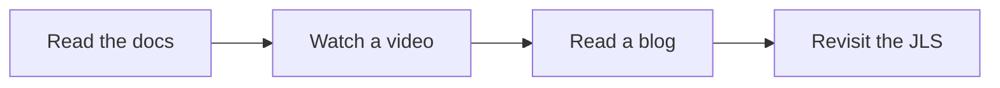

# Advanced OOP Top Resource Guide

Curated external resources for records, generics, wrappers, and object contracts.

## Records

1. [Dev.java: Using Records to Model Immutable Data](https://dev.java/learn/records/)
2. [Dev.java: Working with Records](https://dev.java/learn/reflection/records/)
3. [Oracle JLS: Records](https://docs.oracle.com/en/java/javase/15/docs/specs/records-jls.html)
4. [Microsoft Learn: All about Java Records - Part 1](https://learn.microsoft.com/en-us/shows/java-for-beginners/all-about-java-records-part-1)
5. [Microsoft Learn: All about Java Records - Part 2](https://learn.microsoft.com/en-us/shows/java-for-beginners/all-about-java-records-part-2)

## Advanced OOP Reading

1. [Xebia: What Are Java Records?](https://xebia.com/blog/what-are-java-records/)
2. [InfoWorld: Introduction to Java records](https://www.infoworld.com/article/4058874/introduction-to-java-records-simplified-data-centric-programming-in-java.html)
3. *Effective Java, 3rd Edition* by Joshua Bloch

## Python Bridge

| Java concept | Python analog |
|---|---|
| record | frozen dataclass |
| value equality | dataclass equality semantics |
| generics | typed collections / `TypeVar` |
| wrapper classes | boxed primitives / object-only APIs |

## Use This Order

1. Start with Dev.java for the mental model.
2. Read the JLS if you want language-level precision.
3. Watch one record video, then revisit the code.

