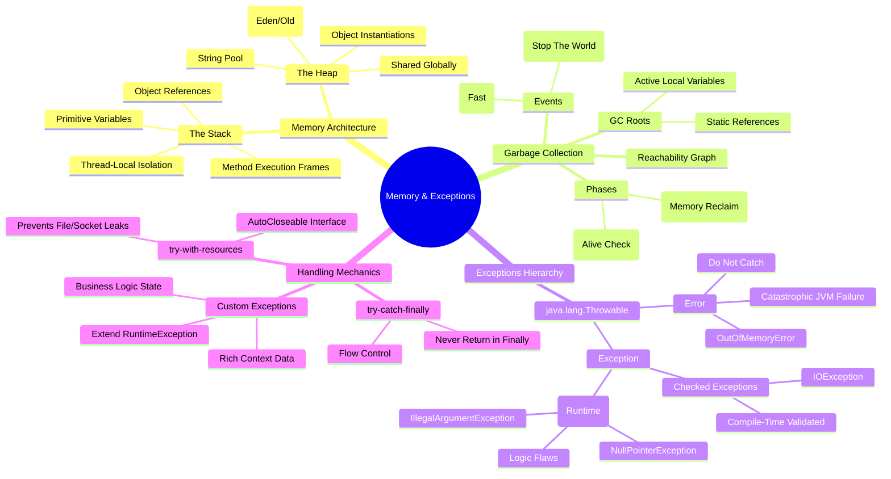

```mermaid
mindmap
  root((Memory & Exceptions))
    Memory Architecture
      The Stack
        Thread-Local Isolation
        Primitive Variables
        Object References
        Method Execution Frames
      The Heap
        Shared Globally
        Object Instantiations
        String Pool
        Generations (Eden/Old)
    Garbage Collection
      Reachability Graph
      GC Roots
        Active Local Variables
        Static References
      Phases
        Mark Phase (Alive Check)
        Sweep Phase (Memory Reclaim)
      Events
        Minor GC (Fast)
        Major GC (Stop The World)
    Exceptions Hierarchy
      java.lang.Throwable
        Error
          Catastrophic JVM Failure
          Do Not Catch
          OutOfMemoryError
        Exception
          Checked Exceptions
            Compile-Time Validated
            IOException
          Unchecked (Runtime)
            Logic Flaws
            NullPointerException
            IllegalArgumentException
    Handling Mechanics
      try-catch-finally
        Flow Control
        Never Return in Finally
      try-with-resources
        AutoCloseable Interface
        Prevents File/Socket Leaks
      Custom Exceptions
        Business Logic State
        Rich Context Data
        Extend RuntimeException
```
