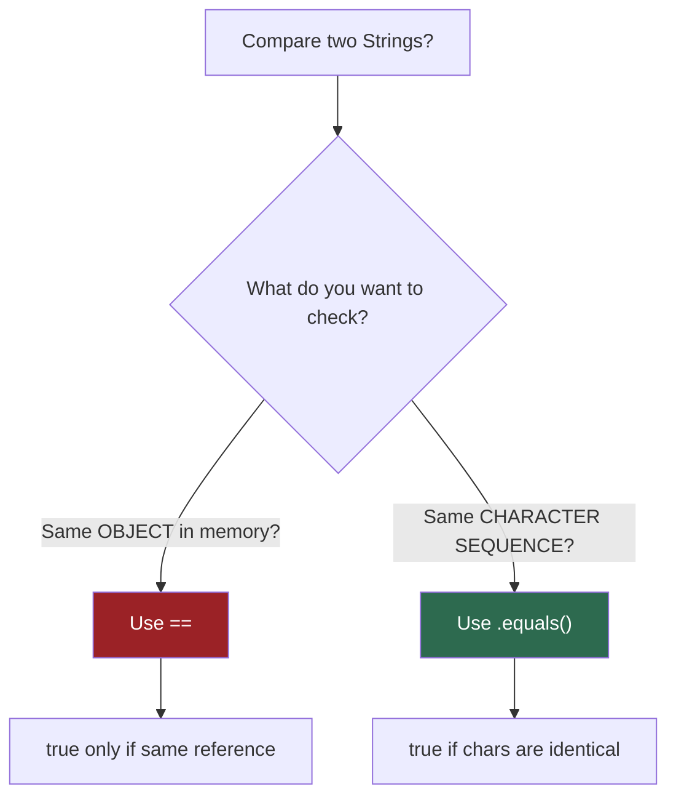

# Strings in Java: Immutability, Pool, and the `==` Trap

Strings are the most heavily used object type in Java. In a typical Spring Boot application, HTTP headers, JSON keys, SQL queries, config properties, and log messages are all Strings. Understanding their internal architecture is non-negotiable.

## The Core Rule: Strings Are Immutable

Once a `String` object is created, its internal character array **cannot be changed**. Every operation that appears to "modify" a String actually creates an entirely new String object on the Heap.

```java
String greeting = "Hello";    // Creates "Hello" in String Pool
greeting = greeting + " World"; // Creates NEW "Hello World" object. "Hello" still exists.
```

### WHY Was Immutability Chosen?

1. **Thread Safety**: Immutable objects are inherently thread-safe. No synchronization needed.
2. **Hash Caching**: `String.hashCode()` is calculated once and cached. This is why `String` is the ideal `HashMap` key.
3. **Security**: Class names, file paths, and network URLs are Strings. If Strings were mutable, a loaded class name could be changed after security validation.
4. **String Pool Optimization**: Immutability guarantees that sharing String references across the JVM is safe.

## String Pool: The JVM's Memory Optimization

```
┌─────────────────────────────────────────────────────┐
│                    JVM HEAP                          │
│                                                      │
│   ┌──────────────────────────────────┐               │
│   │        STRING POOL                │               │
│   │  ┌─────────┐  ┌─────────┐       │               │
│   │  │ "Hello" │  │ "World" │       │               │
│   │  └────▲────┘  └────▲────┘       │               │
│   │       │             │            │               │
│   └───────┼─────────────┼────────────┘               │
│           │             │                            │
│   ┌───────┼─────────────┼────────────────────┐       │
│   │       │             │   REGULAR HEAP      │       │
│   │   s1 ─┘         s2 ─┘                    │       │
│   │                                           │       │
│   │   s3 ──── ┌─────────┐  (new String)      │       │
│   │           │ "Hello" │  (SEPARATE COPY!)   │       │
│   │           └─────────┘                     │       │
│   └───────────────────────────────────────────┘       │
└─────────────────────────────────────────────────────┘
```

```java
String s1 = "Hello";              // Pool lookup → creates "Hello" in Pool
String s2 = "Hello";              // Pool lookup → REUSES same "Hello"
String s3 = new String("Hello");  // Bypasses pool → new object on Heap

System.out.println(s1 == s2);     // true  — same pool reference
System.out.println(s1 == s3);     // false — different memory locations
System.out.println(s1.equals(s3)); // true  — same character sequence
```

### The `intern()` Method

```java
String s3 = new String("Hello");
String s4 = s3.intern();          // Looks up pool → returns pool reference
System.out.println(s1 == s4);     // true — s4 now points to pool "Hello"
```

## The `==` vs `.equals()` Trap

This is the #1 String bug in Java. Here's the mental model:



**Python Comparison:**
- Python `==` compares **values** → Java `.equals()`
- Python `is` compares **identity** → Java `==`

## String Concatenation Performance

```
Concatenating 10,000 strings in a loop:

String concat (+=):
  Iteration 1:  "a"                    → new String (1 char)
  Iteration 2:  "a" + "a"             → new String (2 chars), old discarded
  Iteration 3:  "aa" + "a"            → new String (3 chars), old discarded
  ...
  Iteration N:  copy (N-1) chars + 1  → O(N²) total characters copied

StringBuilder:
  Iteration 1:  buffer.append("a")    → mutate internal array
  Iteration 2:  buffer.append("a")    → mutate internal array
  ...
  Iteration N:  buffer.append("a")    → O(N) total, array doubles when full
```

> **Rule**: Never use `+=` for String concatenation inside loops. Use `StringBuilder`.

## Key Methods Reference

| Method | What It Does | Python Equivalent |
|--------|-------------|-------------------|
| `charAt(i)` | Get char at index | `s[i]` |
| `substring(i, j)` | Extract range | `s[i:j]` |
| `indexOf("x")` | Find first occurrence | `s.find("x")` |
| `contains("x")` | Check if present | `"x" in s` |
| `replace("a", "b")` | Replace all occurrences | `s.replace("a", "b")` |
| `split(",")` | Split into array | `s.split(",")` |
| `strip()` | Remove leading/trailing whitespace | `s.strip()` |
| `toUpperCase()` | Uppercase | `s.upper()` |
| `format("Hi %s", name)` | Formatted string | `f"Hi {name}"` |
| `"Hi %s".formatted(name)` | Instance format (Java 15+) | `f"Hi {name}"` |

---

## Interview Questions

### Conceptual

**Q1: Why are Strings immutable in Java?**
> Thread safety (no synchronization needed for shared strings), hash code caching (hashCode computed once, cached for HashMap performance), security (class names and file paths cannot be altered post-validation), and String Pool optimization (safe to share references across threads).

**Q2: What is the String Pool and where does it live?**
> The String Pool is a special region inside the Java Heap (moved from PermGen in Java 7) where the JVM stores unique String literals. When you write `"Hello"`, the JVM checks the pool first. If "Hello" already exists, it returns the existing reference. If not, it creates a new entry. `new String("Hello")` bypasses the pool and creates a separate Heap object.

### Scenario/Debug

**Q3: Why does this print `false`?**
```java
String a = new String("test");
String b = new String("test");
System.out.println(a == b);
```
> Both `new String()` calls create separate objects on the Heap. `==` compares references (memory addresses), which are different. Use `a.equals(b)` to compare character content, which returns `true`.

**Q4: A developer reports that their string concatenation in a loop is causing GC pauses. What's happening?**
> Each `+=` in a loop creates a new String object and copies all previous characters. For N iterations, this creates N intermediate String objects (O(N²) char copies). The abandoned intermediate Strings pile up as garbage, triggering frequent GC. Fix: replace with `StringBuilder.append()`.

### Quick Fire

**Q5: What does `"Hello".intern()` do?**
> Returns the canonical (pool) reference for "Hello". If "Hello" is already in the pool, returns that reference. If not, adds it to the pool and returns it.

**Q6: Is `String` a primitive or object? Why does `String s = "Hi"` work without `new`?**
> `String` is an object (class `java.lang.String`). The literal syntax `"Hi"` is syntactic sugar — the compiler creates a String object in the Pool. It's the only object type that can be initialized without `new`.
