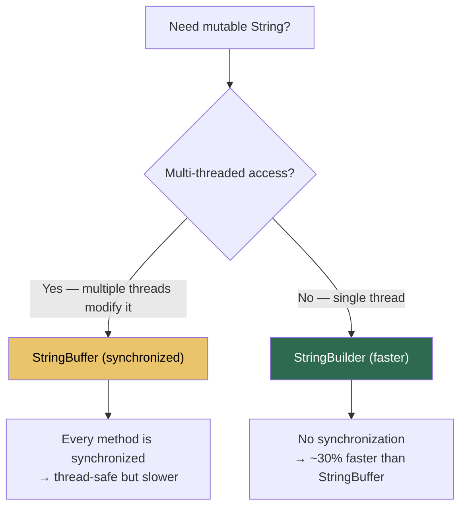

# StringBuilder & StringBuffer: Mutable String Operations

## The Problem: String Concatenation is O(n²)

Because Strings are immutable, every `+=` creates a new object and copies all previously accumulated characters. In a loop of N iterations, you copy 1 + 2 + 3 + ... + N = N(N+1)/2 characters total — **quadratic time**.

```
String result = "";
for (int i = 0; i < 4; i++) {
    result += "a";
}

Step-by-step memory allocation:
┌─────────────────────────────────────────────────┐
│  Iteration 0:  ""  + "a"  → new "a"     (copy 1 char)  │
│  Iteration 1:  "a" + "a"  → new "aa"    (copy 2 chars) │
│  Iteration 2:  "aa"+ "a"  → new "aaa"   (copy 3 chars) │
│  Iteration 3:  "aaa"+"a"  → new "aaaa"  (copy 4 chars) │
│                                                          │
│  4 abandoned String objects now waiting for GC           │
│  Total chars copied: 1+2+3+4 = 10 (quadratic!)         │
└─────────────────────────────────────────────────┘
```

## The Solution: StringBuilder

`StringBuilder` maintains an internal `char[]` buffer that it **mutates in place**. When the buffer fills up, it doubles in size (amortized O(1) per append).

```
StringBuilder sb = new StringBuilder();  // default capacity: 16

Internal buffer state:
┌──┬──┬──┬──┬──┬──┬──┬──┬──┬──┬──┬──┬──┬──┬──┬──┐
│  │  │  │  │  │  │  │  │  │  │  │  │  │  │  │  │  capacity=16, length=0
└──┴──┴──┴──┴──┴──┴──┴──┴──┴──┴──┴──┴──┴──┴──┴──┘

sb.append("Hello");
┌──┬──┬──┬──┬──┬──┬──┬──┬──┬──┬──┬──┬──┬──┬──┬──┐
│ H│ e│ l│ l│ o│  │  │  │  │  │  │  │  │  │  │  │  capacity=16, length=5
└──┴──┴──┴──┴──┴──┴──┴──┴──┴──┴──┴──┴──┴──┴──┴──┘

sb.append(" World");
┌──┬──┬──┬──┬──┬──┬──┬──┬──┬──┬──┬──┬──┬──┬──┬──┐
│ H│ e│ l│ l│ o│  │ W│ o│ r│ l│ d│  │  │  │  │  │  capacity=16, length=11
└──┴──┴──┴──┴──┴──┴──┴──┴──┴──┴──┴──┴──┴──┴──┴──┘

sb.toString();  // Creates ONE final String object
```

## StringBuilder vs StringBuffer



| Feature | StringBuilder | StringBuffer |
|---------|--------------|--------------|
| Thread-safe? | ❌ No | ✅ Yes (synchronized) |
| Performance | ⚡ Fast | 🐌 ~30% slower |
| When to use | 99% of cases | Only when shared between threads |
| Introduced | Java 5 | Java 1.0 |

## Key Methods

| Method | What it Does | Returns |
|--------|-------------|---------|
| `append(x)` | Add to end | `this` (for chaining) |
| `insert(i, x)` | Insert at index | `this` |
| `delete(i, j)` | Delete range [i, j) | `this` |
| `reverse()` | Reverse in place | `this` |
| `toString()` | Convert to immutable String | `String` |
| `capacity()` | Internal buffer size | `int` |
| `length()` | Actual content length | `int` |

## Python Comparison

```python
# Python: Building strings efficiently
parts = []
for word in data:
    parts.append(word)
result = "".join(parts)        # O(n) — exactly what StringBuilder does

# Or with io.StringIO:
import io
buf = io.StringIO()
buf.write("Hello")
buf.write(" World")
result = buf.getvalue()        # "Hello World"
```

In Java, `StringBuilder` is the equivalent of Python's `"".join(list)` pattern or `io.StringIO`.

---

## Interview Questions

**Q1: When would you use StringBuffer over StringBuilder?**
> Only when the buffer is shared across multiple threads that concurrently append to it. In 99% of real applications, StringBuilder is correct because string building happens within a single method scope (single thread). StringBuffer's synchronized methods add unnecessary lock overhead for single-threaded use.

**Q2: What happens internally when StringBuilder's buffer is full?**
> StringBuilder doubles its internal `char[]` array capacity (new_capacity = old_capacity * 2 + 2), allocates a new array, and copies existing characters via `System.arraycopy()`. This is why pre-sizing with `new StringBuilder(expectedSize)` avoids resize overhead when you know the approximate final length.

**Q3: The compiler automatically converts String concatenation to StringBuilder. So why does `+=` in loops still matter?**
> The compiler creates a NEW StringBuilder per iteration of the loop. Each iteration: create StringBuilder → copy existing String → append → toString(). The problem isn't that StringBuilder isn't used — it's that a new one is created every iteration instead of reusing one across all iterations.
