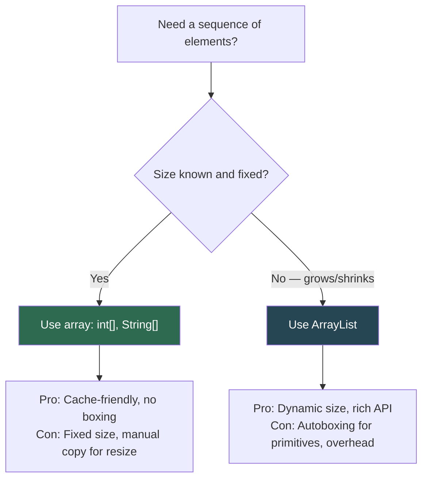

# Arrays in Java: Fixed-Size Typed Containers

## The Core Concept

An array in Java is a **fixed-size**, **typed**, **contiguous block of memory** on the Heap. Once created, its size cannot change.

```
Python list:     [1, "hello", 3.14, True]   ← any type, dynamic size
Java array:      int[] arr = {1, 2, 3, 4}   ← one type, fixed size
```

## Memory Layout

```
int[] scores = new int[4];

Stack:                          Heap:
┌──────────┐                    ┌───────────────────────────────────┐
│ scores   │───reference───────▶│  Object Header (12 bytes)         │
│ (ref)    │                    │  ┌──────────┐                     │
└──────────┘                    │  │ length=4 │ (final, immutable)  │
                                │  ├──────────┤                     │
                                │  │ [0] = 0  │  ← default init    │
                                │  │ [1] = 0  │                     │
                                │  │ [2] = 0  │                     │
                                │  │ [3] = 0  │                     │
                                │  └──────────┘                     │
                                │  Total: 12 + 4 + (4 × 4) = 32 B  │
                                └───────────────────────────────────┘

String[] names = new String[3];

Stack:                          Heap:
┌──────────┐                    ┌───────────────────────────────────┐
│ names    │───reference───────▶│  Object Header (12 bytes)         │
│ (ref)    │                    │  ┌──────────┐                     │
└──────────┘                    │  │ length=3 │                     │
                                │  ├──────────┤                     │
                                │  │ [0]=null │──▶ (no object yet)  │
                                │  │ [1]=null │──▶ (no object yet)  │
                                │  │ [2]=null │──▶ (no object yet)  │
                                │  └──────────┘                     │
                                │  Each slot holds a REFERENCE (8B) │
                                └───────────────────────────────────┘
```

**Critical insight**: For primitive arrays, the values are stored inline. For object arrays, only **references** are stored; the actual objects live elsewhere on the Heap.

## Declaration, Initialization & Access

```java
// 1. Declare + allocate (default values: 0 for int, null for objects)
int[] scores = new int[5];

// 2. Declare + initialize with values
int[] primes = {2, 3, 5, 7, 11};

// 3. Access by index (0-based)
int first = primes[0];    // 2
int last  = primes[primes.length - 1];  // 11

// 4. Iteration
for (int i = 0; i < primes.length; i++) { ... }   // index-based
for (int p : primes) { ... }                        // for-each (read-only)
```

## Multi-dimensional Arrays

```
// Regular 2D array (3 rows × 4 cols)
int[][] matrix = new int[3][4];

Memory: array of arrays
┌─────────┐
│ matrix  │──▶ ┌────┬────┬────┐
└─────────┘    │ [0]│ [1]│ [2]│  ← 3 references
               └─┬──┴─┬──┴─┬──┘
                 ▼     ▼     ▼
              [0,0,0,0] [0,0,0,0] [0,0,0,0]  ← each is int[4]

// Jagged array (rows of different lengths)
int[][] jagged = new int[3][];
jagged[0] = new int[2];    // row 0 has 2 cols
jagged[1] = new int[5];    // row 1 has 5 cols
jagged[2] = new int[1];    // row 2 has 1 col
```

> **Python Comparison**: Python's `[[0]*4 for _ in range(3)]` creates a list of lists, which is conceptually the same as Java's jagged arrays — NOT contiguous memory.

## The `Arrays` Utility Class

```java
import java.util.Arrays;

int[] data = {5, 3, 8, 1, 9};

Arrays.sort(data);                    // Sorts in-place → [1, 3, 5, 8, 9]
int idx = Arrays.binarySearch(data, 5); // Binary search (array must be sorted)
Arrays.fill(data, 0);                // Fill all slots with 0
int[] copy = Arrays.copyOf(data, 10);  // Copy with new length (pads with 0)
String str = Arrays.toString(data);    // "[0, 0, 0, 0, 0]" for printing
boolean eq = Arrays.equals(a, b);      // Deep value comparison
```

## ArrayIndexOutOfBoundsException

```java
int[] arr = new int[3];  // indices 0, 1, 2
arr[3] = 10;             // RUNTIME EXCEPTION: ArrayIndexOutOfBoundsException
```

Unlike Python (which supports negative indexing: `arr[-1]`), Java has **no negative indexing**. Accessing outside `[0, length-1]` throws an exception.

## Array vs ArrayList Decision



---

## Interview Questions

**Q1: What is the default value of elements in a newly created array?**
> Primitives: `0` (int, long), `0.0` (double, float), `false` (boolean), `'\u0000'` (char). References: `null`. Java always zero-initializes arrays, unlike C/C++ which may contain garbage values.

**Q2: Why can't you resize an array in Java?**
> Arrays are contiguous memory blocks on the Heap. The JVM allocates exactly `header + length × element_size` bytes. There's no guarantee that adjacent memory is free for expansion. To "resize," you must allocate a new larger array and copy elements via `System.arraycopy()` or `Arrays.copyOf()`. ArrayList does this internally.

**Q3: What is the time complexity of array access by index?**
> O(1). Because arrays are contiguous in memory, accessing `arr[i]` is a single pointer arithmetic operation: `base_address + (i × element_size)`. This is why arrays are faster than LinkedList for random access.

**Q4: Can you store primitives in an `ArrayList`?**
> No. `ArrayList<int>` does not compile. You must use `ArrayList<Integer>`, which triggers autoboxing (wrapping `int` → `Integer` object). Each boxed Integer costs 16 bytes vs. 4 bytes for raw `int`. For large datasets, use arrays or specialized libraries (e.g., Eclipse Collections `IntArrayList`).
