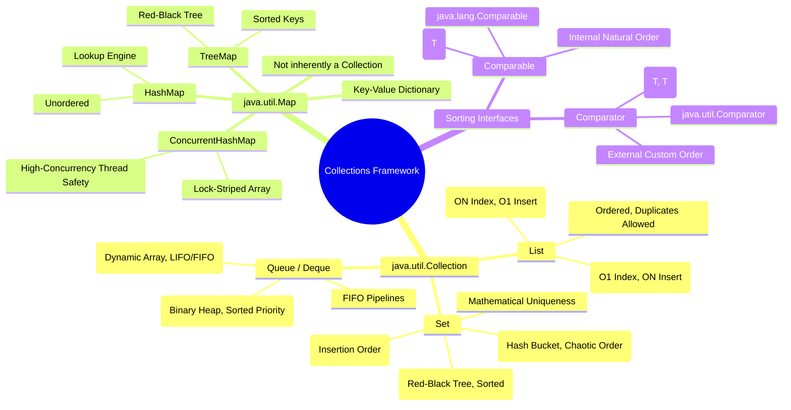

```mermaid
mindmap
  root((Collections Framework))
    java.util.Collection
      List
        Ordered, Duplicates Allowed
        ArrayList (O1 Index, ON Insert)
        LinkedList (ON Index, O1 Insert)
      Set
        Mathematical Uniqueness
        HashSet (Hash Bucket, Chaotic Order)
        TreeSet (Red-Black Tree, Sorted)
        LinkedHashSet (Insertion Order)
      Queue / Deque
        FIFO Pipelines
        ArrayDeque (Dynamic Array, LIFO/FIFO)
        PriorityQueue (Binary Heap, Sorted Priority)
    java.util.Map
      Key-Value Dictionary
      Not inherently a Collection
      HashMap
        Lookup Engine
        Unordered
      ConcurrentHashMap
        Lock-Striped Array
        High-Concurrency Thread Safety
      TreeMap
        Red-Black Tree
        Sorted Keys
    Sorting Interfaces
      Comparable
        Internal Natural Order
        java.lang.Comparable
        compareTo(T)
      Comparator
        External Custom Order
        java.util.Comparator
        compare(T, T)
```
