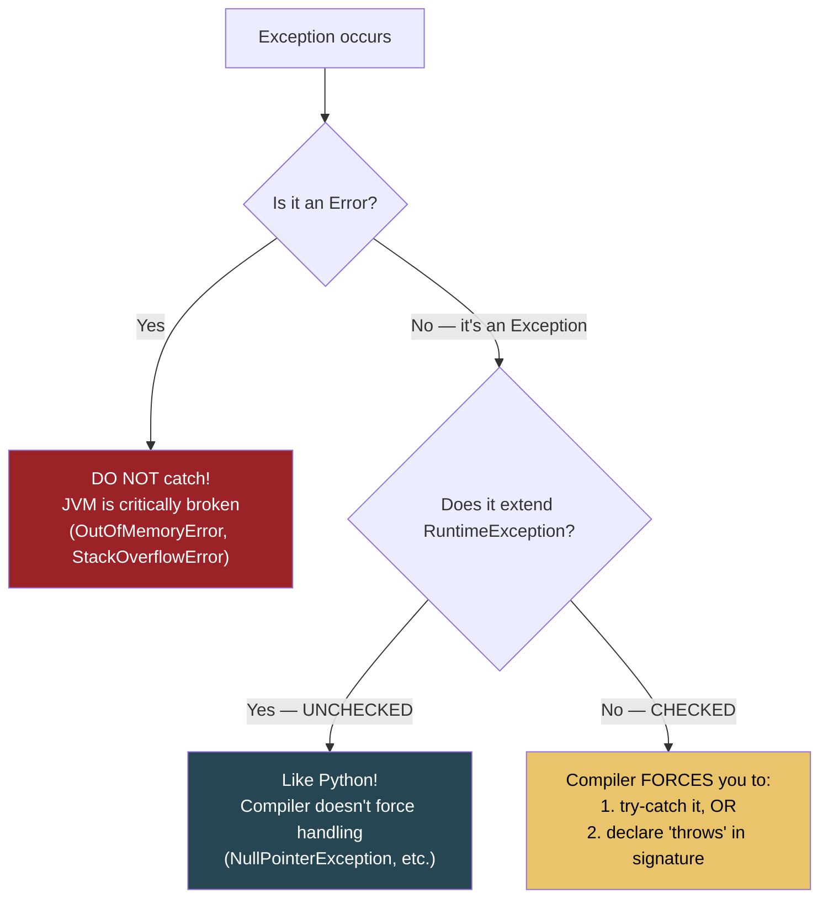

# Exception Hierarchy: The Architecture of Java Error Handling

## The Full Class Hierarchy

```
                        ┌──────────┐
                        │ Throwable │ ← root of ALL throwable types
                        └─────┬────┘
                    ┌─────────┴──────────┐
               ┌────┴────┐         ┌─────┴─────┐
               │  Error  │         │ Exception  │
               └────┬────┘         └─────┬─────┘
                    │                     │
    ┌───────────────┼──────────┐    ┌─────┴──────────────────────┐
    │               │          │    │                             │
 OutOfMemory  StackOverflow   ...  │                      ┌──────┴───────┐
 Error        Error               │                      │RuntimeException│
                              Checked                    └──────┬────────┘
                              ┌───┴────────┐                    │
                              │            │           ┌────────┼──────────┐
                         IOException  SQLException  NullPtr  IllegalArg  ClassCast
                                                    Exception Exception  Exception
```

## Checked vs Unchecked: The Decision Java Made



**Python Comparison:**
All Python exceptions are **unchecked**. You CAN catch them, but the compiler never forces you to. Java's checked exceptions are Java's unique feature — the compiler acts as a safety net for recoverable failures.

## The try-catch-finally Flow

```
TRY BLOCK                    CATCH BLOCK                  FINALLY BLOCK
┌──────────────────┐         ┌──────────────────┐         ┌──────────────────┐
│                  │         │                  │         │                  │
│  Risky code      │──THROW──▶  Handle error    │         │  ALWAYS runs     │
│  that might fail │         │  (most specific  │         │  (cleanup,       │
│                  │         │   catch first!)  │         │   close files)   │
│                  │         │                  │         │                  │
└──────────────────┘         └──────────────────┘         └──────────────────┘
       │                            │                            │
       └───── success ──────────────┴────── always ──────────────┘
```

```java
try {
    // risky code
    int result = 10 / 0;
} catch (ArithmeticException e) {
    // handle — most specific first!
    System.out.println("Division by zero: " + e.getMessage());
} catch (Exception e) {
    // broader catch — must come AFTER specific catches
    System.out.println("General error: " + e.getMessage());
} finally {
    // ALWAYS runs — even if return/throw in try or catch
    System.out.println("Cleanup done");
}
```

### Multi-catch (Java 7+)

```java
try {
    riskyOperation();
} catch (IOException | SQLException e) {
    // Handle both the same way — no code duplication
    log.error("I/O or DB failure: " + e.getMessage());
}
```

## Exception Handling Anti-patterns

```
❌  NEVER catch generic Exception/Throwable everywhere
    catch (Exception e) { /* swallowed */ }
    → Hides bugs, makes debugging impossible

❌  NEVER use exceptions for control flow
    try { list.get(i); } catch (IndexOutOfBounds) { break; }
    → Use if-checks instead, exceptions are 50-100x slower

❌  NEVER catch Error
    catch (OutOfMemoryError e) { /* retry */ }
    → JVM is in undefined state, cannot recover reliably

✅  DO catch specific exception types
✅  DO log the exception with stack trace
✅  DO wrap lower-level exceptions with domain-specific ones
```

---

## Interview Questions

**Q1: What is the difference between checked and unchecked exceptions?**
> Checked exceptions extend `Exception` (but NOT `RuntimeException`) and the compiler forces you to either catch them or declare them with `throws`. They model recoverable failures (file not found, network timeout). Unchecked exceptions extend `RuntimeException` and the compiler doesn't enforce handling. They model programming errors (null pointer, array index out of bounds).

**Q2: Why doesn't Spring use checked exceptions?**
> Spring converts most checked exceptions to unchecked `RuntimeException` subclasses. Reason: checked exceptions pollute method signatures, break functional interfaces (lambdas/streams can't throw checked exceptions), and most catch blocks just wrap and re-throw anyway. Spring's `DataAccessException` hierarchy is entirely unchecked.

**Q3: What happens if both the `try` block and `finally` block throw exceptions?**
> The exception from `finally` replaces ("suppresses") the exception from `try`. The original exception is lost unless explicitly attached via `addSuppressed()`. This is one reason try-with-resources was introduced — it properly records suppressed exceptions.

**Q4: Can you explain the exception execution order in this code?**
```java
try {
    return 1;
} finally {
    return 2;
}
```
> Returns 2. The `finally` block ALWAYS executes, even after a `return`. The `finally` return overrides the `try` return. This is a well-known gotcha — never put `return` in `finally`.
