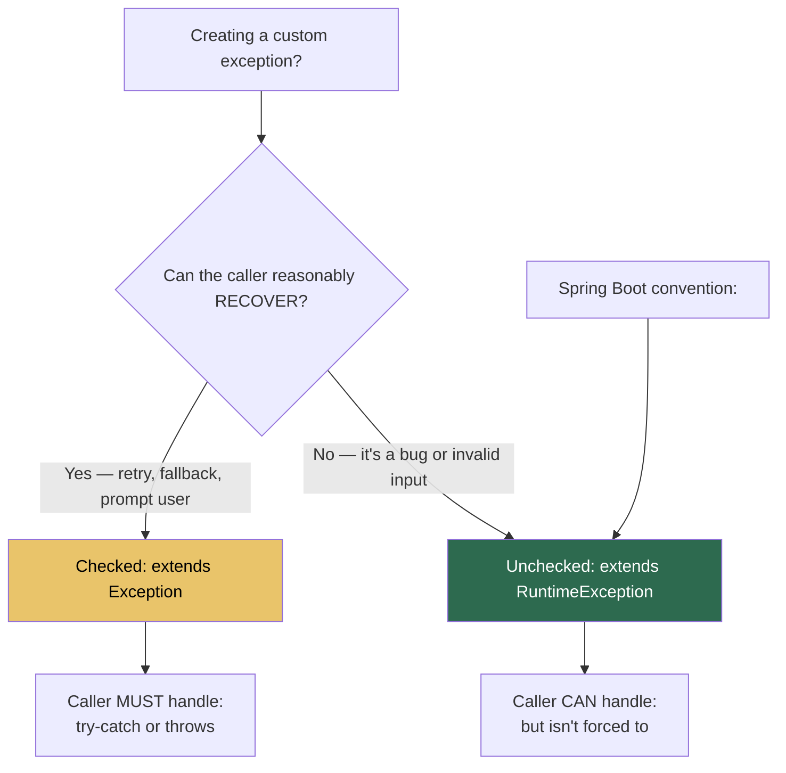

# Custom Exceptions: Domain-Specific Error Modeling

## Why Create Custom Exceptions?

Generic exceptions (`Exception`, `RuntimeException`) tell you nothing about your business domain. Custom exceptions encode **what went wrong** in your application's language.

```
Generic:    throw new RuntimeException("Not enough money");
Domain:     throw new InsufficientFundsException(account, amount, balance);
```

The second version can carry structured data (account ID, requested amount, current balance) that error handlers can use for logging, API responses, and recovery logic.

## When to Use Checked vs Unchecked



> **Spring Convention**: Almost always extend `RuntimeException`. Spring's transaction management only rolls back on unchecked exceptions by default. Checked exceptions do NOT trigger rollback unless explicitly configured.

## Building a Custom Exception

```java
// ── Basic Pattern ───────────────────────────────────────────────────
public class InsufficientFundsException extends RuntimeException {
    
    private final String accountId;
    private final double requested;
    private final double available;
    
    public InsufficientFundsException(String accountId, double requested, double available) {
        super(String.format("Account %s: requested %.2f but only %.2f available", 
              accountId, requested, available));
        this.accountId = accountId;
        this.requested = requested;
        this.available = available;
    }
    
    // Getters for structured error handling
    public String getAccountId() { return accountId; }
    public double getRequested() { return requested; }
    public double getAvailable() { return available; }
}
```

### The Exception Constructor Chain

```
Your Exception
      │
      ▼
RuntimeException(String message)
      │
      ▼
Exception(String message)
      │
      ▼
Throwable(String message)  ← stores message + captures stack trace
```

Every `super()` call passes the message up to `Throwable`, which:
1. Stores the message string
2. Captures the **stack trace** (expensive! calls `fillInStackTrace()` natively)

## Exception Hierarchy Pattern for a Domain

```
                    ┌───────────────────────────────┐
                    │  ApplicationException          │  ← base for YOUR app
                    │  extends RuntimeException      │
                    └──────────┬────────────────────┘
                               │
           ┌───────────────────┼───────────────────────┐
           │                   │                        │
  ┌────────▼──────────┐  ┌────▼────────────┐  ┌───────▼──────────────┐
  │ ResourceNotFound  │  │ InvalidOperation│  │ AuthorizationFailed  │
  │ Exception         │  │ Exception       │  │ Exception            │
  └───────────────────┘  └─────────────────┘  └──────────────────────┘
  → 404 in Spring          → 400 in Spring       → 403 in Spring
```

## Python Comparison

```python
# Python custom exception
class InsufficientFundsError(Exception):
    def __init__(self, account_id, requested, available):
        super().__init__(f"Account {account_id}: requested {requested} but only {available}")
        self.account_id = account_id
        self.requested = requested
        self.available = available

# Usage
raise InsufficientFundsError("ACC-001", 500, 100)
```

Almost identical pattern! The only difference: Python never forces you to catch it.

---

## Interview Questions

**Q1: When should you create a checked vs unchecked custom exception?**
> Checked: when the caller realistically can and should recover (retry a network call, prompt for a different file). Unchecked: when it's a programming error (null passed to method, invalid argument), or when using Spring (which requires unchecked for auto-rollback and clean lambda/stream usage).

**Q2: What is the performance cost of throwing an exception?**
> Creating an exception object calls `fillInStackTrace()`, which walks the entire call stack and records every frame. This is expensive — roughly 10-100x slower than a normal return. Never use exceptions for control flow. For performance-critical paths, consider returning `Optional` or error codes.

**Q3: How would you design an exception hierarchy for a REST API?**
> Create a base `ApiException extends RuntimeException` with an HTTP status code field. Then create specific subclasses: `ResourceNotFoundException` (404), `ValidationException` (400), `AuthorizationException` (403). Spring's `@ControllerAdvice` catches these and maps them to the appropriate HTTP response.
