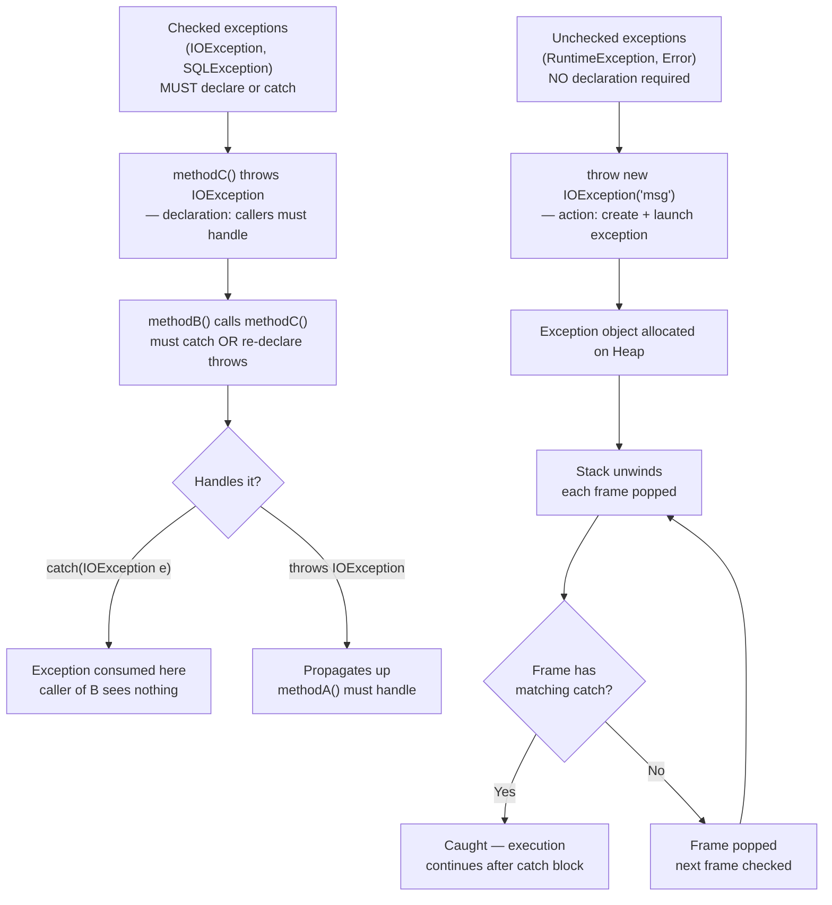

# `throws` vs `throw`: Declaration vs Instantiation

## Diagram: throws vs throw in the Call Stack



## The Two Keywords

These look similar but serve completely different purposes:

```
throw   → CREATE and LAUNCH an exception object (like Python's raise)
throws  → DECLARE that a method might throw a checked exception (no Python equivalent)
```

## `throw` — The Action

```java
// throw = instantiate an exception and launch it up the call stack
public void withdraw(double amount) {
    if (amount <= 0) {
        throw new IllegalArgumentException("Amount must be positive: " + amount);
        //    ^^^                              ^^^^^^^^^^^^^^^^^^^^^^^^^^^^^^^^^^^
        //    action                           new exception OBJECT with message
    }
}
```

**Python equivalent:**
```python
def withdraw(amount):
    if amount <= 0:
        raise ValueError(f"Amount must be positive: {amount}")
```

### What Happens When You `throw`

```
CALL STACK UNWINDING:

main() → service() → validate() → THROW!

┌─────────────────┐
│ validate()       │ ← exception created HERE
│  throw new Ex()  │ ──▶ remove frame, propagate up
└────────┬────────┘
         ▼
┌─────────────────┐
│ service()        │ ← does it have a catch? NO → propagate up
└────────┬────────┘
         ▼
┌─────────────────┐
│ main()           │ ← does it have a catch? YES → handle it
│  try { ... }     │
│  catch (Ex e) {} │
└─────────────────┘

If NO method catches it → Thread dies → stack trace printed to stderr
```

## `throws` — The Declaration

`throws` only applies to **checked exceptions**. It tells the compiler: "this method might throw this type, so callers must handle it."

```java
// Without throws → COMPILE ERROR for checked exceptions
public String readFile(String path) throws IOException {
    //                               ^^^^^^^^^^^^^^^^^^
    //                               DECLARATION: "I might throw IOException"
    return new String(Files.readAllBytes(Path.of(path)));
}

// Caller MUST handle it:
// Option 1: try-catch
try {
    String content = readFile("data.txt");
} catch (IOException e) {
    System.err.println("File error: " + e.getMessage());
}

// Option 2: propagate with throws
public void process() throws IOException {
    String content = readFile("data.txt");  // passes responsibility to MY caller
}
```

**Python has no equivalent**: Python never forces you to declare exceptions. All Python exceptions are unchecked.

## Decision Matrix

```
┌──────────────────────────────────────────────────────────────────┐
│                                                                   │
│  throw new IllegalArgumentException(...)                          │
│  → Use throw to CREATE and LAUNCH an exception                   │
│  → Works with both checked and unchecked                          │
│                                                                   │
│  public void doWork() throws IOException { ... }                  │
│  → Use throws to DECLARE checked exceptions in method signature  │
│  → NOT needed for unchecked (RuntimeException and subclasses)    │
│  → NOT needed for Error                                           │
│                                                                   │
│  MEMORY AID:                                                      │
│    throw  = "I am throwing right NOW"     (verb, action)          │
│    throws = "I MIGHT throw in the future" (adjective, declaration)│
│                                                                   │
└──────────────────────────────────────────────────────────────────┘
```

## Exception Wrapping Pattern

A common pattern: catch a low-level exception, wrap it in a domain-specific exception, and rethrow:

```java
public User findUser(String id) {
    try {
        return database.query(id);              // throws SQLException (checked)
    } catch (SQLException e) {
        throw new UserServiceException(         // wrap in domain exception (unchecked)
            "Failed to find user: " + id, 
            e                                   // ← PRESERVE the original cause!
        );
    }
}
```

> **Key**: Always pass the original exception as the `cause` parameter. Without it, the root cause stack trace is lost forever.

---

## Interview Questions

**Q1: What happens if you throw a checked exception without declaring it with `throws`?**
> Compilation error. The compiler enforces that all checked exceptions are either caught (try-catch) or declared (throws) in the method signature. Unchecked exceptions (RuntimeException subclasses) don't have this requirement.

**Q2: Can you throw an exception from a `finally` block?**
> Yes, but it's dangerous. If the `try` block already threw an exception, the `finally` exception replaces it — the original is lost. With try-with-resources, this is handled properly via suppressed exceptions.

**Q3: What is exception chaining and why is it important?**
> Exception chaining is passing the original exception as the `cause` when creating a new exception: `throw new AppException("msg", originalException)`. This preserves the full stack trace chain. Without it, you lose the root cause, making production debugging nearly impossible.
