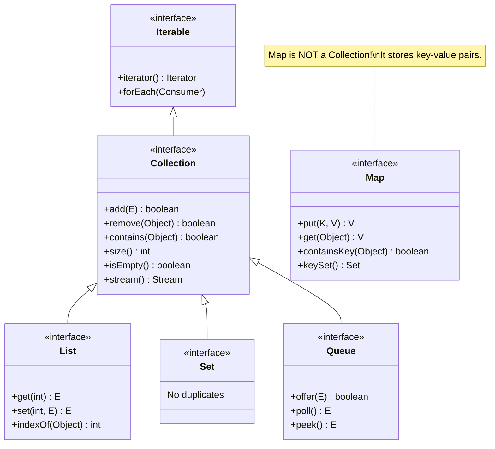

# The Collections Framework: Interface Hierarchy

## The Big Picture

Java's Collections Framework is **interface-driven**. You program against interfaces (`List`, `Set`, `Map`) and swap implementations without changing calling code:

```java
// Code to the INTERFACE, not the IMPLEMENTATION
List<String> names = new ArrayList<>();  // can swap to LinkedList later
names.add("Alice");
names.get(0);  // works regardless of which List implementation
```

## The Complete Hierarchy



> **Key insight**: `Map` does NOT extend `Collection`. It's a separate hierarchy. This is a common interview question.

## Interface → Implementation Matrix

```
┌──────────────┬────────────────────────────────────────────────────────────┐
│  Interface   │  Implementations                                          │
├──────────────┼────────────────────────────────────────────────────────────┤
│  List        │  ArrayList    LinkedList    Vector(legacy)   CopyOnWrite  │
│  Set         │  HashSet      TreeSet       LinkedHashSet                 │
│  Queue/Deque │  ArrayDeque   PriorityQueue LinkedList                    │
│  Map         │  HashMap      TreeMap       LinkedHashMap   Hashtable    │
└──────────────┴────────────────────────────────────────────────────────────┘

              Time Complexity Comparison:
┌──────────────────┬──────────┬──────────┬──────────┬──────────┐
│  Operation       │ArrayList │LinkedList│ HashSet  │ TreeSet  │
├──────────────────┼──────────┼──────────┼──────────┼──────────┤
│  add(E)          │  O(1)*   │  O(1)    │  O(1)    │ O(log n) │
│  get(index)      │  O(1)    │  O(n)    │   N/A    │   N/A    │
│  contains(E)     │  O(n)    │  O(n)    │  O(1)    │ O(log n) │
│  remove(E)       │  O(n)    │  O(n)    │  O(1)    │ O(log n) │
└──────────────────┴──────────┴──────────┴──────────┴──────────┘
 * amortized — occasionally O(n) when array resizes
```

## Generics: Type Safety

```java
// WITHOUT generics (Java 1.4 and earlier) — dangerous
List rawList = new ArrayList();
rawList.add("hello");
rawList.add(42);          // compiles! no type check
String s = (String) rawList.get(1);  // ClassCastException at RUNTIME

// WITH generics (Java 5+) — safe
List<String> typedList = new ArrayList<>();
typedList.add("hello");
// typedList.add(42);     // COMPILE ERROR — caught early
String s = typedList.get(0);         // no cast needed
```

**Python comparison**: Python's `list` has no type enforcement. Java's `List<String>` enforces types at compile time (type erasure removes them at runtime, but the compiler catches errors).

## The Diamond Operator `<>`

```java
// Java 7+: compiler infers the type on the right
List<String> names = new ArrayList<>();  // no need to repeat <String>

// Java 9+: factory methods for immutable collections
List<String> immutable = List.of("Alice", "Bob");
Map<String, Integer> map = Map.of("a", 1, "b", 2);
Set<Integer> set = Set.of(1, 2, 3);
```

## Iteration Patterns

```java
List<String> names = List.of("Alice", "Bob", "Charlie");

// 1. Enhanced for (preferred for simple iteration)
for (String name : names) { System.out.println(name); }

// 2. forEach with lambda (Java 8+)
names.forEach(name -> System.out.println(name));

// 3. Iterator (needed for remove-during-iteration)
Iterator<String> it = names.iterator();
while (it.hasNext()) {
    String name = it.next();
    if (name.startsWith("B")) it.remove();  // safe removal
}

// 4. Traditional for loop (when you need the index)
for (int i = 0; i < names.size(); i++) {
    System.out.println(i + ": " + names.get(i));
}
```

> **ConcurrentModificationException**: If you modify a collection during enhanced for-loop iteration (e.g., `names.remove(name)`), Java throws this exception. Use `Iterator.remove()` or `Collection.removeIf()` instead.

---

## Interview Questions

**Q1: Why does Map not extend Collection?**
> Map stores key-value pairs, while Collection stores single elements. The `add(E)` method signature doesn't make sense for a key-value pair. Map needs `put(K, V)`. They serve fundamentally different abstractions. However, you can get a Collection view of a Map: `map.keySet()`, `map.values()`, `map.entrySet()`.

**Q2: What is the difference between fail-fast and fail-safe iterators?**
> fail-fast iterators (ArrayList, HashMap) throw `ConcurrentModificationException` if the collection is modified during iteration. fail-safe iterators (`ConcurrentHashMap`, `CopyOnWriteArrayList`) work on a snapshot or allow concurrent modification. fail-fast detects bugs early; fail-safe is for concurrent access.

**Q3: What is the difference between `Collection.remove(Object)` and `List.remove(int)`?**
> `Collection.remove(Object)` removes by value. `List.remove(int)` removes by index. With `List<Integer>`, `list.remove(1)` removes at index 1, while `list.remove(Integer.valueOf(1))` removes the element 1. This is a classic autoboxing trap.
