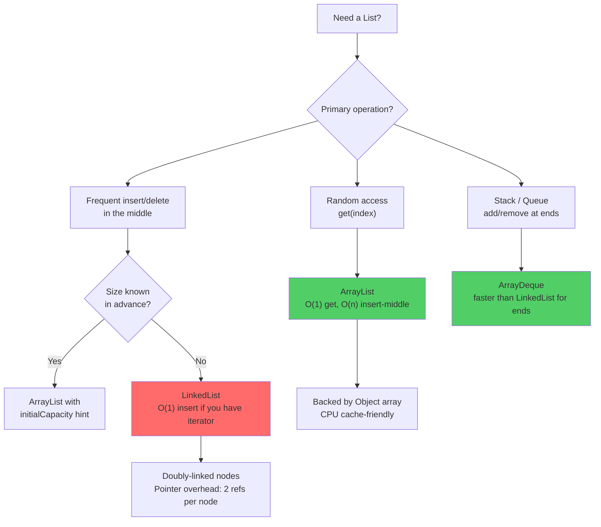

# List Implementations: ArrayList vs LinkedList

## Diagram: ArrayList vs LinkedList Decision



## The Default Choice: ArrayList

ArrayList is backed by an internal `Object[]` array. For 99% of use cases, ArrayList is the correct choice.

```
ArrayList INTERNAL STRUCTURE:

  ArrayList<String> list = new ArrayList<>();

  ┌──────────────────────────────────────────────┐
  │  ArrayList object                              │
  │  ┌─────────────────────────────────────────┐  │
  │  │  elementData: Object[]                  │  │
  │  │  ┌────┬────┬────┬────┬────┬────┬────┐  │  │
  │  │  │ A  │ B  │ C  │ D  │null│null│null│  │  │
  │  │  └────┴────┴────┴────┴────┴────┴────┘  │  │
  │  │   [0]  [1]  [2]  [3]  [4]  [5]  [6]   │  │
  │  │                                         │  │
  │  │  size = 4       capacity = 7            │  │
  │  └─────────────────────────────────────────┘  │
  └──────────────────────────────────────────────┘

  size     = number of elements actually stored
  capacity = length of internal array (grows automatically)
```

### Auto-Resizing (grow)

When you add an element and `size == capacity`:

```
BEFORE (capacity = 4, size = 4):
  ┌───┬───┬───┬───┐
  │ A │ B │ C │ D │  ← FULL!
  └───┴───┴───┴───┘

Step 1: Calculate new capacity = old * 1.5 = 6
Step 2: Create new array
  ┌───┬───┬───┬───┬───┬───┐
  │   │   │   │   │   │   │  new Object[6]
  └───┴───┴───┴───┴───┴───┘

Step 3: System.arraycopy (native, fast)
  ┌───┬───┬───┬───┬───┬───┐
  │ A │ B │ C │ D │   │   │  copied!
  └───┴───┴───┴───┴───┴───┘

Step 4: Add new element
  ┌───┬───┬───┬───┬───┬───┐
  │ A │ B │ C │ D │ E │   │  size = 5
  └───┴───┴───┴───┴───┴───┘

Step 5: Old array becomes garbage → GC reclaims it
```

### Insert at Middle: O(n)

```
list.add(1, "X"):  Insert "X" at index 1

BEFORE:   [A] [B] [C] [D] [_] [_]

Step 1: Shift elements right from index 1
          [A] [_] [B] [C] [D] [_]
              ←── shift ──────→

Step 2: Place element at index 1
          [A] [X] [B] [C] [D] [_]

This shift is O(n) — moves ALL elements after the insertion point.
```

## LinkedList: Doubly-Linked Nodes

```
LinkedList INTERNAL STRUCTURE:

  ┌──────┐     ┌──────┐     ┌──────┐     ┌──────┐
  │ null │◄────│      │◄────│      │◄────│      │
  │  A   │────▶│  B   │────▶│  C   │────▶│  D   │─────▶ null
  └──────┘     └──────┘     └──────┘     └──────┘
    head                                    tail
  
  Each Node:
  ┌───────────────┐
  │  prev: Node   │  ← pointer to previous
  │  item: E      │  ← the actual data
  │  next: Node   │  ← pointer to next
  └───────────────┘
  
  Memory per node: ~48 bytes (vs ~4-8 bytes per slot in ArrayList)
```

### Insert at Index: Still O(n)

```
Even though insertion itself is O(1) (just pointer re-wiring),
FINDING the insertion point is O(n):

  get(2): Walk from head → node 0 → node 1 → node 2
          Operations: n/2 on average

  So: O(n) traversal + O(1) insertion = O(n) total
```

## Head-to-Head Comparison

```
┌──────────────────┬──────────────────┬──────────────────┐
│  Operation       │  ArrayList       │  LinkedList       │
├──────────────────┼──────────────────┼──────────────────┤
│  get(index)      │  O(1) ✅         │  O(n) ❌         │
│  add(end)        │  O(1) amortized  │  O(1) ✅         │
│  add(index)      │  O(n)            │  O(n)*           │
│  remove(index)   │  O(n)            │  O(n)*           │
│  contains(E)     │  O(n)            │  O(n)            │
│  iterator.next() │  O(1) ✅         │  O(1) ✅         │
│  Memory/element  │  ~4-8 bytes      │  ~48 bytes ❌    │
│  CPU cache       │  Excellent ✅    │  Poor ❌         │
└──────────────────┴──────────────────┴──────────────────┘

 * O(n) because you must FIND the node first (traversal)
 
RULE OF THUMB: Use ArrayList. Always.
Only use LinkedList if you MEASURED that it's faster for your case.
```

### Why ArrayList Almost Always Wins

CPU cache locality matters enormously:

```
ArrayList: contiguous memory → cache-friendly
  ┌───┬───┬───┬───┬───┐
  │ A │ B │ C │ D │ E │  → CPU loads an entire cache line at once
  └───┴───┴───┴───┴───┘    (64 bytes = ~8-16 elements pre-fetched!)

LinkedList: scattered memory → cache-hostile
  ┌───┐         ┌───┐     ┌───┐
  │ A │─ ─ ─ ─▶│ B │─ ─▶│ C │  → each node is elsewhere in memory
  └───┘    ▲    └───┘     └───┘    Cache miss on every traversal step!
           │
     CACHE MISS!

Even though insert is O(1) theoretically, the constant factor
from cache misses makes LinkedList slower in PRACTICE.
```

## Python Comparison

```python
# Python list = Java ArrayList (internally a resizable C array!)
names = ["Alice", "Bob"]    # Java: new ArrayList<>(List.of("Alice", "Bob"))
names.append("Charlie")     # Java: list.add("Charlie")
names[0]                    # Java: list.get(0)

# Python deque = Java LinkedList (when used as deque)
from collections import deque
d = deque()
d.appendleft("first")       # Java: linkedList.addFirst("first")
d.append("last")            # Java: linkedList.addLast("last")
```

---

## Interview Questions

**Q1: When should you use LinkedList over ArrayList?**
> Almost never. The theoretical O(1) insertion advantage of LinkedList is dominated by poor cache locality and higher memory overhead. Use ArrayList by default. Consider LinkedList only as a Deque (queue/stack operations) and only after benchmarking proves it's faster for your specific access pattern.

**Q2: What happens when ArrayList runs out of capacity?**
> It creates a new array with capacity `= old * 1.5` (via `Arrays.copyOf`, which uses `System.arraycopy`). This is an O(n) operation, but since it happens infrequently, the amortized cost of `add()` remains O(1). If you know the final size, use `new ArrayList<>(capacity)` to avoid resizing entirely.

**Q3: What is the difference between `ArrayList.remove(int)` and `ArrayList.remove(Object)`?**
> With `List<Integer>`, `list.remove(0)` removes element at index 0 (the `int` overload). To remove the value `0`, use `list.remove(Integer.valueOf(0))`. The `int` overload takes priority due to autoboxing rules.
