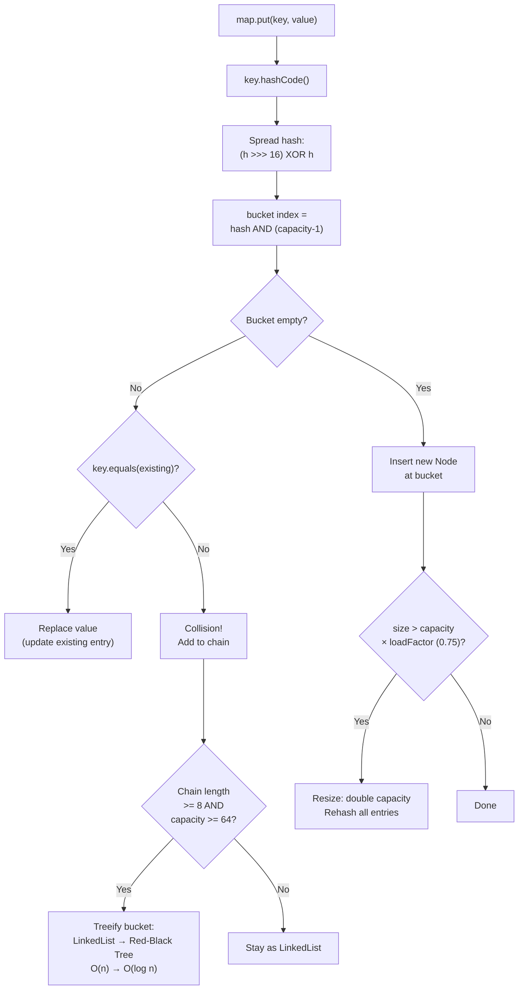

# Set & Map: Hashing Internals

## Diagram: HashMap Put Operation Flow



## HashMap: How It Actually Works

HashMap is the most important collection to understand deeply. It appears in virtually every interview and every Spring application.

### Internal Structure

```
HashMap<String, Integer> map = new HashMap<>();

  ┌────────────────────────────────────────────────────────────────┐
  │  HashMap                                                       │
  │  ┌──────────────────────────────────────────────────────────┐  │
  │  │  Node<K,V>[] table (the "bucket array")                 │  │
  │  │  ┌──────┬──────┬──────┬──────┬──────┬──────┬──────┬───┐│  │
  │  │  │  [0] │  [1] │  [2] │  [3] │  [4] │  [5] │  ... │   ││  │
  │  │  │ null │  ──▶ │ null │  ──▶ │ null │ null │      │   ││  │
  │  │  └──────┴──┬───┴──────┴──┬───┴──────┴──────┴──────┴───┘│  │
  │  │            │              │                              │  │
  │  │            ▼              ▼                              │  │
  │  │      ┌──────────┐  ┌──────────┐                         │  │
  │  │      │"Alice"→1 │  │"Bob"→2   │                         │  │
  │  │      │next: null│  │next: ──▶─┼─┐                       │  │
  │  │      └──────────┘  └──────────┘ │                       │  │
  │  │                           ┌─────┘                       │  │
  │  │                           ▼                              │  │
  │  │                     ┌──────────┐                         │  │
  │  │                     │"Dan"→4   │  ← COLLISION! Same bucket│  │
  │  │                     │next: null│                          │  │
  │  │                     └──────────┘                         │  │
  │  │                                                          │  │
  │  │  size = 3     capacity = 16     loadFactor = 0.75       │  │
  │  └──────────────────────────────────────────────────────────┘  │
  └────────────────────────────────────────────────────────────────┘
```

### The put() Algorithm

```
map.put("Alice", 1):

Step 1: Compute hashCode
  "Alice".hashCode() → 63350368
  
Step 2: Compute bucket index
  index = hash(63350368) & (capacity - 1)
  // hash() spreads high bits to low bits to reduce collisions
  // & (n-1) is equivalent to % n when n is power of 2
  index = 2 (for example)

Step 3: Check bucket
  table[2] == null?
    YES → Create new Node("Alice", 1), place at table[2]
    NO  → Walk linked list, check each key with equals()
          Key exists? → Replace value
          Key new?    → Append to list (or tree)

Step 4: Check load
  if (size > capacity * loadFactor) → RESIZE!
```

### Collision Resolution: List → Tree (Java 8+)

```
When collisions accumulate (bucket gets long):

  Linked List (≤ 8 entries):                 Red-Black Tree (> 8 entries):
  
  bucket[3] → [A] → [B] → [C] → null        bucket[3] →     [C]
              O(n) traversal                               /     \
                                                        [A]      [E]
  When list length > 8 (TREEIFY_THRESHOLD):            /  \     / \
  The linked list CONVERTS to a Red-Black tree       [B]  ...  [D] [F]
  → O(n) degrades to O(log n)                        O(log n) traversal
  
  When tree shrinks to ≤ 6 (UNTREEIFY_THRESHOLD):
  The tree converts BACK to a linked list
```

### Resize (rehash)

```
When size exceeds capacity * 0.75:

BEFORE: capacity = 4, threshold = 3, size = 3
  [0]: null
  [1]: "A"→1
  [2]: "B"→2 → "D"→4
  [3]: "C"→3

AFTER: capacity = 8, threshold = 6
  New buckets are double the size.
  ALL entries are REHASHED (new index = hash & (newCap - 1)):
  
  [0]: null
  [1]: "A"→1
  [2]: "B"→2       ← "D" might move to bucket 6 (new bit)
  [3]: "C"→3
  [4]: null
  [5]: null
  [6]: "D"→4       ← rehashed to new position
  [7]: null

  Every resize copies ALL entries — O(n).
  Avoid by setting initial capacity: new HashMap<>(expectedSize / 0.75 + 1)
```

## HashSet: Just a HashMap

```
HashSet<String> set = new HashSet<>();
set.add("Alice");

// INTERNALLY: HashSet wraps a HashMap!
// set.add("Alice") → map.put("Alice", DUMMY_VALUE)
// set.contains("Alice") → map.containsKey("Alice")

┌─────────────────────────────────────┐
│  HashSet                             │
│  ┌─────────────────────────────────┐│
│  │  private HashMap<E, Object> map ││
│  │       key = your element        ││
│  │       value = PRESENT (dummy)   ││
│  └─────────────────────────────────┘│
└─────────────────────────────────────┘
```

## The hashCode/equals Contract

This is the **most important invariant** for HashMap/HashSet:

```
CONTRACT (must ALWAYS hold):
  1. If a.equals(b) → a.hashCode() == b.hashCode()   (REQUIRED)
  2. If a.hashCode() == b.hashCode() → a.equals(b)?   (NOT required — collision)
  3. If !a.equals(b) → hashCode can be same or different

VIOLATION CONSEQUENCES:
  ┌──────────────────────────────────────────────────────────────────┐
  │  If equals() overridden but hashCode() NOT overridden:          │
  │                                                                  │
  │  Person p1 = new Person("Alice");  // hashCode = 12345          │
  │  Person p2 = new Person("Alice");  // hashCode = 67890          │
  │  p1.equals(p2) → true                                           │
  │  p1.hashCode() != p2.hashCode() → DIFFERENT BUCKETS!           │
  │                                                                  │
  │  map.put(p1, "value1");  → goes to bucket 5                    │
  │  map.get(p2);            → searches bucket 10 → NOT FOUND!     │
  │                                                                  │
  │  YOU LOSE DATA.                                                  │
  └──────────────────────────────────────────────────────────────────┘
```

## TreeMap / TreeSet

```
TreeMap: Red-Black Tree (self-balancing BST)
  - ALL operations O(log n)
  - Keys must implement Comparable OR provide Comparator
  - Maintains SORTED order

  TreeMap<String, Integer>:
  
            ┌───────────┐
            │ "Charlie"  │
            │   value=3  │
            └─────┬─────┘
          ┌───────┴───────┐
    ┌─────┴─────┐   ┌─────┴─────┐
    │  "Alice"  │   │  "David"  │
    │  value=1  │   │  value=4  │
    └───────────┘   └───────────┘
    
  Keys are sorted: Alice < Charlie < David
```

## Python Comparison

```python
# Python dict = Java HashMap (insertion-ordered since Python 3.7)
d = {"Alice": 1, "Bob": 2}    # Java: Map.of("Alice", 1, "Bob", 2)
d["Charlie"] = 3               # Java: map.put("Charlie", 3)
d.get("Alice")                 # Java: map.get("Alice")

# Python set = Java HashSet
s = {"Alice", "Bob"}           # Java: Set.of("Alice", "Bob")
s.add("Charlie")               # Java: set.add("Charlie")
"Alice" in s                   # Java: set.contains("Alice")
```

---

## Interview Questions

**Q1: Explain how HashMap handles collisions.**
> Each bucket starts as a linked list. When you put a key that maps to an occupied bucket, the new entry is appended to the list (after checking for duplicate keys with `equals()`). In Java 8+, when a bucket's list exceeds 8 entries, it's converted to a Red-Black tree for O(log n) lookups instead of O(n). When the tree shrinks to 6 or fewer, it converts back.

**Q2: Why must hashCode() and equals() be overridden together?**
> HashMap finds the bucket using `hashCode()`, then finds the exact key using `equals()`. If `equals()` says two objects are the same but they have different `hashCode()` values, the second object goes to a different bucket and the first is never found. You lose data silently. Rule: same equals = same hashCode. Always.

**Q3: What is the initial capacity and load factor of HashMap?**
> Initial capacity: 16 (always a power of 2). Load factor: 0.75. When size exceeds `capacity * loadFactor` (12 for default), the table doubles in size and all entries are rehashed. If you know the expected size, set initial capacity to `expectedSize / 0.75 + 1` to avoid rehashing.
