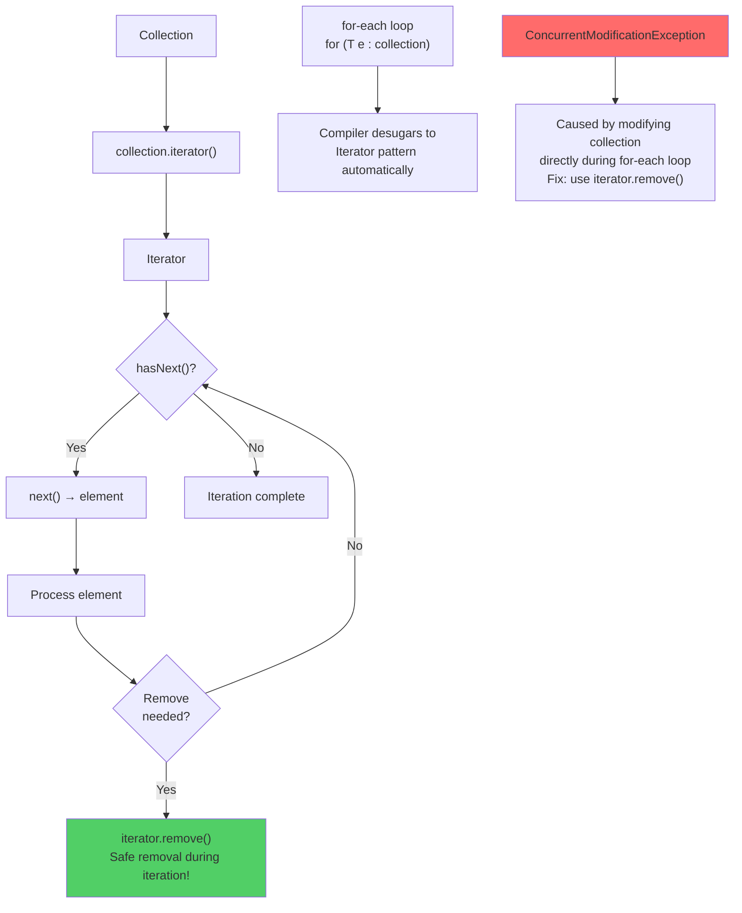

# Iterators and Collections Utilities

## Diagram: Iterator Pattern and Collections Class



## The Iterator Contract

Iterator is the fundamental mechanism behind Java's `for-each` loop. Any class implementing `Iterable<T>` can be used in a for-each.

```java
// What the compiler does with for-each:
for (String name : names) { process(name); }

// Is identical to:
Iterator<String> it = names.iterator();
while (it.hasNext()) {
    String name = it.next();
    process(name);
}
```

```
SAFE REMOVAL during iteration:
  ❌ Wrong — ConcurrentModificationException:
     for (String name : list) {
         if (name.startsWith("A")) list.remove(name);  // modifies list!
     }

  ✅ Correct — iterator.remove():
     Iterator<String> it = list.iterator();
     while (it.hasNext()) {
         if (it.next().startsWith("A")) it.remove();  // safe!
     }

  ✅ Modern — removeIf():
     list.removeIf(name -> name.startsWith("A"));  // uses iterator internally
```

---

## Collections Utility Class

`java.util.Collections` provides static algorithms on any `Collection` or `List`:

```
┌───────────────────────────────────────────────────────────────────┐
│  Collections.sort(list)                   → natural order sort    │
│  Collections.sort(list, comparator)        → custom order sort    │
│  Collections.binarySearch(list, key)       → O(log n) search      │
│  Collections.reverse(list)                → reverse in place      │
│  Collections.shuffle(list)                → random order          │
│  Collections.min(collection)              → minimum element       │
│  Collections.max(collection)              → maximum element       │
│  Collections.frequency(collection, obj)   → count occurrences     │
│  Collections.nCopies(n, obj)              → immutable list of n   │
│  Collections.unmodifiableList(list)        → read-only wrapper     │
│  Collections.synchronizedList(list)        → thread-safe wrapper  │
│  Collections.disjoint(c1, c2)             → true if no overlap   │
│  Collections.swap(list, i, j)             → swap two elements     │
└───────────────────────────────────────────────────────────────────┘
```

### Unmodifiable vs Immutable

```java
List<String> mutable = new ArrayList<>(List.of("a", "b", "c"));

// Unmodifiable VIEW — operations throw UnsupportedOperationException
// But the original list can still be mutated!
List<String> view = Collections.unmodifiableList(mutable);
mutable.add("d");  // works!
view.get(0);       // "a" — reflects the mutation!

// Truly immutable — cannot change the data at all
List<String> immutable = List.of("a", "b", "c");   // Java 9+
List<String> immutable2 = List.copyOf(mutable);    // defensive copy

// WHY this matters in Spring: @Bean methods returning collections should
// return List.copyOf() to prevent callers from mutating shared state
```

---

## Java 9+ Factory Methods

```java
// Modern immutable collection creation:
List<String> names  = List.of("Alice", "Bob", "Charlie");
Set<Integer> ids    = Set.of(1, 2, 3);
Map<String, Integer> scores = Map.of("Alice", 95, "Bob", 87);

// For larger maps:
Map<String, Integer> bigMap = Map.ofEntries(
    Map.entry("Alice", 95),
    Map.entry("Bob", 87),
    Map.entry("Charlie", 92)
);

// Rules for List.of():
//   - null elements → NullPointerException
//   - returns truly immutable list
//   - add/set/remove → UnsupportedOperationException
```

---

## ListIterator — Bidirectional

```java
// ListIterator extends Iterator with backward traversal
ListIterator<String> lit = list.listIterator(list.size()); // start at end
while (lit.hasPrevious()) {
    System.out.println(lit.previous());  // iterate backwards
}

// ListIterator can also ADD elements (Iterator.remove() cannot add)
lit.add("new element");
```

---

## Python Bridge

| Java Iterator / Utilities | Python Equivalent |
|---|---|
| `for (T e : collection)` | `for e in collection:` |
| `iterator.remove()` | `del` with index or list comprehension |
| `list.removeIf(pred)` | `list[:] = [x for x in list if not pred(x)]` |
| `Collections.sort(list)` | `list.sort()` |
| `Collections.sort(list, comparator)` | `list.sort(key=lambda x: ...)` |
| `Collections.shuffle(list)` | `random.shuffle(list)` |
| `Collections.unmodifiableList(list)` | `tuple(list)` or `frozenset()` |
| `List.of("a", "b")` | `["a", "b"]` (already immutable in functional style) |
| `Collections.frequency(c, obj)` | `c.count(obj)` |

**Critical Difference:** Python's `for` loop can iterate over any iterable without an explicit `.iterator()` call — Python's `__iter__` protocol is the same as Java's `Iterable<T>` interface, just implicit. The `ConcurrentModificationException` trap has no Python equivalent — Python allows list modification during iteration but produces unpredictable results. Java's fail-fast iterators detect this immediately.

---

## Interview Questions

**Q1: Your code throws ConcurrentModificationException. You weren't even using threads. How is that possible?**
> Java collections use a `modCount` internal counter. Any structural modification (add/remove) increments it. When an iterator is created, it saves the current `modCount`. On every `next()` call, it checks whether `modCount` has changed — if so, it throws CME immediately. This is "fail-fast" behavior. Fix: use `iterator.remove()`, `removeIf()`, or collect to-remove items first, then remove after iteration.

**Q2: What's the difference between `Collections.unmodifiableList()` and `List.of()`?**
> `Collections.unmodifiableList(original)` is a read-only *view* of the original — if the original mutates, the view reflects the change. `List.of()` creates a new immutable list with no backing mutable list. Use `List.of()` or `List.copyOf()` when you want a truly immutable list, not just a protected view.

**Q3: When would you use `ListIterator` instead of `Iterator`?**
> `ListIterator` adds: (1) bidirectional traversal via `hasPrevious()` / `previous()`, (2) the ability to `add()` elements during iteration, (3) `set()` to replace the last returned element, and (4) index access via `nextIndex()` / `previousIndex()`. Use it when you need to modify the list in place or traverse backwards.
