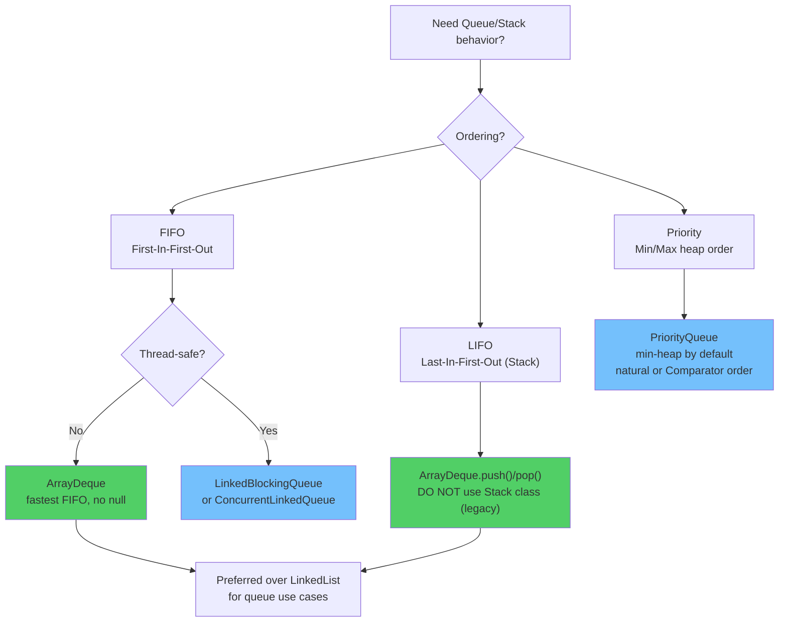

# Queue & Deque — FIFO, LIFO & Priority Ordering

## Diagram: Queue / Deque Type Selection



## Python → Java Mental Map

| Python | Java |
|--------|------|
| `collections.deque` | `ArrayDeque` (preferred) or `LinkedList` |
| `queue.Queue` | `LinkedList` implements `Queue` |
| `heapq` | `PriorityQueue` (min-heap) |
| `queue.LifoQueue` | `ArrayDeque` used as stack |

---

## 1. Queue Interface Hierarchy

```
         <<interface>>
           Iterable
               │
         <<interface>>
          Collection
               │
         <<interface>>
            Queue              ← add/offer, remove/poll, element/peek
           ╱      ╲
    <<interface>>   PriorityQueue  ← min-heap, O(log n) insert/remove
       Deque
      ╱      ╲
ArrayDeque  LinkedList  ← both implement Deque
```

### Two-API Design Pattern

Queue methods come in pairs — one **throws** on failure, one **returns special value**:

```
┌───────────┬──────────────────┬────────────────────┐
│ Operation │ Throws Exception │ Returns null/false  │
├───────────┼──────────────────┼────────────────────┤
│ Insert    │ add(e)           │ offer(e)           │
│ Remove    │ remove()         │ poll()             │
│ Examine   │ element()        │ peek()             │
└───────────┴──────────────────┴────────────────────┘

✅ RULE: Use offer/poll/peek in production code
         (never risk unexpected exceptions)
```

---

## 2. PriorityQueue — Min-Heap Under the Hood

```
Insertion order: [30, 10, 20, 5, 15]

Internal heap array after all inserts:

Index:  [0]  [1]  [2]  [3]  [4]
Value:   5   10   20   30   15

Heap tree visualization:

         5          ← smallest always at root
        / \
      10   20
      / \
    30   15

poll() returns: 5 → 10 → 15 → 20 → 30  (sorted order!)
```

### Custom Ordering with Comparator

```java
// Max-heap (reverse natural order)
PriorityQueue<Integer> maxHeap = new PriorityQueue<>(Comparator.reverseOrder());

// By object field
PriorityQueue<Task> taskQueue = new PriorityQueue<>(
    Comparator.comparingInt(Task::getPriority)
);
```

### Complexity

| Operation | Time |
|-----------|------|
| `offer()` / `add()` | O(log n) |
| `poll()` / `remove()` | O(log n) |
| `peek()` | O(1) |
| `contains()` | O(n) |
| `remove(Object)` | O(n) |

---

## 3. ArrayDeque — The Swiss Army Knife

```
ArrayDeque internal circular buffer:

Initial state (capacity 16):
┌───┬───┬───┬───┬───┬───┬───┬───┬───┬───┬───┬───┬───┬───┬───┬───┐
│   │   │   │   │   │   │   │   │   │   │   │   │   │   │   │   │
└───┴───┴───┴───┴───┴───┴───┴───┴───┴───┴───┴───┴───┴───┴───┴───┘
                                ^head                         ^tail

After addFirst("A"), addLast("B"), addFirst("C"):
┌───┬───┬───┬───┬───┬───┬───┬───┬───┬───┬───┬───┬───┬───┬───┬───┐
│ A │ B │   │   │   │   │   │   │   │   │   │   │   │   │   │ C │
└───┴───┴───┴───┴───┴───┴───┴───┴───┴───┴───┴───┴───┴───┴───┴───┘
          ^tail                                             ^head

Iteration order: C → A → B (head to tail, wrapping around)
```

### ArrayDeque vs LinkedList as Deque

```
┌────────────────┬──────────────┬──────────────┐
│ Feature        │ ArrayDeque   │ LinkedList   │
├────────────────┼──────────────┼──────────────┤
│ Memory         │ Contiguous   │ Node objects │
│ Cache locality │ ✅ Excellent │ ❌ Poor      │
│ GC pressure    │ ✅ Low       │ ❌ High      │
│ Null elements  │ ❌ No        │ ✅ Yes       │
│ Thread safe    │ ❌ No        │ ❌ No        │
│ Performance    │ ✅ Faster    │ Slower       │
└────────────────┴──────────────┴──────────────┘

✅ RULE: Always prefer ArrayDeque over LinkedList
         unless you need null elements
```

### Using ArrayDeque as Stack (replaces legacy Stack class)

```java
Deque<String> stack = new ArrayDeque<>();
stack.push("first");    // addFirst
stack.push("second");   // addFirst
stack.peek();           // "second" — peekFirst
stack.pop();            // "second" — removeFirst
```

---

## 4. Real-World Use Cases

```
┌─────────────────────┬────────────────────────────────┐
│ Data Structure      │ Use Case                       │
├─────────────────────┼────────────────────────────────┤
│ Queue (ArrayDeque)  │ BFS traversal, task scheduling │
│ Stack (ArrayDeque)  │ DFS, undo/redo, expression eval│
│ PriorityQueue       │ Dijkstra's, job schedulers     │
│ Deque               │ Sliding window, work stealing  │
└─────────────────────┴────────────────────────────────┘
```

### Spring Connection: Message Queues

```
HTTP Request → Controller → Service → MessageQueue
                                          │
                              ┌───────────┼───────────┐
                              ▼           ▼           ▼
                          Worker 1    Worker 2    Worker 3

Spring uses queues extensively:
- @Async + ThreadPoolTaskExecutor (internal queue)
- Spring AMQP (RabbitMQ queues)
- Spring Kafka (topic partitions)
```

---

## 🎯 Interview Questions

**Q1: Why should you prefer ArrayDeque over Stack and LinkedList?**
> `Stack` extends `Vector` (synchronized, slow). `LinkedList` creates node objects (GC pressure, poor cache locality). `ArrayDeque` uses a resizable circular array — faster and more memory-efficient for both stack and queue usage.

**Q2: Can PriorityQueue contain duplicates? Can it contain null?**
> Yes to duplicates (it's not a Set). No to null — `offer(null)` throws `NullPointerException` because it needs to compare elements via natural ordering or Comparator.

**Q3: What's the time complexity of PriorityQueue.remove(Object)?**
> O(n) — it must search linearly to find the element, then O(log n) to re-heapify. Total: O(n). This surprises many people who assume it's O(log n) like poll().
