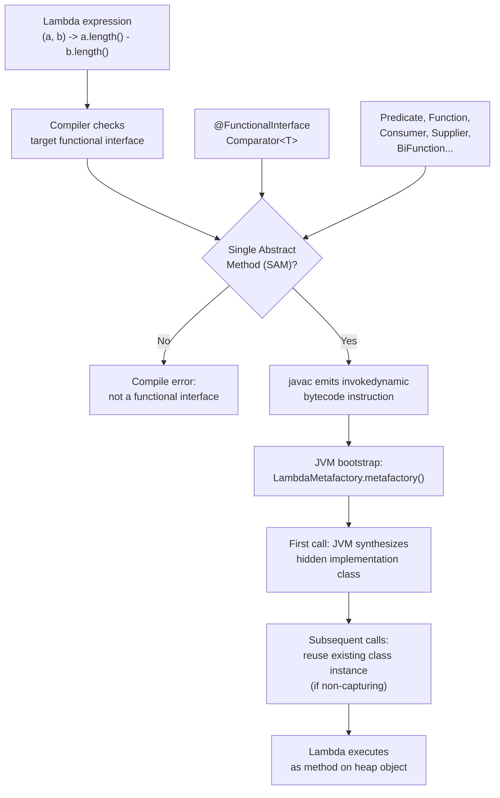

# Lambda Expressions & Functional Interfaces

## Diagram: Lambda to Bytecode Pipeline



## What Is a Lambda?

A lambda is an anonymous function — a block of code you can pass around like a variable.

```java
// Traditional approach (anonymous inner class):
Comparator<String> byLength = new Comparator<String>() {
    @Override
    public int compare(String a, String b) {
        return a.length() - b.length();
    }
};

// Lambda (same thing, 1 line):
Comparator<String> byLength = (a, b) -> a.length() - b.length();
```

**Python equivalent:**
```python
by_length = lambda a, b: len(a) - len(b)
# or: sorted(words, key=len)
```

## Lambda Syntax

```
Full form:     (String a, String b) -> { return a.length() - b.length(); }
Inferred types:(a, b)               -> { return a.length() - b.length(); }
Single expr:   (a, b)               -> a.length() - b.length()
Single param:  a                     -> a.toUpperCase()

SYNTAX RULES:
┌──────────────────────────────────────────────────────────────────────┐
│  (params)  →  body                                                   │
│                                                                      │
│  0 params:   () -> "hello"                                           │
│  1 param:    x -> x * 2           (parentheses optional)            │
│  2+ params:  (x, y) -> x + y     (parentheses required)            │
│  Block body: (x) -> { int r = x * 2; return r; }  (braces + return)│
│  Expr body:  (x) -> x * 2        (no braces, no return, no semicol)│
└──────────────────────────────────────────────────────────────────────┘
```

## Functional Interfaces

A lambda can only be assigned to a **functional interface** — an interface with exactly ONE abstract method (SAM = Single Abstract Method).

```
BUILT-IN FUNCTIONAL INTERFACES (java.util.function):

┌──────────────────┬───────────────────┬────────────────────────────────┐
│  Interface       │  Method           │  Use Case                      │
├──────────────────┼───────────────────┼────────────────────────────────┤
│  Predicate<T>    │  boolean test(T)  │  Filtering: is this valid?    │
│  Function<T,R>   │  R apply(T)       │  Transform: T → R             │
│  Consumer<T>     │  void accept(T)   │  Side effect: print, log, save│
│  Supplier<T>     │  T get()          │  Factory: create/provide a T  │
│  Comparator<T>   │  int compare(T,T) │  Ordering: which comes first? │
│  Runnable        │  void run()       │  Task: execute with no args   │
│  UnaryOperator<T>│  T apply(T)       │  Transform: same type in/out  │
│  BiFunction<T,U,R>│ R apply(T,U)    │  Two inputs → one output      │
└──────────────────┴───────────────────┴────────────────────────────────┘
```

### Examples in Context

```java
// Predicate: "Does this element match a condition?"
Predicate<String> isLong = s -> s.length() > 5;
names.stream().filter(isLong).toList();

// Function: "Transform this element"
Function<String, Integer> toLength = String::length;
names.stream().map(toLength).toList();

// Consumer: "Do something with this element"  
Consumer<String> printer = System.out::println;
names.forEach(printer);

// Supplier: "Give me a new instance"
Supplier<List<String>> listFactory = ArrayList::new;
List<String> fresh = listFactory.get();
```

## Method References (`::`)

Method references are shorthand for lambdas that just call an existing method:

```
┌────────────────────────────────────────────────────────────────────────┐
│  Lambda                          │  Method Reference                   │
├──────────────────────────────────┼─────────────────────────────────────┤
│  x -> System.out.println(x)     │  System.out::println                │
│  x -> x.toUpperCase()           │  String::toUpperCase                │
│  x -> Integer.parseInt(x)       │  Integer::parseInt                  │
│  (a, b) -> a.compareTo(b)       │  String::compareTo                  │
│  () -> new ArrayList<>()         │  ArrayList::new                     │
└──────────────────────────────────┴─────────────────────────────────────┘

FOUR TYPES:
  1. Static method:        ClassName::methodName     (Integer::parseInt)
  2. Instance of object:   instance::methodName      (System.out::println)
  3. Instance of type:     ClassName::instanceMethod  (String::toLowerCase)
  4. Constructor:          ClassName::new             (ArrayList::new)
```

## Effectively Final

Lambdas can access local variables from the enclosing scope, but they must be **effectively final** (never reassigned after initialization):

```java
String prefix = "Hello ";  // effectively final (never reassigned)
Consumer<String> greeter = name -> System.out.println(prefix + name);  // OK

// String prefix = "Hello ";
// prefix = "Hi ";  // reassigned!
// Consumer<String> greeter = name -> System.out.println(prefix + name);  // COMPILE ERROR
```

**Why?** Lambdas capture a *copy* of the variable. If the variable changes after capture, which value should the lambda use? Java avoids this ambiguity by requiring effective finality.

---

## Interview Questions

**Q1: What is a functional interface?**
> An interface with exactly one abstract method (SAM). It can have default and static methods. The `@FunctionalInterface` annotation is optional but recommended — it causes a compile error if you accidentally add a second abstract method. Examples: `Predicate`, `Function`, `Consumer`, `Supplier`, `Comparator`.

**Q2: What is the difference between `Function<T,R>` and `UnaryOperator<T>`?**
> `UnaryOperator<T>` extends `Function<T,T>` — both input and output are the same type. Use `Function<T,R>` when types differ (e.g., `String → Integer`). Use `UnaryOperator<T>` when the type is the same (e.g., `String → String` for transformations).

**Q3: Why must variables used in lambdas be effectively final?**
> Lambdas capture a snapshot of the variable, not a reference to it. If the variable could change after capture, the lambda would silently use a stale value, leading to confusing bugs. Java prevents this at compile time. Workaround: use a single-element array or `AtomicReference` if you truly need mutation.
