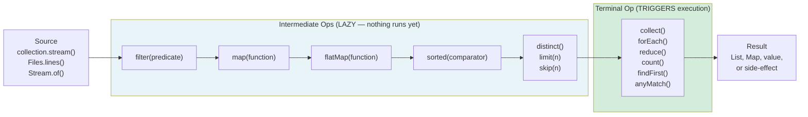

# Streams API: Declarative Data Processing

## Diagram: Stream Pipeline Execution Model



## What Is a Stream?

A Stream is a **pipeline** for processing data declaratively — like SQL for collections.

```
PIPELINE MODEL:

  Source        →  Intermediate Ops  →  Terminal Op  →  Result
  (Collection)    (lazy, chainable)     (triggers)      (value)

  employees.stream()                                   → List<String>
      .filter(e -> e.getSalary() > 50000)   // lazy
      .map(Employee::getName)                // lazy
      .sorted()                              // lazy
      .collect(Collectors.toList());         // EXECUTES everything!
```

**Python equivalent:**
```python
# List comprehension (similar concept, different syntax):
[e.name for e in employees if e.salary > 50000]

# Or using built-in functions:
list(map(lambda e: e.name, filter(lambda e: e.salary > 50000, employees)))
```

## Lazy Evaluation: The Key Insight

Streams are **lazy** — intermediate operations do nothing until a terminal operation triggers execution.

```
WITHOUT LAZINESS (hypothetical):
  filter(all 1M elements) → 500K results stored
  map(500K elements) → 500K new objects stored
  limit(10) → throw away 499,990 results!

WITH LAZINESS (actual):
  Stream processes ONE element at a time through the pipeline:
  
  Element 1 → filter → pass → map → limit(count=1) → keep
  Element 2 → filter → fail → SKIP
  Element 3 → filter → pass → map → limit(count=2) → keep
  ...
  After 10 passes through limit → STOP. Don't process remaining elements!

  ┌───────────────────────────────────────────────────┐
  │  Lazy means:                                       │
  │  1. No intermediate results are stored             │
  │  2. Short-circuits when possible (limit, findFirst)│
  │  3. Each element flows through the ENTIRE pipeline │
  │     before the next element starts                 │
  └───────────────────────────────────────────────────┘
```

## Common Operations

### Intermediate (return Stream, lazy)

```java
stream.filter(x -> x > 5)           // keep if predicate is true
stream.map(x -> x * 2)              // transform each element
stream.flatMap(list -> list.stream())// flatten nested streams  
stream.sorted()                      // natural order
stream.sorted(Comparator.reverseOrder()) // custom order
stream.distinct()                    // remove duplicates
stream.limit(10)                     // take first N
stream.skip(5)                       // skip first N
stream.peek(System.out::println)     // debug (DO NOT use for side effects)
```

### Terminal (trigger execution, consume stream)

```java
stream.collect(Collectors.toList())  // → List<T>
stream.toList()                      // → unmodifiable List<T> (Java 16+)
stream.forEach(System.out::println)  // side effect on each element
stream.count()                       // → long (number of elements)
stream.reduce(0, Integer::sum)       // → single value
stream.min(Comparator.naturalOrder())// → Optional<T>
stream.max(Comparator.naturalOrder())// → Optional<T>
stream.anyMatch(x -> x > 10)        // → boolean (short-circuits)
stream.allMatch(x -> x > 0)         // → boolean
stream.noneMatch(x -> x < 0)        // → boolean
stream.findFirst()                   // → Optional<T>
stream.toArray()                     // → Object[] or T[]
```

## Collectors: The Power Tool

```java
// Collect to specific collection types
.collect(Collectors.toList())           // ArrayList
.collect(Collectors.toSet())            // HashSet
.collect(Collectors.toUnmodifiableList()) // immutable

// Group by a property (like SQL GROUP BY)
Map<String, List<Employee>> byDept = employees.stream()
    .collect(Collectors.groupingBy(Employee::getDepartment));

// Partition by predicate (true/false groups)
Map<Boolean, List<Employee>> partitioned = employees.stream()
    .collect(Collectors.partitioningBy(e -> e.getSalary() > 50000));

// Join strings
String names = employees.stream()
    .map(Employee::getName)
    .collect(Collectors.joining(", "));  // "Alice, Bob, Charlie"

// Statistics
IntSummaryStatistics stats = employees.stream()
    .collect(Collectors.summarizingInt(Employee::getAge));
// stats.getAverage(), stats.getMax(), stats.getMin(), stats.getCount()
```

## Stream vs Collection

```
┌────────────────────────────────────────────────────────────────┐
│  Collection                    │  Stream                       │
├────────────────────────────────┼───────────────────────────────┤
│  Stores elements in memory     │  Computes on demand (lazy)    │
│  Can iterate multiple times    │  Can only be consumed ONCE    │
│  External iteration (for loop) │  Internal iteration (pipeline)│
│  Eagerly populated             │  Lazily evaluated             │
│  Mutable (add/remove)          │  Immutable (read-only view)   │
│  Focus: data storage           │  Focus: data processing       │
└────────────────────────────────┴───────────────────────────────┘
```

---

## Interview Questions

**Q1: What is the difference between `map()` and `flatMap()`?**
> `map()` transforms each element 1:1 (e.g., `String → Integer`). `flatMap()` transforms each element into a stream and flattens all results into a single stream. Use `flatMap()` when each element maps to multiple results: `orders.stream().flatMap(order -> order.getItems().stream())`.

**Q2: When should you use parallel streams?**
> Almost never. Parallel streams add overhead from thread management, splitting, and merging. They only help with: (1) large datasets (>10,000 elements), (2) computationally expensive per-element operations, (3) stateless, non-ordering-dependent operations, and (4) no shared mutable state. Benchmark before using.

**Q3: Can you reuse a stream after a terminal operation?**
> No. Streams can only be consumed once. After a terminal operation (`collect`, `forEach`, etc.), the stream is closed. Attempting to reuse it throws `IllegalStateException`. If you need to process the same data again, create a new stream from the source collection.
